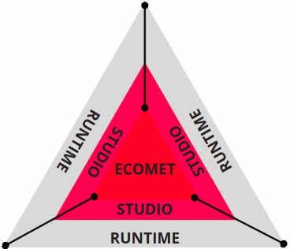
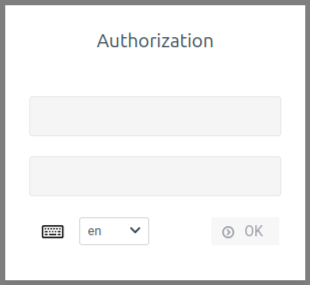
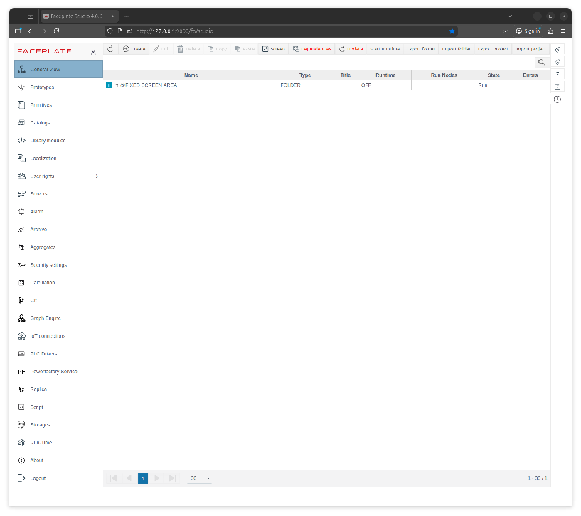
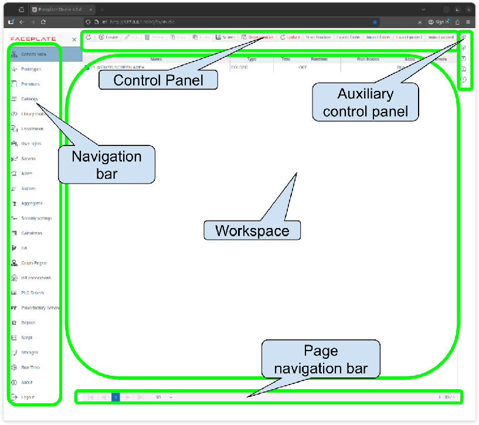
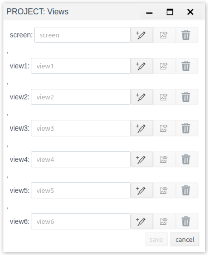

# General information

FACEPLATE is a software package that provides the user with the necessary environment and set of tools for solving the problems of collecting and converting data into information, storing information, and organizing access to it through various interfaces.  
FACEPLATE is a client-server application. The client is a browser, recommended browsers include Firefox, Chrome, Safari, Edge, and others. Mobile versions of these browsers are supported. No additional software installation is required on the client.  
The server part of FACEPLATE is a cross-platform application executed by the Erlang virtual machine ([https://www.erlang.org](https://www.erlang.org)).

## Usage

The primary purpose of FACEPLATE is to provide a development environment for IIoT solutions that can be used to build distributed, scalable solutions for industrial enterprises.  
FACEPLATE enables real-time monitoring of production and process equipment, generating customizable reports in the form of various KPIs and OEE indicators, analyzing anomalies, and predicting equipment maintenance. Machine learning is used to create mathematical models to optimize and improve the efficiency of equipment and processes.  
The main goals of the FACEPLATE software package:

* increasing transparency and flexibility of production;  
* accounting of equipment operation and quality of technical maintenance;  
* improving production safety and environmental reliability;  
* the ability to analyze production efficiency and equipment performance;  
* the ability to use the most advanced work optimization practices, such as machine learning and predictive analysis.

## Compound​

The FACEPLATE software suite includes the FACEPLATE Studio development environment and the FACEPLATE Runtime runtime environment. Everything created in the software suite is stored and processed in the ECOMET database.

* FACEPLATE Studio \- is a development environment, a full suite of software tools for designing human-machine interfaces, developing control algorithms, configuring archives, reports, alert systems, and other functions.  
* FACEPLATE Runtime \- is a runtime environment and a real-time automated control system.  
* ECOMET \- is a database for real-time applications

## Functional

The functionality of the FACEPLATE software package is flexible and can be changed during the technical specification approval stage.  
Functionality by software package modules:

* Graphic Editor \- An editor for creating mnemonic diagrams, control elements, and visualizations. It includes a wide range of essential and commonly used tools.  
* Archiving \- The built-in archiving subsystem meets the needs of storing and processing data for projects of varying complexity levels and allows for the evaluation of the dynamics of changes in process parameters over a long period of time.  
* Messages \- A messaging system for recording and archiving events with the ability to display and manage them; customization of message categories; display, notification, and archiving.  
* Scripts \- Built-in support for the Erlang and JavaScript programming languages allows you to create custom scripts of any complexity for manipulating project objects (including tags, messages, archives, IoT connections, etc.), as well as any properties of these objects.  
* Web client \- To connect, you need a client device that uses a standard browser, local network, or the Internet to access data on the Web server.  
* Simulator/Imitator \- Built-in support in the development environment for data simulation for any type of tags, which allows you to test the configuration of objects without setting up connections to external devices.  
* Trends \- Powerful functionality for presenting historical data in the form of graphs and trends in runtime mode.  
* IoT Hub \- Supports the concept of a data transmission network between physical objects ("things") equipped with built-in tools and technologies for interacting with each other or with the external environment.  
* Drivers \- Integration of external hardware or software components into the FACEPLATE software suite. Extensive database of popular drivers with the ability to expand.  
* Modeling \- A forecasting tool for identifying temporal patterns in a dataset. Designed to run models implemented using modern algorithms and modeling libraries. Enables the creation of accurate forecast models automatically, and the user can add their own forecast models if needed.  
* Catalogs \- Functionality for displaying information in a user-friendly format, organized into a set of tables. Ensuring the integrity of large volumes of data. Easy access without reorganizing the database.  
* Multilingualism \- FACEPLATE projects can be adapted to different languages. Kazakh, Russian, and English packages are enabled by default.  
* Clustering \- A built-in mechanism for duplicating server stations, synchronizing their information content in real time and automatically redistributing the load between nodes.  
* Export/Import mechanisms \- Export and import mechanisms for both the entire project and its individual components are supported.

# Launch

FACEPLATE is launched on the server from the distribution package with the faceplate executable file in the bin directory. Administrator privileges are required to run it.  
To run successfully, the server must meet the following minimum requirements:  
Server environment:

* Operating system: 64-bit Linux distributions (Ubuntu, CentOS, Debian, Red Hat or compatible)  
* Architecture: x86\_64  
* RAM: from 4 GB  
* Disk space: from 10 GB of free space  
* Network: TCP/IP access for connecting client workstations

Client environment:

* Any device with a web browser  
* A web browser that supports modern web standards (Firefox, Chrome, Safari, Edge, and similar)  
* Mobile browser versions are supported

General requirements:

* Correctly configured system time and network parameters  
* Possibility of accessing the server via HTTP/HTTPS  
* Server hardware resources are selected depending on the expected load and scale of system operation.

These requirements are sufficient for basic startup and test use of FACEPLATE for industrial and high-load systems, a more powerful configuration is required.  
The path to the folder from which the application will be launched must consist of Latin characters and must not contain spaces, brackets, or special characters. After successful launch, the following interfaces are available: FACEPLATE Studio, FACEPLATE Runtime, and ECOMET.

## FACEPLATE Studio

FACEPLATE development environment. A client can connect from any device with network access to the FACEPLATE server.   
To do this, navigate to one of the following addresses in your browser:

* http://\<ip address\>:9000/fp/studio  
* https://\<ip address\>:9443/fp/studio

## FACEPLATE Runtime

The FACEPLATE runtime environment is designed for operators. To open the runtime environment in a browser, use one of the following URLs:

* http://\<ip address\>:9000/fp/runtime  
* https://\<ip address\>:9443/fp/runtime

## ECOMET

The core component of the FACEPLATE system, including the ECOMET database, is an integral part of FACEPLATE.   
To open the management interface, enter the following path in your browser:

* http://\<ip address\>:8000/static/admin.html  
* https://\<ip address\>:8443/static/admin.html

Where \<ip address\> is the IP address of the server running FACEPLATE. Connections from client devices are established if network access to the FACEPLATE server is available.

# Licensing

A license is required for the continuous operation of the server. A license issued for one server cannot be used on another.

# Quick start

The FACEPLATE Studio development environment. The client can connect from any device with network access to the FACEPLATE server.   
To do this, navigate to the following address in your browser: http://\<ipaddress\>:9000/fp/studio  
Where \<ip address\> is the IP address of the server running FACEPLATE.  
An authorization window will appear in which the user enters the default credentials:  
login \- system  
password \- 111111  

For further use, you need to add a new user to the system.  
After successful authorization, the main interface of FACEPLATE Studio opens \- General view:  

  

## General appearance

The main module of the software suite displays a list of all created objects and mnemonic diagrams. It serves as an entry point for quickly assessing the project structure.  
The main window interface consists of the following areas and panels:

* Control Panel  
* Auxiliary control panel  
* Workspace  
* Navigation bar  
* Page navigation bar

  

The project's information fund is presented in the form of a hierarchical structure, reminiscent of a file system, where files (objects) are stored in folders (groups), which in turn can contain other folders (subgroups).

### Control Panel

The top panel of the interface, designed for basic object and project management within the FACEPLATE. It contains buttons for creating, editing, deleting, copying, and pasting objects, as well as tools for managing dependencies, launching the Runtime, and importing and exporting.

**Refresh**  
Update the current status. Update the project database display. If the project is being developed simultaneously by multiple users, this button is used to retrieve the latest updates made by other users.  

**Create**  
A button for creating a new object in the general project structure. These objects include: IoT, PLC, Primitive, Prototype, and System.  

Below is a more detailed description of how to create these objects:

* IoT \- allows you to configure data exchange between FACEPLATE and other information systems via various IoT protocols, creating the necessary connections. The following connection types are supported: HTTP, MQTT, WEBSOCKET.

For each IoT connection, it is possible to create an action and source, which in turn consist of: eventlog, script, tag, ts.

* PLC \- collects information from existing intelligent devices, processes it initially, and writes it to tag fields, creating the necessary connections. The following connection types are supported: IEC-101, IEC-104, S7 (Siemens), MODBUS, SNMP, MERCURY 230, M-BUS, DCON (ICP DAS), OPC-UA, OPC-DA, IEC-62056, and ETHERNET-IP.

For each PLC connection, it is possible to create bindings. Bindings describe the data exchanged between the system and the connected device. Each binding maps one unit of data from the device's memory area to one field of the FACEPLATE tag.

* Primitive \- allows you to create simplified elements based on a library of primitives. This is a tool for creating simplified elements. In other words, they are primitive templates for creating specific object instances. Each instance of a primitive inherits its properties and methods and can also have its own unique field values. A primitive standardizes the creation and management of objects, ensuring reuse and simplifying system development and maintenance.  
* Prototype \- allows you to create more advanced elements based on a prototype library. The concept of prototypes is similar to the concept of classes in object-oriented programming. In other words, they represent templates/forms for creating specific instances of objects or devices, defining their structure, properties, content, and behavior. This means that a prototype includes the definition of fields, their data types, content, methods, and functions for working with these fields and content, as well as logic for handling events and object states. A prototype is the basis for creating specific instances of objects. Each prototype instance inherits its properties and methods and can also have its own unique values for fields, content, and behavior. A prototype standardizes the creation and management of objects, ensuring code reuse and simplifying system development and maintenance. It also defines an interface for interacting with objects and devices, simplifying integration and extending system functionality.  
* System object \- is a set of basic platform components designed for storing, processing, calculating, modeling, and exchanging data, as well as expanding the system's functionality. They organize the project structure, implement user and system logic, integrate with external sources, perform calculations, manage messages and events, and support the distributed and scalable FACEPLATE architecture.

The following object types are supported:

  * Archive \- A system object for long-term storage and viewing of historical data and events.  
  * Folder \- A hierarchical container for logical grouping and organization of FACEPLATE objects.  
  * Replica \- A mechanism for synchronizing and copying data between FACEPLATE instances.  
  * Message \- An object for generating, storing and transmitting notifications, events and system messages.  
  * Calculator \- A component for performing calculations, processing data and calculating user expressions.  
  * DSF service \- Service object for integration, processing and transfer of data between external sources and FACEPLATE.  
  * Graph engine \- A subsystem for working with graph structures, connections and dependencies between objects.  
  * JS library \- A set of JavaScript modules used to extend the functionality of the FACEPLATE client side.  
  * Modeling \- A tool for creating, analyzing and executing process and system models in the FACEPLATE environment.  
  * Custom Script \- An object for implementing custom logic and automation using scripting languages.

**Edit/Delete/Copy/Paste**  
The Edit, Delete, Copy, and Paste buttons are designed to perform basic operations for managing FACEPLATE objects and provide the ability to create, modify, move, and delete elements within the current section or selected folder, supporting standard scenarios for working with data and project structure.

**Mnemonic diagram**  
A button to open the mnemonic diagram menu and access the graphical editor. The graphical editor is used to create and edit project graphical content. Mnemonic diagrams are used to present up-to-date information about the current state of the control object to the user in an easy-to-read format.  

**Dependencies**  
Viewing invalid dependencies between objects. This button allows you to quickly identify broken links in created project objects.

**Refresh**  
Updating dependency status. If a project is being developed simultaneously by multiple users, this button is used to retrieve the latest updates made by other users.

**Start/Stop Runtime**  
The "Start/Stop Runtime" button controls the FACEPLATE runtime environment and is used to start or stop runtime processes that execute logic, scripts, and data processing in the system's operating mode. The project development environment operates independently of the runtime state.

**Export/ Import folder**  
The Export Folder and Import Folder buttons are used to save and load the folder structure and the FACEPLATE objects they contain, allowing you to transfer, back up, and restore data between projects or system instances.

**Export/ Import of the project**  
The "Export Project" and "Import Project" buttons are used to save and load an entire FACEPLATE project, including its structure, settings, and objects, and are used to transfer projects, back up, and restore the system.

**Search**  
Search for objects and groups by name or title. The search is not case-sensitive. It is performed recursively within the group displayed in the workspace. The search results are displayed in the workspace.

### Auxiliary control panel

An additional control panel is located on the right side of the editor. It contains an additional set of buttons for working with the project.

### Workspace

The central part of the interface, which displays the contents of the selected FACEPLATE section. It is used to create, view, edit, and manage objects, structures, and system parameters.

### Navigation bar

The navigation bar is used to navigate between FACEPLATE sections and system editors. It provides access to the platform's functional modules, settings, and service components.  
The main menu of FACEPLATE Studio editors. Located on the left, it includes editors for customizing project work:

* General view \- is the main module of the project, which contains a list of all objects and screens included in the project.  
* Prototypes \- prototype management module.  
* Primitives \- module for managing primitives.  
* Catalogs \- is a module for organizing data in the form of a set of tables.  
* Library modules \- is a module for creating a script library.  
* Localizations \- language localization settings.  
* Rights \- managing access and user rights.  
* Servers \- server status monitoring module.  
* Message \- is a module of the message system.  
* Archive \- is a module of the data archiving system.  
* Aggregates \- editor for creating custom aggregates for trends.  
* Security Settings \- OAuth 2.0 authorization protocol settings editor.  
* Calculation \- is a module for creating computational blocks: formulas, data processing algorithms.  
* Git \- is a module for working with Git.  
* Graph Engine \- is an editor for creating graphs, diagrams, and visual data analysis.  
* IoT Connections \- module for editing IoT connections.  
* PLC Drivers \- is a module for editing PLC connections.  
* Powerfactory service \- is a module for integration with electrical network analysis and modeling services.  
* Replica \- is a module for editing project replicas.  
* Script \- script editing module.  
* Storage \- setting up connections to databases.  
* Run-Time \- is a button to switch to execution mode.  
* About the application \- information about the software version and build.  
* Logout \-  is a button to log out of the application and account.

### Page navigation bar

The project page navigation bar is located at the bottom of the interface and is used to navigate through the object list pages. It allows you to switch between pages, select the number of items displayed, and control your current position in the list.