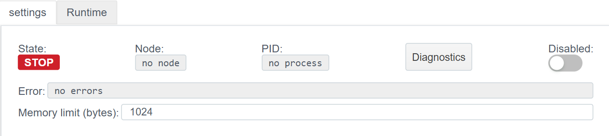
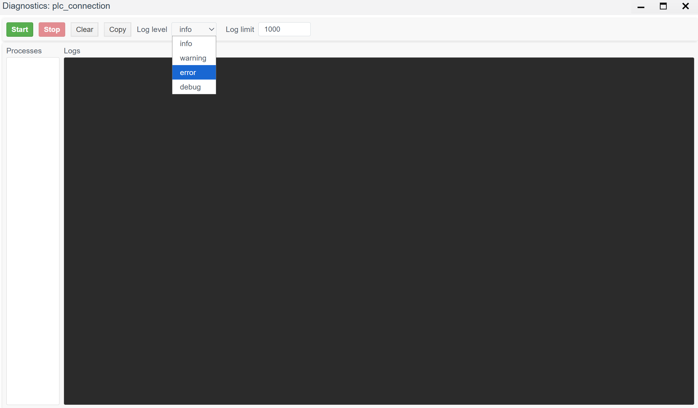
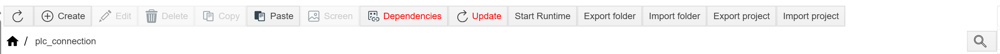
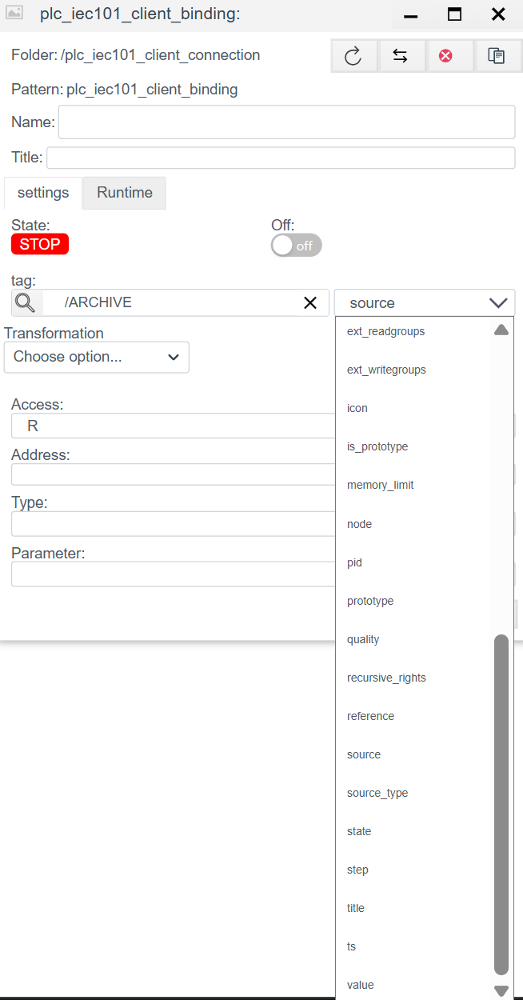
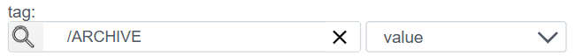

# PLC Connections

## Module Purpose

The **PLC Connections** module is designed for configuring and managing connections between **Faceplate Runtime** and external automation devices/systems:

- **PLC/RTU/IED** (controllers, terminals, relay protection)
- **Meters and gauges** (electric meters, heat meters, etc.)
- **OPC servers**
- Other sources of process data via industrial protocols

Via PLC connections, the system receives and/or sends:

- **Tags/signals** (AI/DI/DO/AO)
- **Events and alarms**
- **Service communication statuses**
- **Control commands** (if allowed by configuration)

---

## How PLC Connections Are Used

PLC connections are used for:

1. **Telemetry collection** Reading sensor values, states, measurements.

2. **Sending commands** Discrete control, setpoints, acknowledgments, etc.

3. **Integration with third-party systems** OPC DA/UA, gateways, SCADA systems, RTU concentrators.

4. **Availability monitoring** Communication channel diagnostics, connection statuses, exchange statistics.

---

# Client and Server Connections

## Client Connection

**Client connection** means that **Faceplate initiates the connection** to the remote side:

- Faceplate connects via IP/port (or via COM port) itself
- performs protocol exchange
- receives/transmits data

**Examples:**
- IEC-104 Client → connection to an RTU/protection relay server
- Modbus Client → device polling via TCP/RTU
- OPC UA Client → reading data from an OPC UA server

---

## Server Connection

**Server connection** means that **Faceplate listens for incoming connections** (accepts the connection as a server):

- an external device/system connects to Faceplate
- Faceplate serves incoming requests/sessions
- provides data or accepts commands

**Examples:**
- IEC-104 Server → upper-level SCADA connects to Faceplate
- OPC UA Server → clients read values from Faceplate

---

# Supported Types of PLC Connections

Listed below are the types available in the **/plc** folder.

## Client Connections (Supported)

- **plc_iec101_client_connection** → [IEC-101 Client](./plc_iec101_client_connection_ru.md)
- **plc_iec104_client_connection** → [IEC-104 Client](./plc_iec104_client_connection_ru.md)
- **plc_opcua_client_connection** → [OPC UA Client](./plc_opcua_client_connection_ru.md)

---

## Server Connections (Supported)

- **plc_iec101_server_connection** → [IEC-101 Server](./plc_iec101_server_connection_ru.md)
- **plc_iec104_server_connection** → [IEC-104 Server](./plc_iec104_server_connection_ru.md)
- **plc_opcua_server_connection** → [OPC UA Server](./plc_opcua_server_connection_ru.md)

---

## Other Connections (General Types)

- **plc_ethernet_ip_connection** → [EtherNet/IP](./plc_ethernet_ip_connection_ru.md)
- **plc_mbus_connection** → [M-Bus](./plc_mbus_connection_ru.md)
- **plc_modbus_connection** → [Modbus](./plc_modbus_connection_ru.md)
- **plc_opcda_connection** → [OPC DA](./plc_opcda_connection_ru.md)
- **plc_s7_connection** → [Siemens S7](./plc_s7_connection_ru.md)
- **plc_snmp_connection** → [SNMP](./plc_snmp_connection_ru.md)

---

# Creating a PLC Connection
> Identical for all PLC connections.
>
> An example for plc_iec101_client_connection is presented below.

*Step 1.* In the project tree, go to the directory where the PLC connection will be located.
*Step 2.* Click the **"Create"** button.
*Step 3.* In the object tree, open the **plc** section.
*Step 4.* Ensure the list of available connection types is displayed.

*Step 5.* Select the required connection type.
*Step 6.* Click the **"OK"** button.
*Step 7.* The connection configuration window will open.

---

## Diagnostics (Diagnostics)

The diagnostic tool is designed for debugging the connection, analyzing errors, and viewing system messages in real-time.

### Access to Diagnostics
After creating and starting the connection (when the driver status switches to **RUN**), the diagnostics button becomes available in the control panel.

Clicking this button opens the **Diagnostics: plc_connection** window.

### Diagnostics Window Interface

The diagnostics window allows tracking internal driver processes and filtering the message flow.

#### Controls

| Element | Description |
| :--- | :--- |
| **Start** | **Start monitoring.** Begins outputting logs to the console in real-time. |
| **Stop** | **Stop monitoring.** Pauses log updates (pause), allowing detailed examination of received messages. |
| **Clear** | Clears the console window of old messages. |
| **Copy** | Copies console content to the clipboard (useful for sending error reports). |
| **Log level** | **Log detail level.** Allows filtering messages by importance (see below). |
| **Log limit** | Limit on the number of lines stored in the window buffer (default is 1000). Old messages will be deleted upon overflow. |

#### Display Panels

1.  **Processes (left):** List of active Erlang processes serving this connection. Allows viewing the structure of internal driver processes.
2.  **Logs (right):** Main output field displaying event messages (connection, packet exchange, timeout errors, etc.).

### Log Levels

Selecting the level determines how detailed the information you see will be:

* **error:** Only critical errors affecting connection operation (e.g., broken connection, inability to open port).
* **warning:** Warnings (non-critical failures, retry attempts). Includes the *error* level.
* **info:** General operation information (status changes, successful connection). Includes *warning* and *error*.
* **debug:** Maximum detail. Displays service information, byte packets, and responses from the device. Recommended to be enabled only during commissioning, as it creates a heavy load.

# Creating a PLC Binding 

> Steps are identical for all PLC connections.

*Step 1.* After successfully creating a PLC connection, double-clicking LMB on the corresponding connection will open the connection settings window.
*Step 2.* Click the **"Create"** button.

*Step 3.* The PLC binding configuration window will open.
> Binding configurations for each connection
- **plc_iec101_client_binding** → [plc_iec101_client_bindings](./plc_iec101_client_connection_ru.md#шаг-2-настройка-переменных-binding))

*Step 4.* After configuring the binding, click the "save" button.

### Binding to a Tag (using archive as an example)
> Identical for all PLC bindings.
>
> An example for plc_iec101_client_connection is presented below.
 
**Step 1:** Click the magnifying glass icon in the **Tag** field.
> The project tree window will open. You can select an object manually or via search.

**Step 2:** Select the object to write to or read data from.
> Highlight the required object by clicking LMB (left mouse button), then click the **OK** button in the bottom right corner.

**Step 3:** After selecting the object, a dropdown list of fields (to the right of the object path) will become active.
> Select the required object field by clicking LMB.

**Result:**
The **Tag** field will specify the full path to the object and the selected field.

### Binding Error
After successfully creating bindings, in the project tree, the bindings will look like the figure below.

An error will be recorded in the Errors field; if there is no error, the **field** will be empty.
Errors can be:
1. unavailable address "numeric address"
2. shutdown
3. no connection