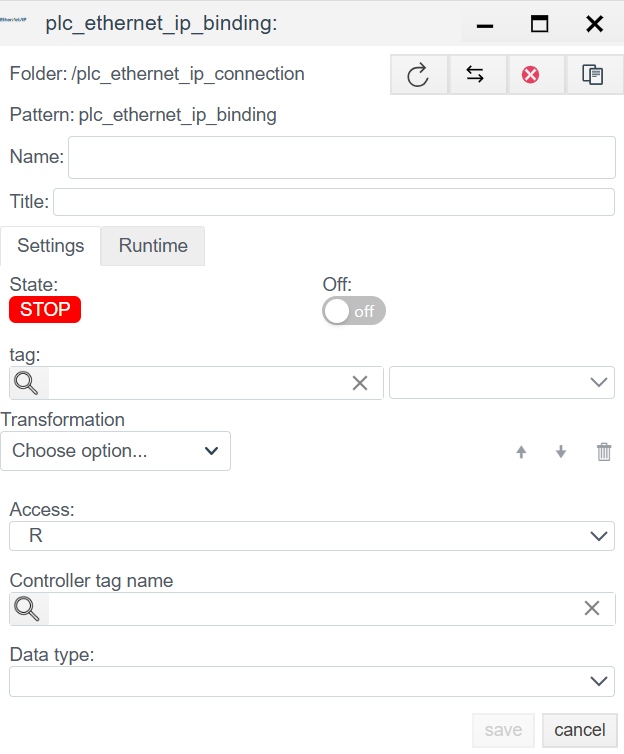

# Ethernet/IP Driver Configuration (Rockwell Automation)

## General Description
The **EtherNet/IP** (Industrial Protocol) is an industrial standard using the Common Industrial Protocol (CIP) over standard Ethernet.
In the **Faceplate** system, this driver is used for native integration with **Allen-Bradley (Rockwell Automation)** controllers and compatible devices.

### Supported Equipment
According to the driver configuration, the following controller families are supported:
* **ControlLogix / CompactLogix** (Tag-based addressing, CIP)
* **Micro800** (Micro820/850/870 Series)
* **MicroLogix** (PCCC addressing)
* **SLC 500** (Legacy, PCCC)
* **PLC-5** (Legacy, PCCC)
* **LogixPCCC** (Specific mode for Logix via PCCC)

The configuration process consists of two stages:
1.  **Connection (`plc_ethernet_ip_connection`):** Configuring the protocol network connection.
2.  **Binding (`plc_ethernet_ip_binding`):** Addressing specific information objects and configuring the binding.

---

## 1. Connection Configuration (Connection)

At this stage, a communication session with the controller is established.
> Create PLC connection → [Steps to create a PLC connection](./general_ru.md#создание-plc-соединения)

### 1.1 Diagnostics Panel
> PLC connection diagnostics → [Diagnostics](./general_ru.md#диагностика-diagnostics)

| Field | Description |
| :--- | :--- |
| **State** | **STOP** — driver is stopped. **RUN** — driver is running. |
| **Node** | Cluster node. Indicates on which node the process is running. |
| **PID** | Process ID. |
| **Error** | Error text (if any). |
| **Disabled** | Connection disable flag. Through this button, the user disables or enables the driver. |
| **Memory limit (bytes)** | Memory limit (RAM limits in bytes for the process serving the connection). Memory capacity determines the number of variables (tags) that can be processed. |
| **Actual connection** | Current active communication channel. In systems with Redundancy, indicates exactly which connection (primary or backup) is currently exchanging data. |
| **Master connection** | Link to the main communication channel. Filled for redundant connections. The field indicates which connection is the priority (Master), defining the logical pair for the redundancy mechanism. |

### 1.1 General Settings

| Parameter | Description |
| :--- | :--- |
| **Name** | Unique system name of the connection. |
| **Title** | Title (description) of this object. |
| **Period (ms)** | Polling period.  *Recommendation:* For Ethernet/IP usually 100-500 ms. CIP is a fast protocol, but do not overload EN2T modules. |
| **Shutdown timeout** | Timeout for correct TCP session termination (CIP Forward Close). |
| **Master connection** | Used for configuring Redundancy. Link to the main channel. |
| **Support for group requests** | **Yes** — enable optimization (Multi-Request packets). The driver will pack multiple reads into a single Ethernet frame. |

### 1.2 Controller Settings

This is a critically important section determining the addressing method.

| Field | Description and Analytics |
| :--- | :--- |
| **Controller Type** | Select the PLC family: • **ControlLogix:** Uses symbolic tag names. The most modern mode. • **MicroLogix / SLC / PLC5:** Use data file addressing (N7:0, F8:1). |
| **IP** | IP address of the communication module or processor. |
| **Routing** | *Optional.* CIP Path to access the processor if it is not in the same slot where Ethernet arrives, or in a different chassis. *Format:* Usually specified as a sequence of `Port,Address` pairs. *Example:* `1,0` (Backplane, Slot 0). Leave empty for CompactLogix (no chassis). |

---

## 2. Variable Configuration (Binding)

In the Ethernet/IP protocol (especially for ControlLogix), we access data by **Tag Name**, not by memory address.

> Create PLC binding → [Steps to create a PLC binding](./general_ru.md#создание-plc-привязки)

### 2.1 Binding Parameters

| Field | Description |
| :--- | :--- |
| **Name** | Name of the binding object in the system tree. |
| **Title** | Title (description) for this object. |
| **State** | **STOP** — binding is stopped. **RUN** — binding is running. |
| **Tag** | Faceplate system tag. The incoming value will be written to the selected field of the selected object. See [Binding to a tag](./general_ru.md#привязка-к-тегу-на-примере-архива) |
| **Access** | **R** (Read), **W** (Write), **RW** (Read/Write).|
| **Transformation** | Value transformation. See [Transformation](./transformation_ru.md). |

### 2.2 Target Data

| Field | Filling Instruction |
| :--- | :--- |
| **Controller tag name** | **Symbolic address in the PLC.** • For **ControlLogix:** Tag name as in Studio 5000. Example: `MyTag`, `Program:MainProg.Step`. • For **SLC/MicroLogix:** Element address. Example: `N7:0`, `F8:10`, `B3:0/5`. |
| **Data type** | Data type expected from the controller (BOOL, SINT, LREAL, USINT, INT, UINT, DINT, UDINT, LINT, LINT, ULINT, REAL). Must match the type declared in the PLC. |

> Error in PLC binding -> [binding error](./general_ru.md#ошибка-в-привязке)
---