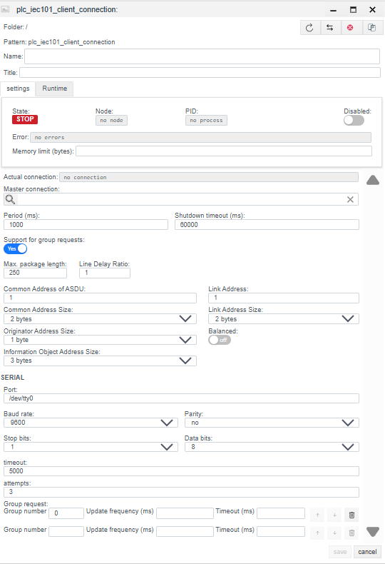
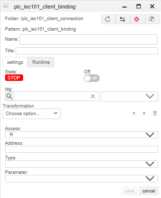

# IEC 60870-5-101 Client Configuration Guide

## General Description
The **IEC 101 Client** driver is designed for data exchange with telecontrol equipment (RTUs) via serial communication channels (RS-232, RS-485) using the **IEC 60870-5-101** protocol. Unlike IEC 104 (TCP/IP), this protocol is oriented towards low-bandwidth physical lines and requires precise link layer addressing configuration.

The configuration process consists of two stages:
1.  **Connection (`plc_iec101_client_connection`):** Configuring the COM port, Link Layer parameters, and addressing.
2.  **Binding (`plc_iec101_client_binding`):** Addressing specific Information Objects (IOA).

---

## STEP 1. Connection Configuration

At this stage, physical port parameters and IEC 101 specific protocol settings (address sizes, balance mode) are defined.

### 1.1 Diagnostics Panel (Runtime)
| Field | Description |
| :--- | :--- |
| **State** | **STOP** — driver is stopped. **RUN** — driver is running. |
| **Error** | Error text (e.g., `Timeout` or port open error). |
| **Actual connection** | Currently active channel (for redundancy). |

### 1.2 General Settings
| Parameter | Description |
| :--- | :--- |
| **Name** | Unique connection name. |
| **Period (ms)** | Base driver processing cycle. |
| **Shutdown timeout (ms)** | Time to wait for operations to complete during shutdown. |
| **Support for group requests** | **Yes** — enable support for General Interrogation. |
| **Max. package length** | Maximum packet size. Usually 250 bytes. |
| **Line Delay Ratio** | Line delay coefficient. |

### 1.3 Protocol Parameters (IEC 60870-5-101)
Critical settings that must match the RTU configuration.

| Field | Description |
| :--- | :--- |
| **Common Address of ASDU** | **Station Address (CA).** The logical address of the device (RTU). |
| **Common Address Size** | Size of the ASDU address field. Standard: **1** or **2** bytes. |
| **Originator Address Size** | Size of the originator address field. Usually **1** byte (sometimes 0). |
| **Information Object Address Size** | Size of the IOA field. Usually **2** or **3** bytes. |
| **Link Address** | **Link Layer Address.** Used for addressing the physical device on an RS-485 bus (in Unbalanced mode). Often matches the Common Address. |
| **Link Address Size** | Size of the link address field. Standard: **1** or **2** bytes (sometimes 0 for point-to-point). |
| **Balanced** | **Transmission Mode:** • **Off (Unbalanced):** Master-Slave mode. The server polls devices sequentially. (Standard for RS-485). • **On (Balanced):** Peer-to-Peer mode. Spontaneous transmission from both sides. (Common for RS-232, fiber optics, full duplex). |

### 1.4 Serial Port Settings (SERIAL)
| Field | Description |
| :--- | :--- |
| **Port** | Path to the COM port (Linux: `/dev/ttyS0`, Windows: `COM1`). |
| **Baud rate** | Transmission speed (e.g., `9600`). |
| **Parity** | Parity checking (None, Even, Odd). IEC 101 often requires `Even`. |
| **Stop bits** | Stop bits (1 or 2). |
| **Data bits** | Data bits (usually 8). |
| **Timeout** | Response timeout from the device. |
| **Attempts** | Number of retry attempts before an error. |

**Group request:** Configuration of General Interrogation frequency for groups (usually group 20).

---

## STEP 2. Variable Configuration (Binding)

### 2.1 Binding Parameters
| Field | Description |
| :--- | :--- |
| **Name** | Binding name. |
| **Tag** | Faceplate system tag. |
| **Transformation** | Value transformation. |
| **Access** | **R** (Read/Monitoring), **W** (Write/Command), **RW** (Read and Write). |
| **Address** | **IOA (Information Object Address).** Object address. Integer. |
| **Type** | **ASDU Type.** Data format. Examples: `1: M_SP_NA_1` (Single Point), `30: M_SP_TB_1` (Single Point + Time). |
| **Parameter** | Value attribute: `Value`, `Quality`, `Timestamp`. |

### IOA Calculation (If defined by Octets)
If the address in the map is defined by bytes (e.g., `10.2.0`), use the Little-Endian formula:
$$Address = Octet_1 + (Octet_2 \times 256) + (Octet_3 \times 65536)$$