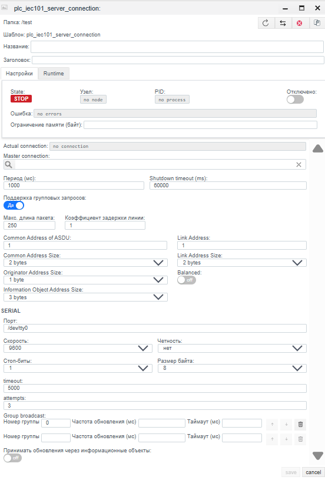
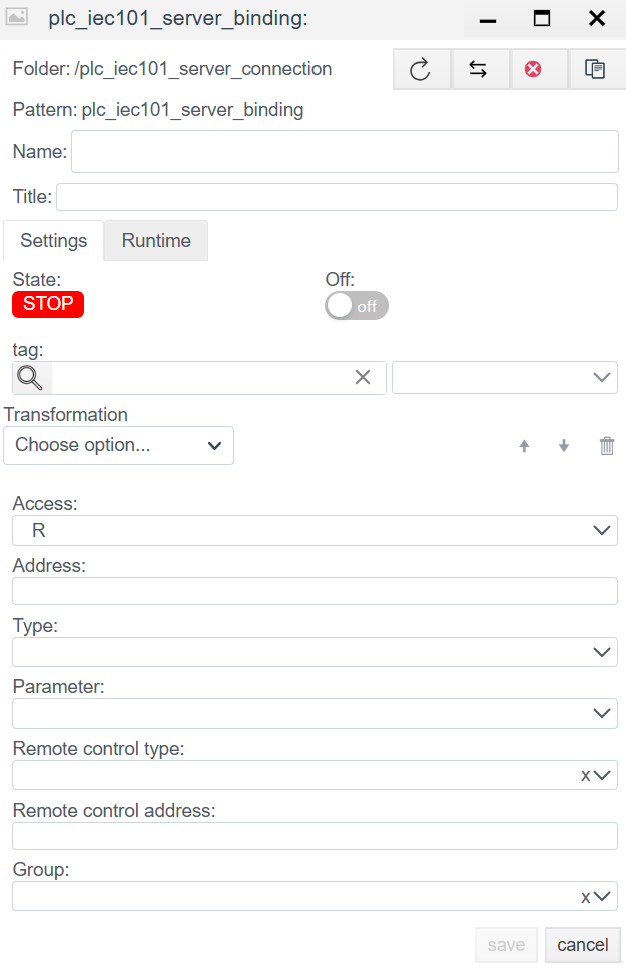
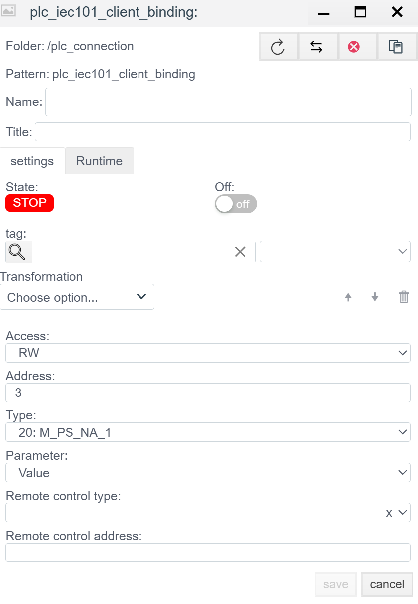

# IEC 60870-5-101 Server Configuration Guide

## General Description
The **IEC 101 Server** driver allows the **Faceplate** system to operate in Controlled Station (Slave) mode via serial interfaces (RS-232/485). In this mode, the system waits for requests from an external Control Center (Master), transmits data, and executes telecontrol commands.

The configuration process consists of two stages:
1.  **Connection (`plc_iec101_server_connection`):** Configuring the COM port, physical layer, and addressing parameters.
2.  **Binding (`plc_iec101_server_binding`):** Forming the address map (IOA) and configuring control parameters.

---

## 1. Connection Configuration (Connection)
> Create PLC connection → [Steps to create a PLC connection](./general_ru.md#создание-plc-соединения)

At this stage, port parameters and protocol logic are defined. They must strictly match the Master settings.

#### 1.1 Diagnostics Panel
> PLC connection diagnostics → [Diagnostics](./general_ru.md#диагностика-diagnostics)

| Field | Description |
| :--- | :--- |
| **State** | **STOP** — driver is stopped. **RUN** — driver is running. |
| **Node** | Cluster node. Indicates on which node the process is running. |
| **PID** | Process ID. |
| **Error** | Error text (if any). |
| **Disabled** | Connection disable flag. Through this button, the user disables or enables the driver. |
| **Memory limit (bytes)** | Memory limit (RAM limits in bytes for the process serving the connection). Memory capacity determines the number of variables (tags) that can be processed. |
| **Actual connection** | Current active communication channel. In systems with Redundancy, indicates exactly which connection (primary or backup) is currently exchanging data. |
| **Master connection** | Link to the main communication channel. Filled for redundant connections. The field indicates which connection is the priority (Master), defining the logical pair for the redundancy mechanism. |

### 1.2 General Settings (Settings)
| Parameter | Description |
| :--- | :--- |
| **Name** | Unique name of the connection. |
| **Title** | Title (description) of this object. |
| **Period (ms)** | Base driver processing cycle. |
| **Shutdown timeout (ms)** | Waiting time for operations to complete when stopping the driver. |
| **Support for group requests** *| **Yes** — enable support for General Interrogation. |
| **Max. package length** *| Maximum packet size. Usually 250 bytes. |
| **Line Delay Ratio** *| Line delay coefficient. |

> *Note:* For this connection type, the parameters "Support for group requests*", "Max. package length*", and "Line Delay Ratio*" are not used. It is recommended to leave these settings at default.

### 1.3 Protocol and Addressing Parameters
| Field | Description |
| :--- | :--- |
| **Common Address of ASDU** | **Station Address (CA).** Logical address of this device. |
| **Common Address Size** | Size of the ASDU address field (1 or 2 bytes). |
| **Originator Address Size** | Size of the originator address field (1 byte or 0). |
| **Information Object Address Size** | Size of the IOA field (2 or 3 bytes). |
| **Link Address** | **Link Layer Address.** Used in unbalanced mode for bus addressing. |
| **Link Address Size** | Size of the link address field (1 or 2 bytes). |
| **Balanced** | **Transmission Mode:** • **Off (Unbalanced):** Unbalanced (Master-Slave). Normal mode for RS-485. • **On (Balanced):** Balanced (Point-to-Point). Equal rights mode (usually RS-232). |

### 1.4 Port Settings (SERIAL)
| Field | Description |
| :--- | :--- |
| **Port** | Port name (e.g., `/dev/ttyUSB0` or `COM1`). |
| **Baud rate** | Transmission speed (9600, 19200, etc.). |
| **Parity** | Parity. In IEC 101, **Even** is the de facto standard. |
| **Stop bits** | Stop bits. |
| **Data bits** | Data bits (usually 8). |
| **Timeout** | Time to wait for a byte on the line. |
| **Attempts** | Number of retries (relevant for balanced mode). |

**Group broadcast:**
Allows configuring the periodic sending of specific data groups, even if the client did not explicitly request them.

**Managing the Group List:**
1.  **Adding a group:** Use the interface controls to create a new row.
2.  **Deleting a group:** Click the button with the trash bin icon (Delete) to the right of the corresponding row.
3.  **Order:** Use the **↑** and **↓** arrows to change the group polling priority.

**Group Parameters:**
| Field | Description |
| :--- | :--- |
| **Group number** | Unique number (ID) of the polling group. Used for internal identification and standard compliance. |
| **Update frequency (ms)** | Group polling period in milliseconds. Determines how often the driver will request data updates for tags included in this group. |
| **Timeout (ms)** | Waiting time for a response from the device for this group of requests. |
---

## 2. Variable Configuration (Binding)

> Create PLC binding → [Steps to create a PLC binding](./general_ru.md#создание-plc-привязки)

### 2.1 Binding Parameters
| Field | Description |
| :--- | :--- |
| **Name** | Name of the binding. |
| **Title** | Title (description) for this object. |
| **State** | **STOP** — binding is stopped. **RUN** — binding is running. |
| **Tag** | Faceplate system tag. The value will be written from the selected field of the selected object to the protocol. See [Binding to a tag](./general_ru.md#привязка-к-тегу-на-примере-архива) |
| **Transformation** | Value transformation. See [Transformation](./transformation_ru.md). |
| **Access** | **R** (Read), **W** (Write), **RW** (Read/Write). |
| **Address** | **IOA (Information Object Address).** Object address. Numeric value. |
| **Type** | **ASDU Type.** Data format. Examples: `1: M_SP_NA_1` (Single Point), `30: M_SP_TB_1` (Single Point + Time). More details at (https://support.kaspersky.com/kics-for-networks/3.0/206199) |
| **Parameter** | Value attribute: `Value`, `Quality` (DIQ/SIQ/QDS), `Timestamp` (TS). |

> Error in PLC binding -> [binding error](./general_ru.md#ошибка-в-привязке)

### 2.2 IOA Calculation (If defined by octets)
If the address in the memory map is defined by bytes (e.g., `10.2.0`), use the formula to convert it to a decimal number:
$$Address = Octet_1 + (Octet_2 \times 256) + (Octet_3 \times 256^2)$$

### 2.3 Write Parameters (When Access = RW / W)

These fields appear only if **RW** or **W** mode is selected.
*Note:* For telecontrol (TU) commands, using `Access: RW` is mandatory.

| Field | Description |
| :--- | :--- |
| **Remote control type** | **Command Type (Command TypeID).** ASDU type for sending the command. Examples: • `45: C_SC_NA_1` (Single Command) • `46: C_DC_NA_1` (Double Command) • `50: C_SE_NC_1` (Set Point Float) |
| **Remote control address** | **Command IOA.** Object address for writing. Often matches the read address (`Address`), but sometimes they are separated (e.g., reading switch status via IOA 100, but controlling it via IOA 2100). |

---