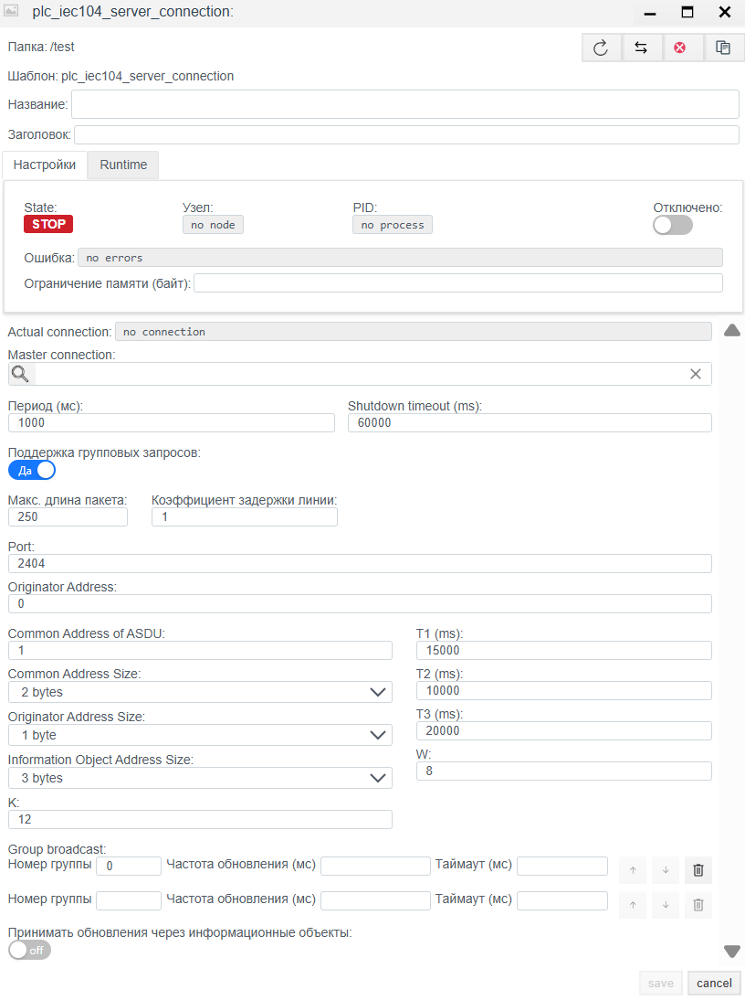

# IEC 60870-5-104 Server Configuration Guide

## General Description
The **IEC 104 Server** driver allows the **Faceplate** system to act as a Controlled Station (Slave). In this mode, the system opens a TCP port and waits for connections from external control systems (Upper-level SCADA, Control Centers), transmitting data from its internal tags to them and accepting control commands.

The configuration process consists of two stages:
1.  **Connection (`plc_iec104_server_connection`):** Configuring the TCP port, ASDU addressing, and protocol timing parameters.
2.  **Binding (`plc_iec104_server_binding`):** Publishing specific tags to the protocol address space (IOA) and configuring parameters for receiving commands.

---

## 1. Connection Configuration (Connection)
> Create PLC connection → [Steps to create a PLC connection](./general_ru.md#создание-plc-соединения)
> 
At this stage, the "listening" socket and link layer parameters are configured. These settings must match the settings of the Client (Master) that will connect to Faceplate.

### 1.1 Diagnostics Panel
The upper part of the window displays the driver status.
> PLC connection diagnostics → [Diagnostics](./general_ru.md#диагностика-diagnostics)

| Field | Description |
| :--- | :--- |
| **State** | **STOP** — driver is stopped. **RUN** — driver is running. |
| **Node** | Cluster node. Indicates on which node the process is running. |
| **PID** | Process ID. |
| **Error** | Error text. |
| **Disabled** | |
| **Memory limit (bytes)** | Memory limit (RAM limits (MB) for the process serving the connection). Memory capacity determines the number of variables (tags) that can be processed during the connection operation. |
| **Actual connection** | Current active communication channel. In systems with Redundancy, indicates exactly which connection (primary or backup) is currently exchanging data. |
| **Master connection** | Link to the main communication channel. Filled for redundant connections. The field indicates which connection is the priority (Master), defining the logical pair for the redundancy mechanism. |

## 1.2 General Settings (Settings)

| Parameter | Description |
| :--- | :--- |
| **Name** | Unique name of the connection. |
| **Title** | Title (description) of this object. |
| **Period (ms)** | Base driver processing cycle. |
| **Shutdown timeout (ms)** | Waiting time for correct connection termination. |
| **Support for group requests** | **Yes** — enable the possibility of periodic General Interrogation. |
| **Max. package length** | Maximum APDU size. Standard is 250 bytes. |
| **Line Delay Ratio** | Delay coefficient for slow communication lines. |

### 1.3 Protocol Parameters (IEC 60870-5-104 server)

| Field | Description |
| :--- | :--- |
| **Port** | TCP port for incoming connections. IANA Standard: **2404**. |
| **Originator Address** | Originator address that the server will substitute in its responses by default (usually 0). |
| **Common Address of ASDU** | **Station Address (CA).** Unique number of this device in the IEC 104 network. Must match Client settings. |
| **Common Address Size** | Size of the ASDU address field in bytes. Standard: **2 bytes**. |
| **Originator Address Size** | Size of the originator address field. Standard: **1 byte** (sometimes 0). |
| **Information Object Address Size** | Size of the object address field (IOA). Standard: **3 bytes**. |
| **K** | Parameter **k** (APDU transmit window). Maximum number of transmitted packets without confirmation. |
| **W** | Parameter **w** (APDU receive window). Maximum number of received packets before sending a confirmation. |
| **T1 (ms)** | Time-out for send confirmation. |
| **T2 (ms)** | Time-out for ack in case of no data message. |
| **T3 (ms)** | Time-out for send test frames. Interval for sending `TESTFR` if the channel is idle. |

**Group broadcast:**
Allows configuring the periodic sending of specific data groups, even if the client did not explicitly request them.

**Managing the Group List:**
1.  **Adding a group:** Use the interface controls to create a new row.
2.  **Deleting a group:** Click the button with the trash bin icon (Delete) to the right of the corresponding row.
3.  **Order:** Use the **↑** and **↓** arrows to change the group polling priority.

**Group Parameters:**
| Field | Description |
| :--- | :--- |
| **Group number** | Unique number (ID) of the polling group. Used for internal identification and standard compliance. |
| **Update frequency (ms)** | Group polling period in milliseconds. Determines how often the driver will request data updates for tags included in this group. |
| **Timeout (ms)** | Waiting time for a response from the device for this group of requests. |
---

## 2. Variable Configuration (Binding)

This stage defines the list of signals that the server will provide to the "upper level".

> Create PLC binding → [Steps to create a PLC binding](./general_ru.md#создание-plc-привязки)
> 
### 2.1 Binding Parameters
| Field | Description |
| :--- | :--- |
| **Name** | Name of the binding. |
| **Title** | Title (description) for this object. |
| **State** | **STOP** — binding is stopped. **RUN** — binding is running. |
| **Tag** | Faceplate system tag. The value will be written from the selected field of the selected object to the protocol. See [Binding to a tag](./general_ru.md#привязка-к-тегу-на-примере-архива) |
| **Transformation** | Value transformation. See [Transformation](./transformation_ru.md). |
| **Access** | **R** (Read), **W** (Write), **RW** (Read/Write). |
| **Address** | **IOA (Information Object Address).** Object address. Numeric value. |
| **Type** | **ASDU Type.** Data format. Examples: `1: M_SP_NA_1` (Single Point), `30: M_SP_TB_1` (Single Point + Time). More details at (https://support.kaspersky.com/kics-for-networks/3.0/206199) |
| **Parameter** | Value attribute: `Value`, `Quality` (DIQ/SIQ/QDS), `Timestamp` (TS). |

> Error in PLC binding -> [binding error](./general_ru.md#ошибка-в-привязке)

### 2.2 IOA Calculation (If defined by octets)
If the address in the memory map is defined by bytes (e.g., `10.2.0`), use the formula to convert it to a decimal number:
$$Address = Octet_1 + (Octet_2 \times 256) + (Octet_3 \times 256^2)$$

### 2.3 Remote Control Parameters
These fields become active and mandatory if `Access` is set to **RW**. They determine how the server should process incoming commands.

| Field | Description |
| :--- | :--- |
| **Remote control type** | **Command Type.** The ASDU type the server expects to receive from the client to act on this object. Examples: `C_SC_NA_1` (Single Command), `C_SE_NC_1` (Setpoint Float). |
| **Remote control address** | **Command IOA.** The address to which the client must send the control command. Often matches the monitoring address (`Address`), but can differ. |
| **Group** | The number of the Interrogation Group this signal belongs to (usually 20 — General Interrogation). |

---