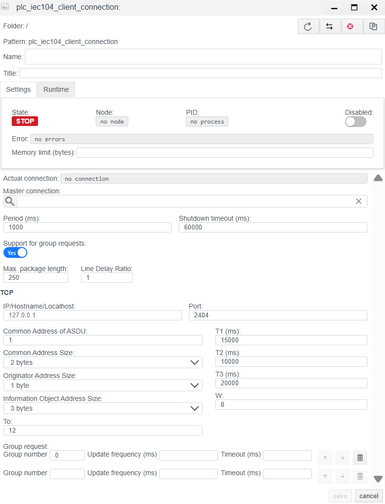
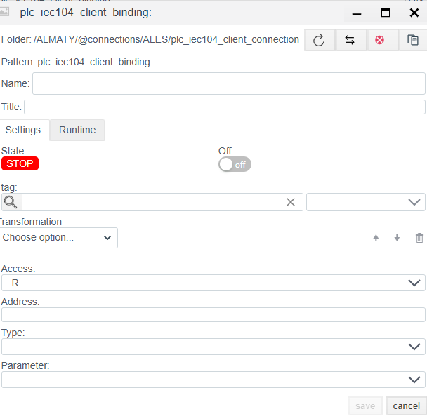

# IEC 60870-5-104 Client Configuration Guide

## General Description
The **IEC 104 Client** driver is designed for data exchange with telecontrol equipment (RTUs, substation controllers, protection relays) via the **IEC 60870-5-104** protocol over TCP/IP networks.

The configuration process consists of two stages:
1.  **Connection (`plc_iec104_client_connection`):** Configuring the network connection, ASDU parameters, and protocol timings.
2.  **Binding (`plc_iec104_client_binding`):** Addressing specific Information Objects (IOA) and configuring telecontrol commands.

---

## STEP 1. Connection Configuration

This stage defines physical connection parameters and link layer settings.

### 1.1 Diagnostics Panel (Runtime)
The upper part of the window displays the driver status.

| Field | Description |
| :--- | :--- |
| **State** | **STOP** — driver is stopped. **RUN** — driver is running. |
| **Error** | Communication error text (e.g., `Socket error` or `DT timeout`). |
| **Actual connection** | The currently active channel (when using redundancy). |

### 1.2 Main Settings

| Parameter | Description |
| :--- | :--- |
| **Name** | Unique connection name. |
| **Period (ms)** | Base driver processing cycle. |
| **Shutdown timeout (ms)** | Time to wait for a graceful disconnection. |
| **Support for group requests** | **Yes** — enable the ability to perform periodic General Interrogations. |
| **Max. package length** | Maximum APDU size. Standard is 250 bytes. |
| **Line Delay Ratio** | Delay coefficient for slow communication lines. |

### 1.3 Protocol Settings (TCP & Layer Parameters)

These parameters must strictly match the settings in the slave device (RTU).

| Field | Description |
| :--- | :--- |
| **IP/Hostname** | IP address of the slave device (Slave/Server). |
| **Port** | TCP port. |
| **Common Address of ASDU** | Station Address (CA). Unique device identifier on the bus. |
| **Common Address Size** | Size of the ASDU address field (usually **2** bytes). |
| **Originator Address Size** | Size of the originator address field (usually **1** byte, sometimes 0). |
| **Information Object Address Size** | Size of the Information Object Address (IOA) field. Standard: **3** bytes. |
| **To** | TCP connection establishment timeout (t0). |
| **T1 (ms)** | Timeout for verification of sent APDUs (t1). |
| **T2 (ms)** | Timeout for unacknowledged received APDUs (t2) in case of no data traffic. |
| **T3 (ms)** | Test frame timeout (t3). If the channel is idle for this time, a `TESTFR` frame is sent. |
| **W** | Transmission window size (w). The number of unacknowledged APDUs that can be received before sending an acknowledgment. |

**Group request:**
The section at the bottom allows configuring the periodicity of the "General Interrogation" for specific groups.
* **Group number:** Interrogation group number (usually 20 for Global Interrogation).
* **Update frequency (ms):** Polling period.
* **Timeout (ms):** Timeout for the interrogation process.

---

## STEP 2. Variable Configuration (Binding)

Configuring the binding for a specific Monitoring (TS) or Measurement (TM) signal.

### 2.1 General Parameters
| Field | Description |
| :--- | :--- |
| **Name** | Binding object name. |
| **Tag** | Faceplate system tag. |
| **Transformation** | Value transformation (e.g., scaling). |
| **Access** | Access mode: • **R** — Read Only (Monitoring). • **W** — Write Only. • **RW** — Read and Write (Telecontrol). |
| **Address** | **IOA (Information Object Address).** The address of the information object (Full Address). Integer (e.g., `100`). See the address calculation section below. |
| **Type** | **ASDU Type (TypeID).** Data type expected from the device. Examples: • `1: M_SP_NA_1` (Single Point) • `30: M_SP_TB_1` (Single Point with CP56 time tag) • `13: M_ME_NC_1` (Measured value, float) • `36: M_ME_TF_1` (Measured value, float with time tag) |
| **Parameter** | The value attribute to extract: `Value`, `Quality` (Signal Quality: QDS/SIQ), `Timestamp` (Time tag). |

### IOA Address Calculation

The standard IOA size is **3 bytes**. If your device documentation splits the IOA into octets, you must convert it to a decimal format using the **Little-Endian** byte order.

**Formula:**
$$Address = Octet_1 + (Octet_2 \times 256) + (Octet_3 \times 65536)$$

**Example:** Address in map `10.2.0` (HEX: `0A 02 00`).
$$10 + (2 \times 256) + (0 \times 65536) = 10 + 512 = \mathbf{522}$$
Enter **522** in the **Address** field.

### 2.2 Telecontrol & Write Parameters (When Access = RW / W)

These fields appear only if the **RW** or **W** mode is selected.
*Note:* For telecontrol commands (TU), using `Access: RW` is mandatory.

| Field | Description |
| :--- | :--- |
| **Remote control type** | **Command TypeID.** ASDU type used for sending the command. Examples: • `45: C_SC_NA_1` (Single Command) • `46: C_DC_NA_1` (Double Command) • `50: C_SE_NC_1` (Set Point Float) |
| **Remote control address** | **Command IOA.** The object address for writing. Often matches the reading `Address`, but in some address maps they are separated (e.g., read status at IOA 100, control command at IOA 2100). |

---