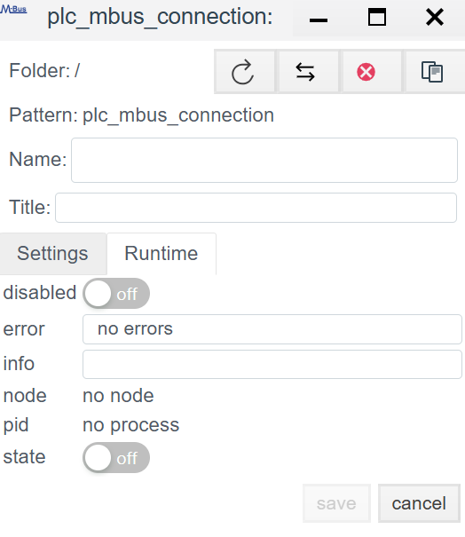
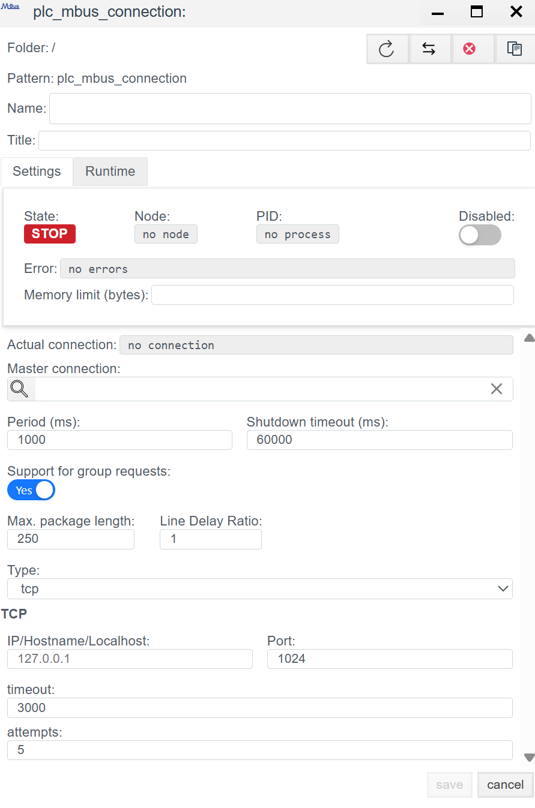

# M‑Bus (Meter‑Bus) Driver Configuration Guide

## Overview
**M‑Bus (Meter‑Bus)** is a specialized European standard (EN 13757) for remote data reading from commercial metering devices: heat meters, water meters, gas meters, and electricity meters.

In **Faceplate**, the M‑Bus driver is hybrid and supports two physical layers:
1. **Serial (COM):** Direct connection to the server via a master level converter (M‑Bus <-> RS‑232/485).
2. **TCP (Ethernet):** Connection via remote gateways (Ethernet‑to‑M‑Bus) or transparent converters.

The configuration architecture has two steps:
1. **Connection (`plc_mbus_connection`):** Transport setup to the bus.
2. **Binding (`plc_mbus_binding`):** Polling a specific variable inside the device.

---

## STEP 1. Connection setup (Connection)

At this stage you configure the master device that polls the bus.

### 1.1 Diagnostics and control (Runtime)
*Panel for real‑time driver monitoring.*

| Field | Description |
| :--- | :--- |
| **State** | **STOP** (Red) — polling stopped. **RUN** (Green) — driver running. |
| **Error** | Last error text (e.g., `Timeout` or `Checksum error`). |
| **Actual connection** | In redundancy mode shows which channel is active (Master or Backup). |

### 1.2 General settings

| Parameter | System analyst recommendations |
| :--- | :--- |
| **Name** | Unique connection name in the system. |
| **Period (ms)** | Bus polling interval.  ⚠️ **Important:** M‑Bus is a slow protocol (typically 2400 baud). Do not set the period below **60000 ms** (1 minute), especially for battery‑powered meters, to avoid premature battery drain. |
| **Type** | Mode switch: `serial` or `tcp`. |

---

### 1.3 Physical layer setup (depends on Type)

#### Option A: `serial` mode (Direct connection)
Used when the hardware M‑Bus converter is connected directly to the server COM port.

| Field | Description |
| :--- | :--- |
| **Port** | System port name (Linux: `/dev/ttyUSB0`, Windows: `COM1`). |
| **Baud rate** | Communication speed.  *Typical:* **2400** (less often 9600). Must match device settings. |
| **Parity** | Parity.  *Typical:* **Even**. Screenshot shows `no`, but most heat meters require `Even`. |
| **Data / Stop bits** | Usually 8 data bits and 1 stop bit. |
| **Timeout** | Response timeout. For M‑Bus use a safe margin (3000–5000 ms). |

#### Option B: `tcp` mode (Network gateway)
Used when the M‑Bus is remote and connected via an Ethernet converter.

| Field | Description |
| :--- | :--- |
| **IP/Hostname** | Gateway IP address/hostname. |
| **Port** | TCP port (commonly `502`, `1001`, or `8000` — see gateway documentation). |
| **Timeout** | Consider network latency + bus slowness. |

> **Action:** Click **Save**, then double‑click the created connection to add bindings.

---

## STEP 2. Variable setup (Binding)

A key feature of M‑Bus: the device returns **all** information in one large packet. A Binding “extracts” the required value from that packet.

### 2.1 Binding parameters

| Field | Description |
| :--- | :--- |
| **Name** | Binding object name. |
| **Tag** | System tag to store the value. |
| **Access** | **R** — Read Only. **W** — Write (rare in M‑Bus). |
| **Address** | **Primary Address.** A number from 1 to 250. Unique meter address on the bus. |
| **Telegram** | Telegram number. For most simple devices = `0` (used if data does not fit in a single packet). |
| **Index** | **Data index in the packet.** The most difficult parameter.  This is the ordinal number of the variable in the M‑Bus response structure.  *Example:* If the meter sends: [Time, Energy, Flow, Temperature], then Energy Index = `1` (or `0` depending on driver implementation — start with 0). |

---

<!-- ## Additional notes

1. **Physical layer (90% of issues):**
   - Typical settings for many meters (Danfoss, Kamstrup, Techem): **2400 baud, 8E1 (Even parity)**.
   - Ensure the `Serial` section matches this. The screenshots show `9600 8N1` — common for Modbus, rarely for M‑Bus.
2. **Finding the correct Index:**
   - The driver does not show variable names in the packet (“Energy”, “Volume”); it only sees a data stream.
   - *Tip:* Use a third‑party utility (e.g., M‑Bus Sheet or vendor software) to read the full packet, identify the target parameter position, and put that number into `Index`.
3. **Address collisions:**
   - A common problem is two devices with factory address `0` or `1` on the same bus. Connect devices one by one and change addresses before assembling the full bus. -->
