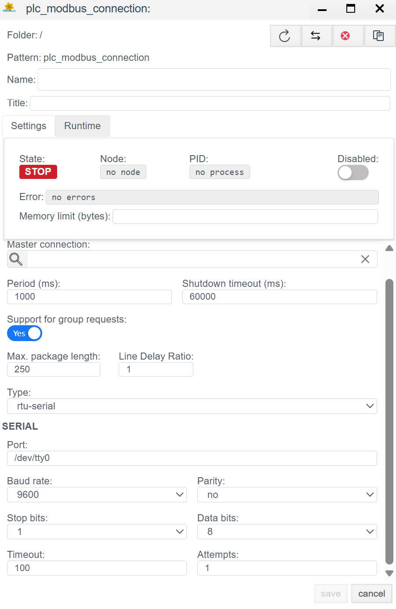

# Modbus (TCP/RTU) Configuration Guide

## General Description
**Modbus** is the de facto standard for industrial automation. The **Faceplate** system implements a universal driver supporting three operation modes, allowing polling of both modern controllers and legacy equipment or sensors via gateways.

Supported modes (`Type`):
1.  **tcp:** Classic Modbus TCP (Ethernet).
2.  **rtu-serial:** Modbus RTU via a physical COM port (RS-485/232).
3.  **rtu-tcp:** Modbus RTU encapsulated in a TCP packet (Modbus-over-TCP). Used for working with transparent gateways (Moxa, HF, etc.).

The configuration process consists of two stages:
1.  **Connection (`plc_modbus_connection`):** Configuring the transport.
2.  **Binding (`plc_modbus_binding`):** Addressing registers.

---

## 1. Connection Configuration (Connection)
> Create PLC connection → [Steps to create a PLC connection](./general_ru.md#создание-plc-соединения)
At this stage, we select the physical connection type.

### 1.1 Diagnostics Panel
> PLC connection diagnostics → [Diagnostics](./general_ru.md#диагностика-diagnostics)

| Field | Description |
| :--- | :--- |
| **State** | **STOP** — driver is stopped. **RUN** — driver is running. |
| **Node** | Cluster node. Indicates on which node the process is running. |
| **PID** | Process ID. |
| **Error** | Error text (if any). |
| **Disabled** | Connection disable flag. Through this button, the user disables or enables the driver. |
| **Memory limit (bytes)** | Memory limit (RAM limits in bytes for the process serving the connection). Memory capacity determines the number of variables (tags) that can be processed. |
| **Actual connection** | Current active communication channel. In systems with Redundancy, indicates exactly which connection (primary or backup) is currently exchanging data. |
| **Master connection** | Link to the main communication channel. Filled for redundant connections. The field indicates which connection is the priority (Master), defining the logical pair for the redundancy mechanism. |

### 1.2 General Settings (Settings)
| Parameter | Description |
| :--- | :--- |
| **Name** | Unique name of the connection. |
| **Title** | Title (description) of this object. |
| **Period (ms)** | Base driver processing cycle. |
| **Shutdown timeout (ms)** | Waiting time for operations to complete when stopping the driver. |
| **Support for group requests** *| **Yes** — enable support for General Interrogation. |
| **Max. package length** *| Maximum packet size. Usually 250 bytes. |
| **Line Delay Ratio** *| Line delay coefficient. |

### 1.3 Transport Type Selection
First, determine the connection type in the **Type** field.

#### 1.3.1 `tcp` Mode (Ethernet)
Used for communication with PLCs or I/O modules that have an Ethernet port and support the Modbus TCP stack.

| Field | Description |
| :--- | :--- |
| **IP/Hostname** | Device IP address (e.g., `192.168.1.10`). |
| **Port** | Standard Modbus TCP port — **502**. |
| **Timeout** | Server response waiting time (in ms). |
| **Attempts** | Number of retry attempts before a communication error. |

#### 1.3.2 `rtu-serial` Mode (RS-485/232)
Used for direct connection of a daisy-chain of devices to the server's COM port.

| Field | Description |
| :--- | :--- |
| **Port** | Path to the port (Linux: `/dev/ttyUSB0`, Windows: `COM1`). |
| **Baud rate** | Speed. Must strictly match on all devices on the line (9600, 19200, etc.). |
| **Parity** | Parity (`no`, `even`, `odd`). |
| **Stop bits / Data bits** | Usually `1` and `8`. |
| **Line Delay Ratio** | Line delay coefficient. Increase if the line is long and "noisy". |

> **Note:** The **rtu-tcp** mode is configured similarly to the TCP mode (requires IP and Port), but the packet structure inside will be like RTU (with CRC checksum).

---

## 2. Variable Configuration (Binding)

Here we bind a specific Modbus register to a system tag.

> Create PLC binding → [Steps to create a PLC binding](./general_ru.md#создание-plc-привязки)

### 2.1 Binding Parameters
| Field | Description |
| :--- | :--- |
| **Name** | Name of the binding. |
| **Title** | Title (description) for this object. |
| **State** | **STOP** — binding is stopped. **RUN** — binding is running. |
| **Tag** | Faceplate system tag. The incoming value will be written to the selected field of the selected object. See [Binding to a tag](./general_ru.md#привязка-к-тегу-на-примере-архива) |
| **Transformation** | Value transformation. See [Transformation](./transformation_ru.md). |
| **Access** | **R** (Read), **W** (Write), **RW** (Read/Write). |

### 2.2 Addressing

| Field | Description |
| :--- | :--- |
| **Slave address** | Device address (Unit ID). In TCP usually `1` (or `255`), in Serial — from `1` to `247`. |
| **Memory area** | Modbus memory type: • **HR** (Holding Registers) — 4xxxx, read/write. • **IR** (Input Registers) — 3xxxx, read only. • **CS** (Coils) — 0xxxx, bit read/write. • **IS** (Discrete Inputs) — 1xxxx, bit read only. |
| **Address** | Register address offset.  *Attention:* In some address maps, numbering starts from 1, in the driver usually from 0. If data is "shifted", try +/- 1. |
| **Read / Write** | Modbus function codes. Usually set automatically when selecting Memory Area (e.g., Read `03`, Write `10` or `06`). |

### 2.3 Data Handling

| Field | Description |
| :--- | :--- |
| **The size** | Data size (Word = 16 bits, DWord = 32 bits, etc.). |
| **Format** | Data interpretation: `signed-integer` (signed), `unsigned`, `float` (floating point). |
| **Byte order** | **Byte order.** Critically important setting. • `21` — Big Endian (standard). • `12` — Little Endian. • `2143` / `3412` — Various Swap options for 32-bit numbers. Selected experimentally if the number is displayed incorrectly. |
| **Check CRC** | Forced checksum check (usually `Yes`). |

---