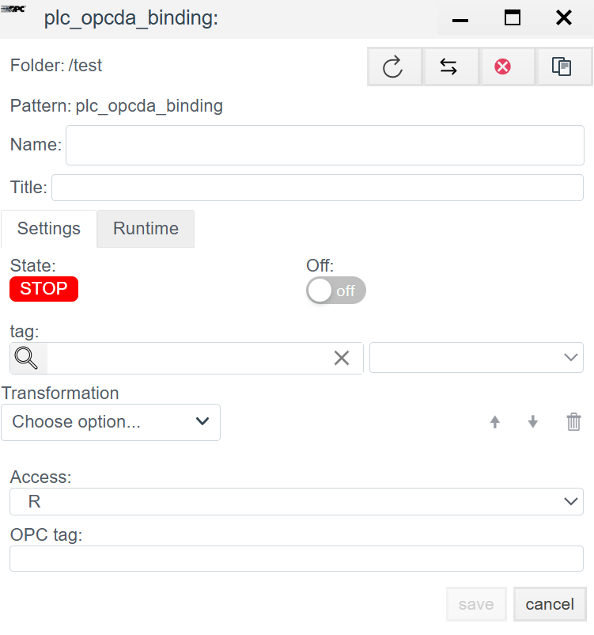

# OPC DA (Classic) Configuration Guide

## General Description
**OPC DA (Data Access)** is a classic data exchange standard in industrial automation based on Microsoft DCOM technology. In the **Faceplate** system, this driver allows connecting to any external OPC servers (e.g., Kepware, Matrikon, Lectus) and reading data from them.

> **Important:** Since OPC DA is based on DCOM, successful connection often requires configuring Windows access rights and DCOM permissions on both sides (Client and Server).

The configuration process consists of two stages:
1.  **Connection (`plc_opcda_connection`):** Configuring the connection to the OPC server.
2.  **Binding (`plc_opcda_binding`):** Subscribing to specific tags.

---

## 1. Connection Configuration (Connection)
> Create PLC connection → [Steps to create a PLC connection](./general_ru.md#создание-plc-соединения)

At this stage, we specify where the OPC server is located and what it is called.

### 1.1 Diagnostics Panel
> PLC connection diagnostics → [Diagnostics](./general_ru.md#диагностика-diagnostics)

| Field | Description |
| :--- | :--- |
| **State** | **STOP** — driver is stopped. **RUN** — driver is running. |
| **Node** | Cluster node. Indicates on which node the process is running. |
| **PID** | Process ID. |
| **Error** | Error text (if any). |
| **Disabled** | Connection disable flag. Through this button, the user disables or enables the driver. |
| **Memory limit (bytes)** | Memory limit (RAM limits in bytes for the process serving the connection). Memory capacity determines the number of variables (tags) that can be processed. |
| **Actual connection** | Current active communication channel. In systems with Redundancy, indicates exactly which connection (primary or backup) is currently exchanging data. |
| **Master connection** | Link to the main communication channel. Filled for redundant connections. The field indicates which connection is the priority (Master), defining the logical pair for the redundancy mechanism. |

### 1.2 General Settings (Settings)

#### Main Parameters
| Parameter | Description |
| :--- | :--- |
| **Name** | Unique name of the connection. |
| **Title** | Title (description) of this object. |
| **Period (ms)** | Base driver processing cycle. |
| **Shutdown timeout (ms)** | Waiting time for operations to complete when stopping the driver. |
| **Support for group requests** *| **Yes** — enable support for General Interrogation. |
| **Max. package length** *| Maximum packet size. Usually 250 bytes. |
| **Line Delay Ratio** *| Line delay coefficient. |

#### 1.3 Protocol Parameters (OPC DA)

Unlike other drivers, here the network settings point to the host where the OPC Server is running.

| Field | Description |
| :--- | :--- |
| **IP/Hostname/Localhost** | Network address of the computer where the OPC server is installed. *Example:* `192.168.1.5` or `localhost` (if the server is on the same machine). |
| **Port** | **8100** (or another port if tunneling is used).  *Note:* In classic OPC DA, the TCP port is not rigidly defined (it works via DCOM/RPC, port 135), but in this driver, this field can be used for specific OPC tunnels or internal proxies. |
| **ServerID** | **OPC Server ProgID.** This is the most important field. It precisely identifies the server's software component in the Windows registry. *Examples:* `Kepware.KEPServerEX.V6`, `Matrikon.OPC.Simulation.1`, `ICONICS.SimulatorOPCDA.2`. |

---

## 2. Variable Configuration (Binding)

In OPC DA, addressing occurs by tag name (Item ID).

> Create PLC binding → [Steps to create a PLC binding](./general_ru.md#создание-plc-привязки)
> 
### 2.1 Binding Parameters
| Field | Description |
| :--- | :--- |
| **Name** | Name of the binding. |
| **Title** | Title (description) for this object. |
| **State** | **STOP** — binding is stopped. **RUN** — binding is running. |
| **Tag** | Faceplate system tag. The incoming value will be written to the selected field of the selected object. See [Binding to a tag](./general_ru.md#привязка-к-тегу-на-примере-архива) |
| **Transformation** | Value transformation. See [Transformation](./transformation_ru.md). |
| **Access** | **R** — Read, **W** — Write, **RW** — Read and Write. |

### 2.2 Addressing (OPC Tag)

| Field | Instruction |
| :--- | :--- |
| **OPC tag** | **Item ID.** Full path to the tag in the OPC server address space. *Examples:* • `Channel1.Device1.Tag1` • `Simulation.Ramp` • `Bucket Brigade.Int4` |

> Error in PLC binding -> [binding error](./general_ru.md#ошибка-в-привязке)

---