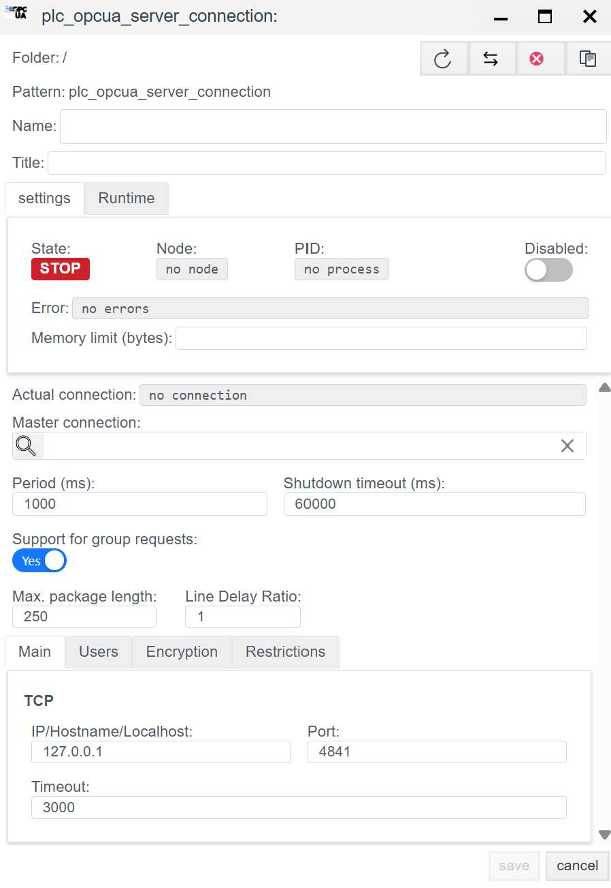
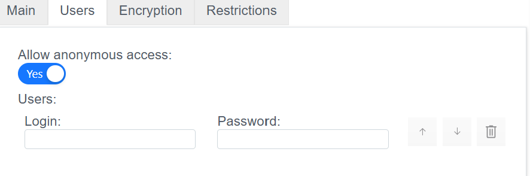
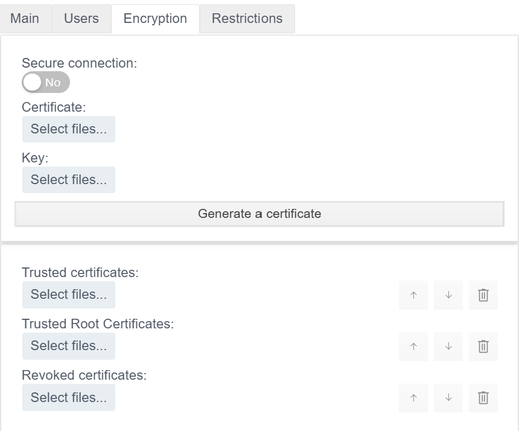

# OPC UA Server Configuration Guide

## General Description
The **OPC UA Server** driver allows the **Faceplate** system to act as an OPC UA server. This means that the system publishes its internal tags to an external network, allowing third-party clients (SCADA, MES, ERP, UaExpert) to connect, read, and write data via the `opc.tcp` protocol.

The configuration process consists of two stages:
1.  **Connection (`plc_opcua_server_connection`):** Configuring the network interface (Endpoint) and server parameters.
2.  **Binding (`plc_opcua_server_binding`):** Publishing specific tags to the server address space.

---

## 1. Connection Configuration (Connection)
> Create PLC connection → [Steps to create a PLC connection](./general_ru.md#создание-plc-соединения)

At this stage, the port and interface where the server will await incoming connections are defined.

### 1.1 Diagnostics Panel
> PLC connection diagnostics → [Diagnostics](./general_ru.md#диагностика-diagnostics)

| Field | Description |
| :--- | :--- |
| **State** | **STOP** — driver is stopped. **RUN** — driver is running. |
| **Node** | Cluster node. Indicates on which node the process is running. |
| **PID** | Process ID. |
| **Error** | Error text (if any). |
| **Disabled** | Connection disable flag. Through this button, the user disables or enables the driver. |
| **Memory limit (bytes)** | Memory limit (RAM limits in bytes for the process serving the connection). Memory capacity determines the number of variables (tags) that can be processed. |
| **Actual connection** | Current active communication channel. In systems with Redundancy, indicates exactly which connection (primary or backup) is currently exchanging data. |
| **Master connection** | Link to the main communication channel. Filled for redundant connections. The field indicates which connection is the priority (Master), defining the logical pair for the redundancy mechanism. |

### 1.2 General Settings (Settings)
| Parameter | Description |
| :--- | :--- |
| **Name** | Unique name of the connection. |
| **Title** | Title (description) of this object. |
| **Period (ms)** | Base driver processing cycle. |
| **Shutdown timeout (ms)** | Waiting time for operations to complete when stopping the driver. |
| **Support for group requests** *| **Yes** — enable support for General Interrogation. |
| **Max. package length** *| Maximum packet size. Usually 250 bytes. |
| **Line Delay Ratio** *| Line delay coefficient. |

#### 1.3 Protocol Parameters (OPC UA server)

Server configuration is performed via a configuration window divided into four main tabs: **Main**, **Users**, **Encryption**, and **Restrictions**. A detailed description of each parameter is provided below.

## 1.3.1 Main Tab (General Settings)

Network parameters required for clients to connect to the server are set here.

* **IP/Hostname/Localhost**
    * Network interface where the server will wait for connections.
    * *Example:* `127.0.0.1` (local access only) or `0.0.0.0` (access from all network cards).
* **Port**
    * TCP port for incoming connections.
    * *Standard value:* `4840` or `4841`.
    * *Important:* Ensure that the specified port is open in the Firewall.
* **Timeout**
    * Waiting time (in ms) before disconnecting if there is no response from the network.
    * *Recommended value:* `3000` (3 seconds).

## 1.3.2 Users Tab (Users and Access)

Management of access rights and accounts.

* **Allow anonymous access**
    * Switch (`Yes`/`No`).
    * If enabled (**Yes**), any client can connect without a password.
    * *Attention:* It is recommended to disable this option for production systems.
* **Users**
    * List of local users for authentication (if anonymous access is disabled).
    * **Login:** Username.
    * **Password:** Password.
    * Use the `↑` `↓` buttons to sort and the trash icon to delete.

## 1.3.3 Encryption Tab (Encryption and Certificates)

Configuration of connection security (Security Policy) and X.509 certificate management.

* **Secure connection**
    * Enables the data encryption requirement. If the switch is set to `No`, data is transmitted in plain text.
* **Certificate**
    * Upload server public certificate (`.der`, `.pem` files).
* **Key**
    * Upload server private key (`.key`, `.pem` files). This file must be kept secret.
* **Generate a certificate**
    * Button to create a self-signed certificate if you do not have a certificate from a Certificate Authority.
* **Trusted certificates**
    * List of trusted client certificates (Whitelist). Clients whose certificates are added here will be able to connect to the server.
* **Trusted Root Certificates**
    * Root certificates of Certificate Authorities (CA).
* **Revoked certificates**
    * List of revoked certificates (Blacklist) prohibited from connecting.

## 1.3.4 Restrictions Tab (Restrictions)

Parameters for protecting the server from overload and resource management.

* **Maximum number of sessions**
    * Maximum number of logical sessions that can be open simultaneously.
* **Maximum number of secure connections**
    * Limit on the number of simultaneous secure TCP channels.
* **Maximum number of simultaneous read operations**
    * Limit on the number of variables (tags) that a client can request in a single read call.
* **Maximum number of simultaneous write operations**
    * Limit on the number of variables that a client can write in a single call.
* **Session timeout (ms)**
    * Inactive session lifetime. If a client is inactive for this time, the server forcibly closes the session.
* **Maximum lifetime of a secret token (ms)**
    * Validity period of the Security Token. After this time, the communication channel must be renewed (re-negotiation).

---

## 2. Variable Configuration (Binding)

This stage defines the "Address Space" of your server. Each binding object creates a node visible to external clients.

> Create PLC binding → [Steps to create a PLC binding](./general_ru.md#создание-plc-привязки)
>

### 2.1 Binding Parameters
| Field | Description |
| :--- | :--- |
| **Name** | Name of the binding. |
| **Title** | Title (description) for this object. |
| **State** | **STOP** — binding is stopped. **RUN** — binding is running. |
| **Tag** | Faceplate system tag. The incoming value will be written to the selected field of the selected object. See [Binding to a tag](./general_ru.md#привязка-к-тегу-на-примере-архива) |
| **Transformation** | Value transformation. See [Transformation](./transformation_ru.md). |
| **Access** | Access level for external clients: • **R** — Read only (Client sees the value but cannot change it). • **RW** — Read and Write (Client can control this tag). |
| **OPC tag** | **Node Name (NodeId).** The name under which the variable will be visible in the OPC UA server tree. Example: `Sensor1` or `Area1.Temp`. |
| **Type** | OPC UA Node Data Type (Double, Int32, Boolean, etc.). If not set, it is inherited from the source tag. |

> Error in PLC binding -> [binding error](./general_ru.md#ошибка-в-привязке)

---