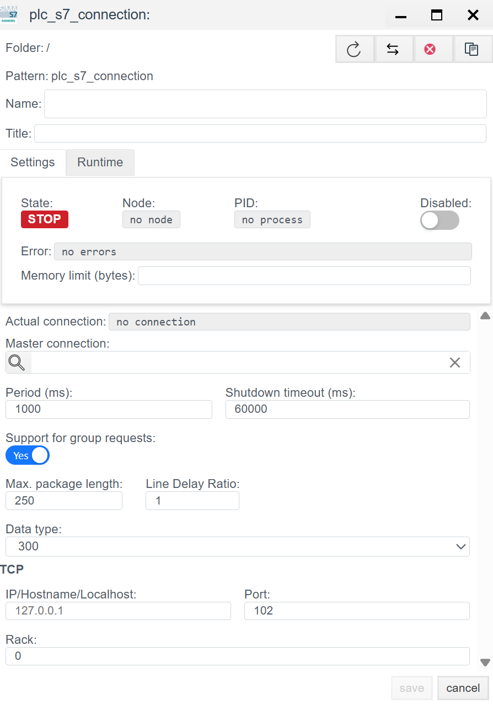

# 📘 Siemens S7 (ISO-on-TCP) Configuration Guide

## General Description
The **S7** driver is designed for native data exchange with Siemens programmable logic controllers (PLCs) of the **Simatic S7** family.

Supported Series:
* **S7-300 / S7-400** (Classic architecture).
* **S7-1200 / S7-1500** (Modern series, require specific access settings, see the Troubleshooting section).
* **Siemens Logo!** (starting from versions 0BA7/0BA8).

Data exchange occurs via the **ISO-on-TCP** protocol (RFC 1006) over standard port **102**.

The configuration process consists of two stages:
1.  **Connection (`plc_s7_connection`):** Configuring network access to the CPU.
2.  **Binding (`plc_s7_binding`):** Addressing a specific memory cell.

---

## STEP 1. Connection Configuration

At this stage, we configure the connection parameters to the communication processor or the Ethernet port on the CPU.

### 1.1 Diagnostics Panel (Runtime)
*The upper part of the window. Used for status monitoring.*

| Field | Description |
| :--- | :--- |
| **State** | **STOP** (Red) — Driver is stopped. **RUN** (Green) — Connection established (Handshake successful). |
| **Error** | Error text.  *Common errors:* `Connection refused` (no link/wrong port), `Iso packet error` (wrong Rack/Slot). |
| **Actual connection** | The currently active channel (when using redundancy). |

### 1.2 Configuration Parameters (Settings)

#### General & Timing Settings
| Parameter | Description |
| :--- | :--- |
| **Name** | Unique connection name. |
| **Period (ms)** | Polling period. Standard is `1000`. S7comm is quite fast; for critical tasks, `100-200` ms is acceptable. |
| **Master connection** | Reference to the main connection (for redundancy). |
| **Support for group requests** | **Yes** — The driver will automatically "glue" requests for adjacent bytes into a single PDU packet (Optimization). |
| **Max. package length** | PDU (Protocol Data Unit) size. Typically `240` or `480` bytes for older series, `960` for newer ones. |

#### Controller Settings (S7 / TCP)
Key parameters for hardware addressing.

| Field | Description and Analysis |
| :--- | :--- |
| **Data type** | Controller family (Type).  Affects packet formation algorithms. Select `300` (for S7-300/400/VIPA) or `1200`/`1500` if available. |
| **IP/Hostname** | Controller IP address. |
| **Port** | **102** (Standard Siemens ISO-on-TCP port). |
| **Rack** | **Rack (Chassis) number.**  • For S7-300/400/1500: Usually `0`. |
| **Slot** | **CPU Slot number.** (Field might be below Rack). ⚠️ **This is a critical parameter:** • **S7-300:** Always `2`. • **S7-400:** Depends on Hardware config (often `2` or `3`). • **S7-1200 / S7-1500:** Usually `1` (or `0` for older 1200 firmwares). |

---

## STEP 2. Variable Configuration (Binding)

In S7, memory has a rigid structure. To access a variable, you need to know its area, type, and offset (address).

### 2.1 Binding Parameters

| Field | Description |
| :--- | :--- |
| **Name** | Binding name. |
| **Tag** | Faceplate system tag. |
| **Access** | **R** (Read), **W** (Write). |

### 2.2 Memory Addressing (S7 Address)

For an address like `DB1.DBX10.2` (Bit 2 in Byte 10 of Data Block 1), the settings would look like this:

| Field | Instruction |
| :--- | :--- |
| **Memory area** | Memory Area: • **DB** — Data Block (Main data area). • **I** (Inputs). • **Q** (Outputs). • **M** (Flags/Merkers) — Internal memory. |
| **Type** | Variable Data Type: • `bit` (BOOL) • `byte`, `word`, `dword` • `int`, `real` (float) |
| **DB** | **Data Block Number.** Filled only if `Memory area` = **DB**. (e.g., `1`). |
| **Byte** | **Byte Offset.** The starting byte of the variable. |
| **Bit** | **Bit Offset.** From `0` to `7`.  Filled **only** if `Type` = `bit`. For other types, it must be `0`. |
| **Format** | Data interpretation (e.g., `integer` for signed numbers or `float` for floating point). |

---

## 💡 System Analyst's Checklist (Troubleshooting)

When working with S7-1200 and S7-1500, access issues frequently arise. If `Error` states "Permission denied" or data is not updating:

1.  **Optimized Block Access:**
    * Drivers of this type (S7comm) typically **cannot** work with "Optimized Blocks" (symbolic addressing).
    * *Solution:* In TIA Portal, open the DB properties and **uncheck** "Optimized block access". Then compile the project and download it to the PLC.
2.  **PUT/GET Access:**
    * In the CPU settings (in TIA Portal), under *Protection & Security -> Connection mechanisms*, the checkbox: *"Permit access with PUT/GET communication from remote partner"* must be **checked**.
3.  **Rack/Slot:**
    * If unable to connect to S7-300: Check that Rack=`0`, Slot=`2`.
    * If unable to connect to S7-1200: Check that Rack=`0`, Slot=`1`.