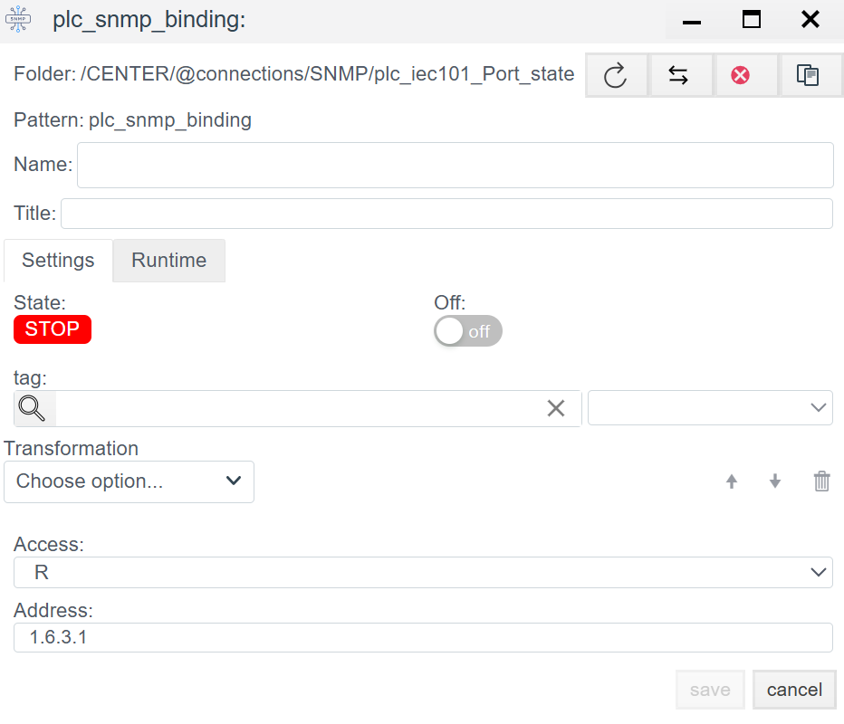

# 📘 SNMP Configuration in Faceplate

## General Description
**SNMP** (Simple Network Management Protocol) is an open communication protocol defined by the Internet Engineering Task Force (IETF). The protocol is widely used for data exchange with network equipment (controllers/PLCs, gateways, UPS).

**Faceplate** supports **SNMPv2** and **SNMPv3** protocol versions.

The integration process consists of two stages:
1.  **Creating a Connection (`plc_snmp_connection`):** Configuring network transport and redundancy logic.
2.  **Creating Bindings (`plc_snmp_binding`):** Addressing specific variables (OIDs) within the device.

---

## STEP 1. Connection Configuration

This step involves establishing a transport channel to the equipment.

### 1.1 Runtime Panel
*The upper part of the window. Displays the current process status.*

| Field | Description |
| :--- | :--- |
| **State** | **STOP** (Red) — Driver is stopped. **RUN** (Green) — Driver is running. |
| **Error** | Text of the last error. `no errors` indicates normal operation. |
| **Node / PID** | Identifies the cluster node and OS Process ID handling this connection. |
| **Actual connection** | **Active Channel Indicator.** Shows which specific connection is currently used for polling. • If redundancy is not configured, this matches the current connection. • If redundancy is configured, it indicates whether the `Master` or the backup channel is currently active. |

### 1.2 Settings Parameters

**General Settings:**
* **Name:** Unique system name (Latin characters, no spaces).
* **Period (ms):** Polling interval (Standard: `1000` ms).
* **Shutdown timeout (ms):** Time allowed for a graceful socket closure (Standard: `60000`).

**Redundancy Configuration:**
* **Master connection:** Reference to the "Main" connection.
    * *Used when creating a backup channel.* If the current connection is a backup, specify the name of the main connection here. The system will automatically switch between them based on availability.

**Network Settings:**
* **IP/Hostname:** IP address of the target device.
* **Port:** `161` (Standard UDP agent port).
* **Community:** Access string (password). Usually `public` (Read-only) or `private` (Write).
* **Support for group requests:** `Yes` — enable `GetBulk` (packet/batch reading). Recommended to accelerate polling if the device supports this feature.

> **Action:** Click **Save**. After saving, double-click the object to enter it and configure tags.

---

## STEP 2. Variable Configuration (Binding)

`plc_snmp_binding` objects are created inside the connection folder. Each object corresponds to a single variable (OID) on the device.

### 2.1 Binding Parameters

| Field | Description |
| :--- | :--- |
| **Name** | Name of the binding in the project tree. |
| **Tag** | Selection of the internal Faceplate system tag where the value will be written. |
| **Transformation** | *Optional.* On-the-fly data processing (e.g., scaling, bit masks). |
| **Access** | Access rights to the variable: • **R** — Read only. • **W** — Write only. • **RW** — Read and Write. |
| **Address** | **OID (Object Identifier).** The variable address in the SNMP hierarchy. *Examples:* `1.3.6.1.2.1.1.1.0` (absolute) or `1.6.3.1` (relative, if supported). |

### 2.2 Runtime Control
* **State:** Current status of the specific binding (active/error).
* **Off:** Switch to temporarily disable polling for this specific tag without deleting the configuration.

---

## 💡 Configuration Checklist

1.  **Redundancy:** If configuring a backup channel, ensure the `Master connection` field points to the correct main connection name. The `Actual connection` field in Runtime will indicate which channel is currently "leading" the polling.
2.  **OID:** In case of `No Such Name` errors, check the **Address** field. It is recommended to use a third-party MIB Browser to validate the OID before configuration.
3.  **Startup Order:**
    1. Configure the Connection.
    2. Start the driver (`State: RUN`).
    3. Verify there are no communication errors.
    4. Create Bindings.