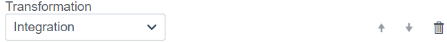
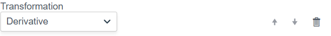
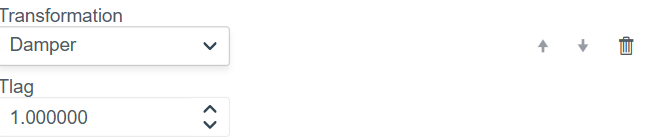

# Transformation Function Configuration

This document describes the data preprocessing (transformation) functionality when creating bindings. The module allows modifying, limiting, or mathematically processing input values before transmitting them to the system.

## 1. Overview of Available Methods

In the **Transformation** block, a **"Choose option..."** dropdown list is available, which opens a list of all available processing methods.

Available methods:
1.  **Scaling**
2.  **Default Value**
3.  **Limit Control**
4.  **Integration**
5.  **Derivative**
6.  **Damper** (Damping/Smoothing)
7.  **Script** (User script)

A detailed description of each method is provided below.

---

## 2. Scaling

The method performs a linear transformation of the input value using the linear function formula:
$$Y = (X \times \text{Factor}) + \text{Shift}$$

**Parameters:**
* **Factor:** Multiplication coefficient (multiplier).
* **Shift:** Shift value (offset).

---

## 3. Default Value

Allows setting a fixed value. Can be used for variable initialization or replacing a value with a constant.

**Parameters:**
* **Value:** The numeric value that will be passed forward.

---

## 4. Limit Control

Limits the input value to a specified range (Clamping). If the value falls outside the limits, it is equated to the nearest boundary.

**Parameters:**
* **Lower Limit:** The lower boundary of the range.
* **Upper Limit:** The upper boundary of the range.

---

## 5. Integration

Performs the mathematical operation of integrating the incoming signal over time (accumulation of value sum).

*Parameters are configured automatically.*

---

## 6. Derivative

Calculates the derivative of the incoming signal, determining the rate of change of the value per unit of time.

*Parameters are configured automatically.*

---

## 7. Damper

A filter for signal smoothing. Allows removing sharp spikes (noise) and making value changes smoother.

**Parameters:**
* **Tlag:** Time constant (inertia coefficient). The larger the value, the stronger the smoothing and the slower the reaction to input changes.

---

## 8. Script

Allows writing arbitrary data processing logic in the **Erlang** language.

**Capabilities:**
* **Variable / Tag / Field:** Allows accessing context variables.
* **Code Editor:**
    * The function accepts arguments: `Input` (input value), `Context` (variable context), `State` (accumulator state).
    * The function must return a tuple: `{Output, State}`.

---

## 9. Using Multiple Transformations

The system supports creating processing chains where multiple transformation functions are applied to a single binding simultaneously.

### Operating Principle

1.  **Execution Order:**
    Functions are executed strictly **from top to bottom**. The output value of the first function becomes the input value for the second, and so on.
    * *In the example above:* **Scaling** triggers first, then the result is passed to **Default Value**.

2.  **Adding a Function:**
    To add a new step to the chain, click the **"Choose option..."** dropdown menu at the bottom of the list. The menu will open (see item 1), and the selected function will be added to the end of the list.

3.  **Managing Elements:**
    To the right of each function are control buttons:
    * ⬆️ **Up Arrow:** Moves the function higher up the list (it will execute earlier).
    * ⬇️ **Down Arrow:** Moves the function lower down the list (it will execute later).
    * 🗑 **Trash Bin:** Deletes the given transformation function from the chain.