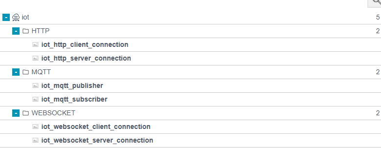

Faceplate

Модуль IoT соединений

# 

[**Содержание**	2](#heading=)

[**1\. Введение и общие принципы	3**](#1.-введение-и-общие-принципы)

[1.1. Назначение модуля IoT	3](#1.1.-назначение-модуля-iot)

[1.2. Единый механизм привязки данных	3](#1.2.-единый-механизм-привязки-данных)

[1.2.1. Структура таблицы конфигурации	3](#1.2.1.-структура-таблицы-конфигурации)

[1.2.2. Направления потока данных	3](#1.2.2.-направления-потока-данных)

[1.2.3. Особенности работы	4](#1.2.3.-особенности-работы)

[1.3. Универсальные компоненты	4](#1.3.-универсальные-компоненты)

[1.3.1. Программируемые скрипты (iot\_script)	5](#1.3.1.-программируемые-скрипты-\(iot_script\))

[1.3.2. Прямая привязка (iot\_tag)	5](#1.3.2.-прямая-привязка-\(iot_tag\))

[1.3.3. Работа с событиями (iot\_eventlog)	5](#1.3.3.-работа-с-событиями-\(iot_eventlog\))

[1.3.4. Исторические данные (iot\_ts)	5](#1.3.4.-исторические-данные-\(iot_ts\))

[1.4. Панель состояния	6](#1.4.-панель-состояния)

[1.5 Механизма запуска запросов (вкладка Triggers)	6](#1.5-механизма-запуска-запросов-\(вкладка-triggers\))

[1.5.1 Основные типы триггеров	6](#1.5.1-основные-типы-триггеров)

[**2\. Транспортные протоколы (Настройка соединений)	8**](#2.-транспортные-протоколы-\(настройка-соединений\))

[2.1. HTTP (HyperText Transfer Protocol)	8](#2.1.-http-\(hypertext-transfer-protocol\))

[2.1.1. Клиент (iot\_http\_client\_connection)	8](#2.1.1.-клиент-\(iot_http_client_connection\))

[2.1.2. Сервер (iot\_http\_server\_connection)	8](#2.1.2.-сервер-\(iot_http_server_connection\))

[2.2. MQTT	9](#2.2.-mqtt)

[2.2.2. Publisher (iot\_mqtt\_publisher)	9](#2.2.2.-publisher-\(iot_mqtt_publisher\))

[2.2.3. Subscriber (iot\_mqtt\_subscriber)	10](#2.2.3.-subscriber-\(iot_mqtt_subscriber\))

[2.3. WebSocket	10](#2.3.-websocket)

[2.3.1. Клиент (iot\_websocket\_client\_connection)	10](#2.3.1.-клиент-\(iot_websocket_client_connection\))

[2.3.2. Сервер (iot\_websocket\_server\_connection)	11](#2.3.2.-сервер-\(iot_websocket_server_connection\))

# 

# **1\. Введение и общие принципы** {#1.-введение-и-общие-принципы}

## **1.1. Назначение модуля IoT** {#1.1.-назначение-модуля-iot}

Модуль IoT (Internet of Things) предназначен для обмена данными с системами поддерживающими протоколы HTTP, MQTT и WEBSOCKET.

## **1.2. Единый механизм привязки данных** {#1.2.-единый-механизм-привязки-данных}

Механизм Bindings является фундаментальным инструментом модуля IoT, предназначенным для установления связи между внутренними тегами системы Faceplate и переменными, используемыми в протоколах обмена (HTTP, MQTT, WebSocket).

### **1.2.1. Структура таблицы конфигурации** {#1.2.1.-структура-таблицы-конфигурации}

Для настройки связи используется унифицированная таблица со следующими ключевыми колонками:

* **Variable (Переменная):** Локальное имя переменной, которое будет использоваться в полезной нагрузке (Payload) или скриптах обработки.  
* **Tag (Системный тег):** Путь к тегу в дереве объектов системы Faceplate, из которого считывается или в который записывается значение.  
* **Field (Атрибут тега):** Указывает, какой именно параметр тега используется для обмена:  
  * `value` — текущее значение тега (наиболее часто используемый параметр);  
  * `ts` — метка времени последнего обновления;  
  * `status` — качество или статус достоверности данных.

### **1.2.2. Направления потока данных** {#1.2.2.-направления-потока-данных}

Логика работы механизма зависит от роли компонента в цепочке обмена данными:

**А. Исходящий поток (Source / Response)** В компонентах типа `source` (например, при подготовке данных к отправке по MQTT или в HTTP-запросе) процесс происходит по схеме:

1. Система считывает значение из указанного **Tag**.  
2. Значение присваивается локальной переменной **Variable**.  
3. Переменная передается в скрипт или напрямую в упаковщик данных для формирования сообщения (Payload).  
   Режим обработки определяет, как обрабатывается входящий запрос:

* **Const:** Статическое сообщение (например, "OK").  
* **JSON:** Автоматическое формирование JSON-ответа с подстановкой значений переменных.  
* **Script:** Программное формирование тела запроса. Тело скрипта принимает переменные и возвращает карту:    
  * Response: A response received from the server.  
    * Context: A map that contains variables and other data.

  **Б. Входящий поток (Action / Request)** В компонентах типа `action` (например, при получении ответа от сервера или подписке на топик) процесс происходит в обратном порядке:

1. Полученные внешние данные парсятся (разбираются) в переменные **Variable**.  
2. Механизм сопоставления находит соответствующий **Tag** в таблице.  
3. Значение из переменной записывается в системный тег Faceplate с учетом выбранного поля (**Field**).  
   Режим обработки определяет, как формируется исходящий запрос:

* **Const:** Статическое сообщение (например, "OK").  
* **JSON:** Автоматическое формирование JSON-ответа с подстановкой значений переменных.  
* **Script:** Программное формирование тела запроса. Тело скрипта принимает переменные и возвращает сериализованную строку:    
  * Data: A map that contains request data.   
    * Context: A map that contains variables and other data.

### **1.2.3. Особенности работы** {#1.2.3.-особенности-работы}

* **Синхронизация:** Привязка данных обеспечивает актуальность значений в режиме реального времени.  
* **Типизация:** Система автоматически пытается привести типы данных (например, преобразует строковое число из JSON в формат `float` системного тега), если это предусмотрено настройками.  
* **Масштабируемость:** Таблица позволяет настраивать неограниченное количество связей для одного соединения.

## **1.3. Универсальные компоненты** {#1.3.-универсальные-компоненты}

Эти компоненты отвечают за преобразование, фильтрацию и трансляцию данных между компонентами модуля и внутренними подсистемами Faceplate.

### **1.3.1. Программируемые скрипты (iot\_script)** {#1.3.1.-программируемые-скрипты-(iot_script)}

Используются для реализации сложной логики преобразования, когда стандартного маппинга JSON недостаточно.

**iot\_script\_source (Генерация данных):** Выполняется непосредственно перед отправкой пакета. Скрипт (JS/Erlang) получает значения тегов и формирует из них итоговую строку или бинарный блок (Payload).

**iot\_script\_action (Обработка данных):** Выполняется сразу после приема данных из сети. Скрипт разбирает «сырые» данные, выполняет вычисления или проверку условий, и возвращает карту значений для записи в теги.

### **1.3.2. Прямая привязка (iot\_tag)** {#1.3.2.-прямая-привязка-(iot_tag)}

Предназначена для простых сценариев обмена «один к одному» без промежуточной логики.

* **iot\_tag\_source:** Считывает текущее значение тега и отправляет его во внешнюю систему в исходном виде. Оптимально для передачи числовых значений и простых строк.  

* **iot\_tag\_action:** Принимает входящее значение (Payload) и записывает его напрямую в системный тег. Включает механизм автоматического приведения типов (например, из текста в число).

### **1.3.3. Работа с событиями (iot\_eventlog)** {#1.3.3.-работа-с-событиями-(iot_eventlog)}

Позволяет транслировать аварийные сообщения и системные события.

* **iot\_eventlog\_source (Экспорт):** Подписывается на шину событий Faceplate и передает новые записи во внешние системы (например, отправка уведомления о критической аварии в Telegram или внешнюю базу).
  
* **iot\_eventlog\_action (Импорт):** Позволяет внешней системе создавать записи в журнале событий Faceplate (например, получение уведомления от удаленного контроллера о вскрытии шкафа).

### **1.3.4. Исторические данные (iot\_ts)** {#1.3.4.-исторические-данные-(iot_ts)}

Компоненты для пакетной передачи архивных массивов, а не мгновенных значений.

* **iot\_ts\_source (Экспорт архива):** Выгружает накопленные данные из архива Faceplate за определенный интервал времени (from/to) для передачи в облачные аналитические платформы.
  
* **iot\_ts\_action (Импорт архива):** Позволяет записывать данные в архив системы «задним числом». Это критично для систем, работающих в режиме офлайн, когда накопленные на устройстве данные передаются пакетом после восстановления связи.
 
## **1.4. Панель состояния** {#1.4.-панель-состояния}

Этот раздел описывает панель мониторинга и управления, которая является идентичной для всех типов соединений (HTTP, MQTT, WebSocket).

В верхней части интерфейса любого IoT-соединения расположена панель управления жизненным циклом процесса. Она позволяет пользователю отслеживать статус работы и управлять ресурсами системы.

Основные элементы мониторинга:

* **State \-** Индикатор текущего состояния соединения:  
  * **STOP** \- процесс остановлен,  
  * **RUNNING** \- активен,   
  * **ERROR** \- сбой.  
* **Узел (Node) \-** Имя системного узла Faceplate, на котором выполняется процесс.Если процесс не запущен, отображается `no node`.  
* **PID \-** Идентификатор процесса (Process ID) в виртуальной машине Erlang. Уникальный номер, необходимый для глубокой диагностики системы.  
* **Отключено \-** Переключатель (флаг) деактивации. Позволяет временно остановить обмен данными, сохраняя все настройки.  
* **Ошибка \-** Текстовое поле для вывода системных сообщений. При нормальной работе отображается `no errors`. При сбое — код и описание ошибки.  
* **Ограничение памяти \-** Лимит ОЗУ, выделяемой под данный процесс (в байтах). Защищает систему от утечек памяти при получении аномально больших объемов данных.  
* **Диагностика** \- открывает окно диагностики.

## **1.5 Механизма запуска запросов (вкладка Triggers)** {#1.5-механизма-запуска-запросов-(вкладка-triggers)}

Триггеры определяют событие или условие, при котором компонент (например, `iot_http_client` или `iot_mqtt_publisher`) формирует пакет данных и отправляет его на сервер.

### **1.5.1 Основные типы триггеров** {#1.5.1-основные-типы-триггеров}

В интерфейсе Faceplate доступны следующие режимы инициации:

* **By Interval (Циклический опрос):** Запрос отправляется автоматически через фиксированные промежутки времени.  
  * *Параметр:* `Interval (ms)`.  
  * *Применение:* Мониторинг медленно меняющихся параметров (температура, уровень в резервуаре).  
* **By Change (По изменению):** Запрос отправляется мгновенно, как только значение хотя бы одного тега, указанного в таблице **Bindings**, изменилось в системе.  
  * *Особенность:* Позволяет экономить трафик, так как данные не пересылаются, если они не обновлены.  
  * *Применение:* Передача дискретных сигналов, аварийных флагов.  
* **External Trigger (Внешний триггер):** Запрос выполняется при получении команды от другого системного процесса или скрипта.  
  * *Применение:* Команды управления, подтверждение действий оператора.

Также доступны следующие параметры:

**Required delivery** \- Если флаг установлен, система будет хранить пакет в очереди до получения подтверждения от сервера (HTTP 200 OK).

**Trigger** \- Кнопка в интерфейсе для немедленной отправки текущего пакета данных.

**Last successful request** \- Информационное (read-only) поле, отображающее метку времени последнего успешного ответа.

**Max. period per send request** \- Максимальный интервал тишины. Если триггеры не срабатывали в течение этого времени, сообщение отправляется принудительно. Часто используется как Heartbeat.

# 

# **2\. Транспортные протоколы (Настройка соединений)** {#2.-транспортные-протоколы-(настройка-соединений)}

## **2.1. HTTP (HyperText Transfer Protocol)** {#2.1.-http-(hypertext-transfer-protocol)}

HTTP (HyperText Transfer Protocol) — это протокол передачи данных в интернете по архитектуре REST. Он работает по модели клиент-сервер, где клиент отправляет запросы (requests), а сервер — ответы (responses).  

Поддержку использования протокола обеспечивают Компоненты:

* **iot\_http\_client\_connection:**  Это клиентская часть соединения. Отправка запросов (GET, POST и др.) к внешним веб серверам.   
* **iot\_http\_server\_connection:**  Серверная часть. Прием входящих запросов. Позволяет внешним системам обмениваться  данными с Faceplate.

### **2.1.1. Клиент (iot\_http\_client\_connection)** {#2.1.1.-клиент-(iot_http_client_connection)}

Компонент `iot_http_client_connection` инициализирует запросы к удаленным серверам. Для обмена данными с брокером необходимо настроить:

* **URL \-**	Полный адрес ресурса, включая протокол, IP/домен и порт ([`http://192.168.1.50:8080/api/v1/data`](http://192.168.1.50:8080/api/v1/data)`)`  
* **Method** HTTP \- Метод запроса, определяющий тип операции.`GET` (чтение), `POST` (запись)  
* **Таймаут (мс) \-** Лимит времени на ожидание ответа. При превышении соединение переходит в статус `Error`.  
* **Headers \-** Метаданные запроса. Важны для указания типа контента или авторизации.`Content-Type = application/json`  
* **Query \-** Переменные, передаваемые в строке URL после знака `?`.`token = xyz123`, `id = 5`  
* **Key \-** Путь к файлу приватного ключа для двустороннего TLS (mTLS). `/etc/ssl/client.key`  
* **Certificate \-** Путь к файлу SSL-сертификата клиента для HTTPS. `/etc/ssl/client.crt`  
* **CA Certificate \-** Путь к сертификату центра сертификации для проверки сервера. `/etc/ssl/certs/rootCA.pem`

### **2.1.2. Сервер (iot\_http\_server\_connection)** {#2.1.2.-сервер-(iot_http_server_connection)}

Этот компонент позволяет системе Faceplate выступать в роли HTTP-сервера, принимая запросы от внешних клиентов (SCADA-систем, веб\-приложений, датчиков) для чтения или записи данных.

Для обмена данными с необходимо настроить:

* **Путь** \- URL-путь, по которому сервер ожидает данные (например, `/api/v1/data`).

* **Method** \- Поддерживаемые методы запроса (`GET, POST, PUT, DELETE, HEAD, PATCH, TRACE, OPTIONS`).

* **Headers** \- Заголовки используются для передачи метаданных между клиентом и сервером. 

* **Query** \- Переменные, которые передаются в URL после знака вопроса (например, `?device_id=123&status=active`).

* **Certificate** \- Путь к файлу SSL-сертификата клиента для HTTPS. `/etc/ssl/client.crt`

При настройке соединения можно задать список постоянных заголовков, которые будут добавляться к каждому пакету:

* **Content-Type:** Определение формата данных (например, `application/json`, `text/plain`).  
* **Authorization:** Передача токенов доступа (Bearier token) или данных Basic Auth.  
* **User-Agent:** Идентификация клиента системы Faceplate.

**Важно:** Настройка **Точка** и **Method** является обязательной.

## **2.2. MQTT** {#2.2.-mqtt}

MQTT (Message Queuing Telemetry Transport) — это открытый сетевой протокол прикладного уровня, работающий поверх TCP/IP.

В платформе присутствуют,  только следующие типы компонентов протокола:

* **iot\_mqtt\_publisher:** 	\- “Издатель”.

* **iot\_mqtt\_subscriber:** \- “Подписчик”.

Брокер MQTT не входит в состав компонентов протокола на стороне Faceplate и является внешним сервисом с которым необходимо установит соединение.

Брокер MQTT должен поддерживать версия протокола не ниже 3.1.1, должен принимает все сообщения, фильтровать их, определять, кто подписан, и отправляет сообщения подписчикам.

### **2.2.2. Publisher (iot\_mqtt\_publisher)** {#2.2.2.-publisher-(iot_mqtt_publisher)}

Компонент предназначен для публикации данных из системы Faceplate в определенные топики брокера. Для обмена данными с брокером необходимо настроить:

* **Host / Port:** Адрес и порт MQTT-брокера (по умолчанию 1883 или 8883 для SSL).  
* **Client ID:** Определяется ПО Faceplate например  
  faceplate\_emqtt\_n01BnvEEqYTTfLjRdt4ke4DpVIvzycdlRMhz3tsKpJEteupJY57RH5XOXTw3fWbPD4eCmut2gaepwdjFekklmg=.  
* **Authentication:** Логин и пароль для доступа к серверу.  
* **Topic:** Путь (например, `sensors/factory1/temp`), в который будут отправляться данные.  
* **QoS (Quality of Service):** Уровень гарантированной доставки (0 — минимум один раз, 1 — хотя бы один раз, 2 — ровно один раз).  
* **Key \-** Путь к файлу приватного ключа для двустороннего TLS (mTLS). `/etc/ssl/client.key`  
* **Certificate \-** Путь к файлу SSL-сертификата клиента для HTTPS. `/etc/ssl/client.crt`  
* **CA Certificate \-** Путь к сертификату центра сертификации для проверки сервера. `/etc/ssl/certs/rootCA.pem`

### **2.2.3. Subscriber (iot\_mqtt\_subscriber)** {#2.2.3.-subscriber-(iot_mqtt_subscriber)}

Компонент предназначен для получения данных из внешних систем через подписку на топики. Для обмена данными с брокером необходимо настроить:

* **Host / Port:** Адрес и порт MQTT-брокера (по умолчанию 1883 или 8883 для SSL).  
* **Client ID:** Определяется ПО Faceplate например  
* faceplate\_emqtt\_n01BnvEEqYTTfLjRdt4ke4DpVIvzycdlRMhz3tsKpJEteupJY57RH5XOXTw3fWbPD4eCmut2gaepwdjFekklmg=.  
* **Authentication:** Логин и пароль для доступа к серверу.  
* **Topic:** Шаблон топика для подписки (например, `sensors/factory1/temp`), в который будут отправляться данные..

## **2.3. WebSocket** {#2.3.-websocket}

WebSocket \- это протокол связи, который устанавливает постоянное, двустороннее (дуплексное) соединение между клиентом и сервером через одно TCP-соединение, позволяя им обмениваться данными в реальном времени.  

Поддержку использования протокола обеспечивают Компоненты:

* **iot\_websocket\_client\_connection:**  Клиент для выполнения подключения к серверу.  
* **iot\_websocket\_server\_connection:** Сервер для подключения клиентов.

### **2.3.1. Клиент (iot\_websocket\_client\_connection)** {#2.3.1.-клиент-(iot_websocket_client_connection)}

Компонент **iot\_websocket\_client\_connection** в системе Faceplate предназначен для организации **постоянного двунаправленного обмена данными** в режиме реального времени между платформой и внешним WebSocket-сервером.

Для обмена данными необходимо настроить:

* **URL \-** Полный адрес WebSocket-сервера (протокол `ws://` или `wss://`).`ws://echo.websocket.org`  
* **Headers \-** HTTP-заголовки, передаваемые при handshake (например, для авторизации).`Authorization: Bearer <token>`  
* **Initialization request \-** JSON-сообщение, отправляемое сразу после открытия сокета (логин/регистрация).`{ "type": "auth", "key": "secret" }`  
* **Initialization response \-** Ожидаемый ответ от сервера, подтверждающий готовность к обмену данными.`{ "status": "authorized" }`  
* **Key \-** Путь к файлу приватного ключа для двустороннего TLS (mTLS). `/etc/ssl/client.key`  
* **Certificate \-** Путь к файлу SSL-сертификата клиента для HTTPS. `/etc/ssl/client.crt`  
* **CA Certificate \-** Путь к сертификату центра сертификации для проверки сервера. `/etc/ssl/certs/rootCA.pem`

### **2.3.2. Сервер (iot\_websocket\_server\_connection)** {#2.3.2.-сервер-(iot_websocket_server_connection)}

Компонент **iot\_websocket\_server\_connection** превращает систему Faceplate в **WebSocket-сервер**. В отличие от клиента, который сам подключается к внешним ресурсам, серверный компонент открывает порт и **ожидает входящие подключения** от внешних клиентов (браузеров, мобильных приложений или сторонних контроллеров).

Для обмена данными необходимо настроить:

* **Host \-** Сетевой интерфейс (IP-адрес) сервера. `0.0.0.0` (все интерфейсы)   
* **Port \-** Порт, который будет прослушивать сервер. `8081`  
* **Path (Endpoint) \-** URL-путь для подключения конкретных клиентов.`/telemetry` или `/commands`

**Start as a client \-** Гибридный режим, при котором сервер может инициировать исходящее WebSocket-подключение как клиент.

# 

