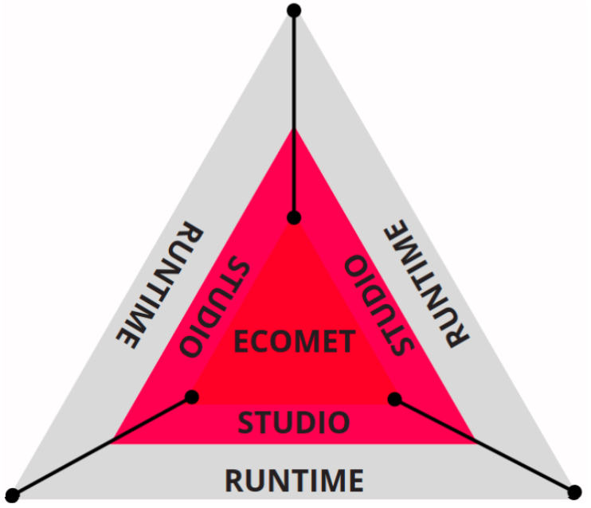
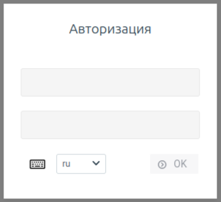
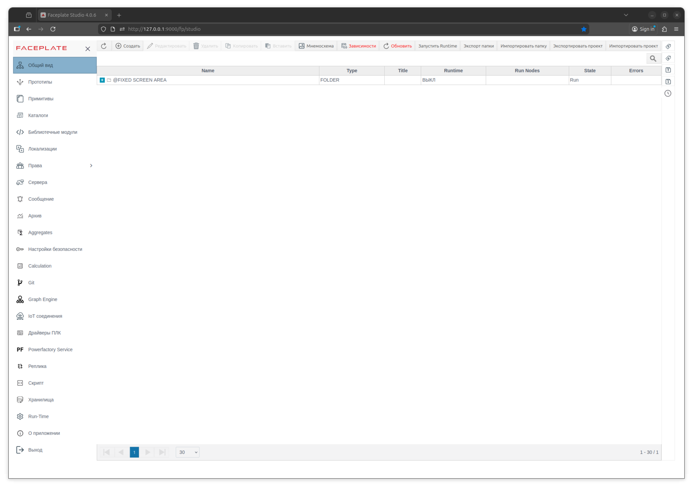
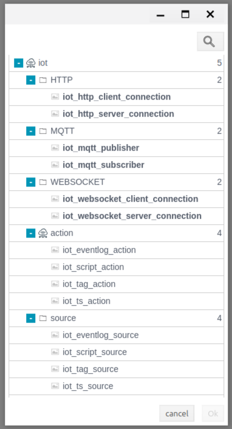
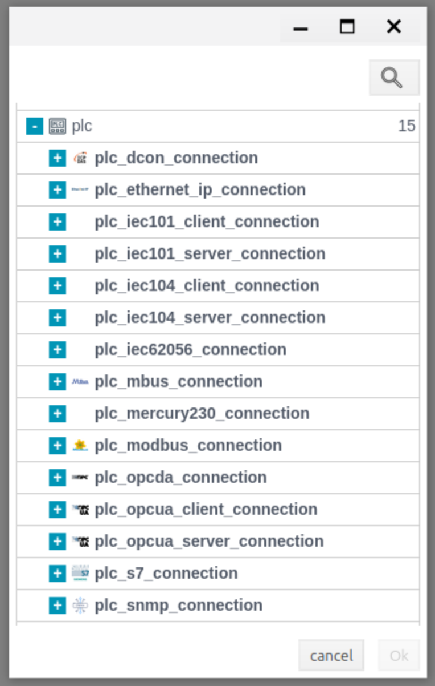
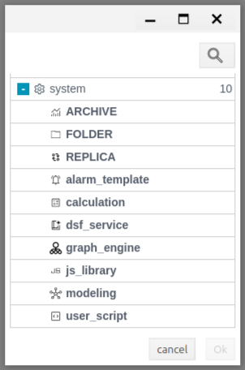
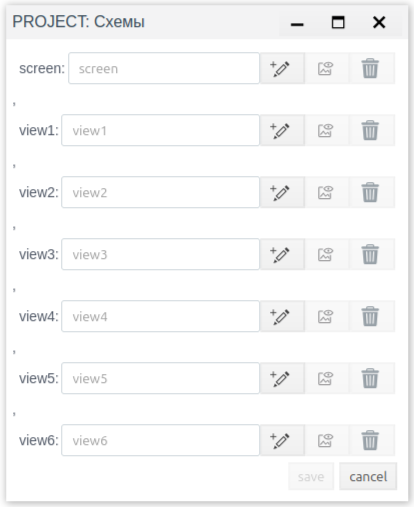

# Общие сведения

FACEPLATE \- программный комплекс, обеспечивающий пользователя необходимым окружением и набором инструментов для решения задач сбора и преобразования данных в информацию, хранение информации и организацию доступа к ней через различные интерфейсы.  
FACEPLATE является клиент-серверным приложением. В качестве клиента выступает браузер, рекомендуемые: Firefox, Chrome, Safari, Edge и другие. Поддерживаются мобильные версии перечисленных браузеров. Установка дополнительного программного обеспечения на клиенте не требуется.  
Серверная часть FACEPLATE является кросс-платформенным приложением исполняемым виртуальной машиной Erlang ([https://www.erlang.org](https://www.erlang.org)).

## Использование

Основное назначение FACEPLATE заключается в предоставлении среды разработки IIoT решений, на базе которых возможно построить распределенные, масштабируемые решения для промышленных предприятий.   
FACEPLATE предоставляет возможность следить за производством и технологическим оборудованием в режиме реального времени, получать настраиваемые отчеты в виде различных KPI и показателей эффективности (OEE), анализировать аномалии, прогнозировать техническое обслуживание оборудования. Использование машинного обучения для создания математических моделей для оптимизации и повышения эффективности работы оборудования и технологического процесса.  
Основные цели программного комплекса FACEPLATE:

* повышение транспарентности и гибкости производства;  
* учет работы оборудования, качества технического обслуживания;  
* повышение безопасности производства и экологической надежности;  
* возможность анализа эффективности производства и производительности оборудования;  
* возможность использования наиболее продвинутых практик оптимизации работы, таких как машинное обучение и предиктивный анализ.

  ## Состав

Программный комплекс FACEPLATE включает в себя среду разработки FACEPLATE Studio и среду исполнения FACEPLATE Runtime. Всё созданное в программном комплексе хранится и обрабатывается в базе данных ECOMET.

* FACEPLATE Studio \- среда разработки, полный комплекс программных средств для проектирования человеко-машинного интерфейса, разработки алгоритмов управления, конфигурации архивов, отчетов, систем оповещения и других функций  
* FACEPLATE Runtime \- среда исполнения, автоматизированная система управления в режиме реального времени  
* ECOMET \- база данных для real-time приложений

  ## Функционал

Функционал программного комплекса FACEPLATE является гибким и может меняться на этапе согласования технического задания.   
Функционал по модулям программного комплекса:

* Графический редактор \- Редактор для создания мнемосхем и элементов управления и визуализации. В его составе большой набор самых необходимых и распространенных инструментов.  
* Архивирование \- Встроенная подсистема архивирования обеспечивает потребности хранения и обработки данных для различных уровней сложности проектов и позволяет оценить динамику изменения технологических параметров за длительный период времени.  
* Сообщения \- Система сообщений для регистрации и архивирования событий с возможностью их отображения и управления; настраивание категорий сообщений; отображения, оповещения и архивирования.  
* Скрипты \- Встроенная поддержка языков программирования Erlang и JavaScript позволяет создавать пользовательские скрипты любой сложности для манипуляции объектами проекта (включая теги, сообщения, архивы, iot соединения и т.д.), а также любыми свойствами данных объектов.  
* Web-клиент \- Для подключения необходимо клиентское устройство, которое использует стандартный браузер, локальной сети или интернет для обращения к данным на Web сервере.  
* Симулятор/Имитатор \- Встроенная поддержка в среду разработки имитации данных  для любых типов тегов, которая позволяет протестировать конфигурацию объектов без настройки связей с внешними устройствами.   
* Тренды \- Мощный функционал представления архивных данных в виде графиков и трендов в режиме исполнения.  
* IoT Hub \- Поддержка концепции сети передачи данных между физическими объектами («вещами»), оснащёнными встроенными средствами и технологиями для взаимодействия друг с другом или с внешней средой.  
* Драйвера \- Интеграция внешнего аппаратного или программного компонента в программный комплекс FACEPLATE. Обширная база популярных драйверов с возможностью её расширения.  
* Моделирование \- Инструмент прогнозирования для выявления временных закономерностей набора данных. Предназначен для запуска моделей, реализованных с использованием современных алгоритмов и библиотек моделирования. Позволяет создавать точные прогнозные модели в автоматическом режиме, при необходимости пользователь может добавить собственные модели для прогноза.  
* Каталоги \- Функционал отображения информации в наиболее простой для пользователя форме, организованной в виде набора таблиц. Обеспечение целостности больших объемов данных. Легкий доступ без реорганизации базы данных.  
* Мультиязычность \- Возможность адаптации проектов FACEPLATE к разным языкам. По умолчанию подключены казахский, русский и английский пакеты.   
* Кластеризация \- Встроенный механизм дублирования серверных станций, синхронизация их информационного наполнения в режиме реального времени и автоматическое перераспределение нагрузки между узлами.  
* Механизмы экспорта/импорта \- Поддерживаются механизмы экспорта и импорта как целого проекта, так и отдельных его составляющих.

# Запуск

FACEPLATE на сервере запускается из дистрибутива с исполняемым файлом faceplate в директории bin. Для запуска необходимо обладать правами администратора.  
Для успешного запуска сервер должен соответствовать следующим минимальным требованиям:  

Серверная среда:

* Операционная система: 64-битные дистрибутивы Linux (Ubuntu, CentOS, Debian, Red Hat или совместимые)  
* Архитектура: x86\_64  
* Оперативная память: от 4 ГБ  
* Дисковое пространство: от 10 ГБ свободного места  
* Сеть: TCP/IP-доступ для подключения клиентских рабочих станций

Клиентская среда:

* Любое устройство с веб\-браузером  
* Веб-браузер с поддержкой современных веб\-стандартов (Firefox, Chrome, Safari, Edge и аналоги)  
* Поддерживаются мобильные версии браузеров

Общие требования:

* Корректно настроенное системное время и сетевые параметры  
* Возможность доступа к серверу по HTTP/HTTPS  
* Аппаратные ресурсы сервера подбираются в зависимости от предполагаемой нагрузки и масштабов эксплуатации системы

Данные требования достаточны для базового запуска и тестовой эксплуатации FACEPLATE; для промышленных и высоконагруженных систем требуется более производительная конфигурация.  
Путь для папки, с которой будет запущено приложение, должен состоять из символов латинского алфавита, и не должен содержать пробелов, скобок и специальных символов. После успешного запуска доступны следующие интерфейсы: FACEPLATE Studio, FACEPLATE Runtime, ECOMET.

## FACEPLATE Studio

Среда разработки FACEPLATE. Клиент может подключиться с любого устройства если имеет сетевой доступ к серверу FACEPLATE.  
Для этого в браузере необходимо перейти по одному из адресов:

* http://\<ip address\>:9000/fp/studio  
* https://\<ip address\>:9443/fp/studio

  ## FACEPLATE Runtime

Среда исполнения FACEPLATE, предназначенная для работы операторов. Для открытия среды исполнения в браузере используется один из адресов:

* http://\<ip address\>:9000/fp/runtime  
* https://\<ip address\>:9443/fp/runtime

  ## ECOMET

Базовый компонент системы FACEPLATE, включающий базу данных ECOMET, которая является неотъемлемой частью FACEPLATE.  
Для открытия интерфейса управления необходимо в браузере указать путь:

* http://\<ip address\>:8000/static/admin.html  
* https://\<ip address\>:8443/static/admin.html

Где \<ip address\> — IP-адрес сервера, на котором запущен FACEPLATE. Подключение с клиентских устройств осуществляется, если имеется сетевой доступ к серверу FACEPLATE.

# Лицензирование

Лицензия требуется для продолжительной работы сервера. Лицензия выписанная для одного сервера не может быть использована на другом.

# Быстрый старт

Среда разработки FACEPLATE Studio. Клиент подключается с любого устройства если имеет сетевой доступ к серверу FACEPLATE.  
Для этого в браузере необходимо перейти по адресу: http://\<ipaddress\>:9000/fp/studio  
Где \<ip address\> — IP-адрес сервера, на котором запущен FACEPLATE.  
Появится окно авторизации, в котором пользователь вводит учетные данные по умолчанию:  
логин \- system  
пароль \- 111111  

Для дальнейшего использования необходимо добавить нового пользователя в систему.  
После успешной авторизации открывается главный интерфейс FACEPLATE Studio \- Общий вид:  

## Общий вид

Основной модуль программного комплекса, в котором отображается список всех созданных объектов и мнемосхем. Используется как точка входа, чтобы быстро оценить структуру проекта.  
Интерфейс главного окна состоит из следующих областей и панелей:

* Панель управления  
* Вспомогательная панель управления  
* Рабочая область  
* Навигационная панель  
* Панель навигации по страницам

Информационный фонд проекта представляется в виде иерархической структуры, напоминающего файловую систему, где файлы (объекты) хранятся в папках (группах), которые в свою очередь могут содержать другие папки (подгруппы).

### Панель управления

Верхняя панель интерфейса, предназначенная для выполнения основных операций управления объектами и проектом FACEPLATE. Содержит кнопки создания, редактирования, удаления, копирования и вставки объектов, а также инструменты работы с зависимостями, запуском Runtime и операциями импорта и экспорта.

**Обновить**  
Обновление текущего состояния. Обновление отображения базы проекта. Если проект разрабатывают одновременно несколько пользователей то кнопка служит для получения последних обновлений, выполненных другими пользователями.  
**Создать**  
Кнопка создания нового объекта в структуре проекта общего вида. Это такие объекты как: IoT, ПЛК, Примитив, Прототип и Системный.

Далее отображено более подробное описание по созданию данных объектов:

* IoT \- позволяет настроить обмен данными между FACEPLATE и другими информационными системами посредством различных IoT протоколов, создавая необходимые соединения. Поддерживаются следующие виды соединений: HTTP, MQTT, WEBSOCKET.

Для каждого IoT соединения есть возможность создавать action и source, которые в свою очередь состоят из: eventlog, script, tag, ts.

* ПЛК \- обеспечивает сбор информации с имеющихся интеллектуальных устройств, ее первичную обработку и запись в поля тегов, создавая необходимые соединения. Поддерживаются следующие виды соединений: IEC-101, IEC-104, S7 (Siemens), MODBUS, SNMP, MERCURY 230, M-BUS, DCON (ICP DAS), OPC-UA, OPC-DA, IEC-62056, ETHERNET-IP.

Для каждого ПЛК соединения есть возможность создания привязок. Привязки описывают какими именно данными обмениваются система и подключаемое устройство. Каждая привязка сопоставляет одну единицу данных из области памяти устройства одному полю тега FACEPLATE.

* Примитив \- позволяет создавать упрощенные элементы на базе библиотеки примитивов. Это инструмент для создания упрощенных элементов. Другими словами они представляют собой примитивные шаблоны для создания конкретных экземпляров объектов. Каждый экземпляр примитива наследует его свойства и методы, а также может иметь собственные уникальные значения для полей. Примитив позволяет стандартизировать создание и управление объектами, обеспечивая повторное использование и упрощая разработку и сопровождение системы.  
* Прототип \- позволяет создавать более расширенные по функционалу элементы на базе библиотеки прототипов. Понятие прототипов схоже с концепцией классов в объектно-ориентированном программировании. Другими словами они представляют собой шаблоны / формы для создания конкретных экземпляров объектов или устройств, определяя их структуру, свойства, содержимое и поведение. Это означает, что прототип включает в себя определение полей, их типы данных, контент, методы и функции для работы с этими полями и контентом, а также логику для обработки событий и состояний объекта. Прототип является основой для создания конкретных экземпляров объектов. Каждый экземпляр прототипа наследует его свойства и методы, а также может иметь собственные уникальные значения для полей, контента и поведения. Прототип позволяет стандартизировать создание и управление объектами, обеспечивая повторное использование кода и упрощая разработку и сопровождение системы. Он также определяет интерфейс для взаимодействия с объектами и устройствами, что упрощает интеграцию и расширение функциональности системы.  
* Системный объект \- представляют собой набор базовых компонентов платформы, предназначенных для хранения, обработки, расчёта, моделирования и обмена данными, а также для расширения функциональности системы. Они обеспечивают организацию структуры проекта, реализацию пользовательской и системной логики, интеграцию с внешними источниками, выполнение вычислений, управление сообщениями и событиями, а также поддержку распределённой и масштабируемой архитектуры FACEPLATE.

Поддерживаются следующие типы объектов:

* Архив \- Системный объект для долговременного хранения и просмотра исторических данных и событий.  
  * Папка \- Иерархический контейнер для логической группировки и организации объектов FACEPLATE.  
  * Реплика \- Механизм синхронизации и копирования данных между экземплярами FACEPLATE.  
  * Сообщение \- Объект для формирования, хранения и передачи уведомлений, событий и системных сообщений.  
  * Калькулятор \- Компонент для выполнения вычислений, обработки данных и расчёта пользовательских выражений.  
  * DSF служба \- Сервисный объект для интеграции, обработки и передачи данных между внешними источниками и FACEPLATE.  
  * Графовый движок \- Подсистема для работы с графовыми структурами, связями и зависимостями между объектами.  
  * JS-библиотека \- Набор JavaScript-модулей, используемых для расширения функциональности клиентской части FACEPLATE.  
  * Моделирование \- Инструмент для создания, анализа и исполнения моделей процессов и систем в среде FACEPLATE.  
  * Пользовательский скрипт \- Объект для реализации пользовательской логики и автоматизации с использованием скриптовых языков.

**Редактировать/Удалить/Копировать/Вставить**  
Кнопки «Редактировать», «Удалить», «Копировать» и «Вставить» предназначены для выполнения базовых операций управления объектами FACEPLATE и обеспечивают создание, изменение, перенос и удаление элементов в рамках текущего раздела или выбранной папки, поддерживая стандартные сценарии работы с данными и структурой проекта.  
**Мнемосхема**  
Кнопка для открытия меню мнемосхем и перехода в графический редактор. Графический редактор предназначен для создания и редактирования графического наполнения проекта. Мнемосхемы служат для представления пользователю актуальной информации о текущем состоянии объекта управления в удобном для восприятия виде.  

**Зависимости**  
Просмотр некорректных зависимостей между объектами. Функционал кнопки позволяет быстро выявить сломанные привязки в созданных объектах проекта.

**Обновить**  
Обновление состояния зависимостей. Если проект разрабатывают одновременно несколько пользователей то кнопка служит для получения последних обновлений, выполненных другими пользователями.

**Запустить/Остановить Runtime**  
Кнопка «Запустить / Остановить Runtime» предназначена для управления средой исполнения FACEPLATE и используется для запуска или остановки Runtime-процессов, обеспечивающих выполнение логики, сценариев и обработки данных в рабочем режиме системы. Среда разработки проекта функционирует независимо от состояния режима Runtime.

**Экспорт / Импорт папки**  
Кнопки «Экспорт папки» и «Импорт папки» предназначены для сохранения и загрузки структуры папок и содержащихся в них объектов FACEPLATE, обеспечивая перенос, резервное копирование и восстановление данных между проектами или экземплярами системы.

**Экспорт / Импорт проекта**  
Кнопки «Экспорт проекта» и «Импорт проекта» предназначены для сохранения и загрузки проекта FACEPLATE целиком, включая его структуру, настройки и объекты, и используются для переноса проектов, резервного копирования и восстановления системы.

**Поиск**  
Поиск объектов и групп по имени или заголовку. Поиск не чувствителен к регистру. Выполняется рекурсивно внутри группы, выведенной в рабочую область. Результат поиска выводится в рабочую область.

### Вспомогательная панель управления

Дополнительная панель управления расположена с правой части редактора. Панель содержит дополнительный набор кнопок для работы с проектом.

### Рабочая область

Центральная часть интерфейса, в которой отображается содержимое выбранного раздела FACEPLATE. Используется для создания, просмотра, редактирования и управления объектами, структурами и параметрами системы.

### Навигационная панель

Навигационная панель предназначена для перехода между разделами и системными редакторами FACEPLATE. Обеспечивает доступ к функциональным модулям, настройкам и сервисным компонентам платформы.  
Основное меню редакторов FACEPLATE Studio. Располагается слева и включает в себя редакторы для настройки работы с проектом:

* Общий вид – основной модуль проекта, в котором содержится список всех объектов и экранов, входящих в проект.  
* Прототипы – модуль управления прототипами.  
* Примитивы – модуль управления примитивами.  
* Каталоги – модуль для организации данных в виде набора таблиц.  
* Библиотечные модули – модуль создания библиотеки скриптов.  
* Локализации – настройки языковой локализации.  
* Права – управление доступом и правами пользователей.  
* Сервера – модуль мониторинга состояний сервера.  
* Сообщение – модуль системы сообщений.  
* Архив – модуль системы архивирования данных.  
* Агрегаты – редактор создания пользовательских агрегатов для трендов.  
* Настройки безопасности – редактор настроек протокола авторизации OAuth 2.0.  
* Calculation – модуль для создания вычислительных блоков: формул, алгоритмов обработки данных.  
* Git – модуль для работы с Git.  
* Graph Engine – редактор построения графов, диаграмм и визуального анализа данных.  
* IoT соединения – модуль редактирования IoT-соединений.  
* Драйверы ПЛК – модуль редактирования ПЛК-соединений.  
* Powerfactory service – модуль интеграции с сервисами анализа электрических сетей и моделирования.  
* Реплика – модуль редактирования реплик проекта.  
* Скрипт – модуль редактирования скриптов.  
* Хранилища – настройка подключения к базам данных.  
* Run-Time – кнопка перехода в режим исполнения.  
* О приложении – информация о версии ПО, сборке.  
* Выход – кнопка выхода из приложения и учетной записи.

  5. ### Панель навигации по страницам

Панель навигации по страницам проекта расположена в нижней части интерфейса и используется для перемещения по страницам списка объектов. Она позволяет переключаться между страницами, выбирать количество отображаемых элементов и контролировать текущую позицию в списке.