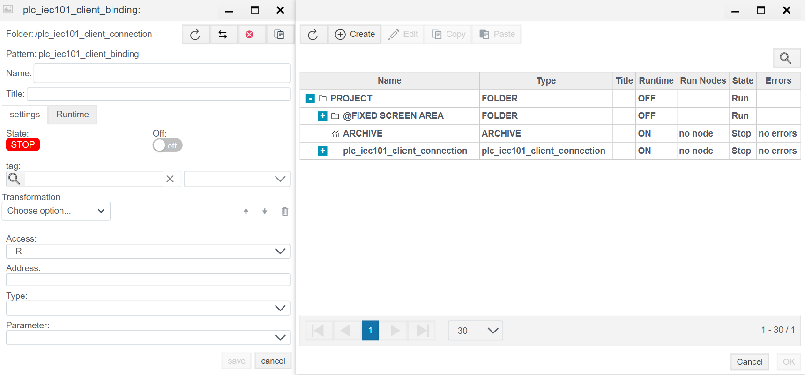
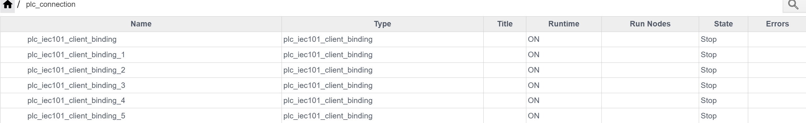

# PLC-соединения

## Назначение модуля

Модуль **PLC Connections** предназначен для настройки и управления соединениями между **Faceplate Runtime** и внешними устройствами/системами автоматизации:

- **PLC/RTU/IED** (контроллеры, терминалы, релейная защита)
- **Счётчики и измерители** (электросчётчики, теплосчётчики и т.д.)
- **OPC-серверы**
- Прочие источники технологических данных через промышленные протоколы

Через PLC-соединения система получает и/или отправляет:

- **Теги/сигналы** (AI/DI/DO/AO)
- **События и аварии**
- **Служебные статусы связи**
- **Команды управления** (если разрешено конфигурацией)

---

## Как используются PLC-соединения

PLC-соединения применяются для:

1. **Сбора телеметрии** Чтение значений датчиков, состояний, измерений.

2. **Отправки команд** Дискретное управление, уставки, подтверждения и т.д.

3. **Интеграции со сторонними системами** OPC DA/UA, шлюзы, SCADA-системы, RTU-концентраторы.

4. **Мониторинга доступности** Диагностика канала связи, статусы подключения, статистика обмена.

---

# Клиентские и серверные соединения

## Клиентское соединение (Client connection)

**Client connection** означает, что **Faceplate инициирует подключение** к удалённой стороне:

- Faceplate сам подключается по IP/порту (или по COM-порту)
- выполняет обмен по протоколу
- получает/передаёт данные

**Примеры:**
- IEC-104 Client → подключение к серверу РЗА/RTU
- Modbus Client → опрос устройства по TCP/RTU
- OPC UA Client → чтение данных с OPC UA сервера

---

## Серверное соединение (Server connection)

**Server connection** означает, что **Faceplate слушает входящие подключения** (принимает соединение как сервер):

- внешнее устройство/система подключается к Faceplate
- Faceplate обслуживает входящие запросы/сеансы
- выдаёт данные или принимает команды

**Примеры:**
- IEC-104 Server → верхняя SCADA подключается к Faceplate
- OPC UA Server → клиенты читают значения из Faceplate

---

# Поддерживаемые типы PLC-соединений

Ниже перечислены типы, доступные в папке **/plc**.

## Клиентские соединения (поддерживаемые)

- **plc_iec101_client_connection** → [IEC-101 Client](./plc_iec101_client_connection_ru.md)
- **plc_iec104_client_connection** → [IEC-104 Client](./plc_iec104_client_connection_ru.md)
- **plc_opcua_client_connection** → [OPC UA Client](./plc_opcua_client_connection_ru.md)

---

## Серверные соединения (поддерживаемые)

- **plc_iec101_server_connection** → [IEC-101 Server](./plc_iec101_server_connection_ru.md)
- **plc_iec104_server_connection** → [IEC-104 Server](./plc_iec104_server_connection_ru.md)
- **plc_opcua_server_connection** → [OPC UA Server](./plc_opcua_server_connection_ru.md)

---

## Прочие соединения (общие типы)

- **plc_ethernet_ip_connection** → [EtherNet/IP](./plc_ethernet_ip_connection_ru.md)
- **plc_mbus_connection** → [M-Bus](./plc_mbus_connection_ru.md)
- **plc_modbus_connection** → [Modbus](./plc_modbus_connection_ru.md)
- **plc_opcda_connection** → [OPC DA](./plc_opcda_connection_ru.md)
- **plc_s7_connection** → [Siemens S7](./plc_s7_connection_ru.md)
- **plc_snmp_connection** → [SNMP](./plc_snmp_connection_ru.md)

---

# Создание PLC-соединения
> Единтичны для всех PLC - соединени.
>
> Пример для plc_iec101_client_connection представлен ниже.

*Шаг 1.* В дереве проекта перейдите в директорию, где будет находиться PLC-соединение.
*Шаг 2.* Нажмите кнопку **«Создать»**.
*Шаг 3.* В дереве объектов откройте раздел **plc**.
*Шаг 4.* Убедитесь, что отображается список доступных типов соединений.

*Шаг 5.* Выберите необходимый тип соединения.
*Шаг 6.* Нажмите кнопку **«OK»**.
*Шаг 7.* Откроется окно конфигурации соединения.

---

## Диагностика (Diagnostics)

Инструмент диагностики предназначен для отладки соединения, анализа ошибок и просмотра системных сообщений в реальном времени.

### Доступ к диагностике
После создания и запуска соединения (когда статус драйвера переходит в **RUN**), в панели управления становится доступна кнопка диагностики.

При нажатии на эту кнопку открывается окно **Diagnostics: plc_connection**.

### Интерфейс окна диагностики

Окно диагностики позволяет отслеживать внутренние процессы драйвера и фильтровать поток сообщений.

#### Элементы управления

| Элемент | Описание |
| :--- | :--- |
| **Start** | **Запуск мониторинга.** Начинает вывод логов в консоль в реальном времени. |
| **Stop** | **Остановка мониторинга.** Приостанавливает обновление лога (пауза), что позволяет детально рассмотреть полученные сообщения. |
| **Clear** | Очистка окна консоли от старых сообщений. |
| **Copy** | Копирование содержимого консоли в буфер обмена (удобно для отправки отчетов об ошибках). |
| **Log level** | **Уровень детализации логов.** Позволяет фильтровать сообщения по важности (см. ниже). |
| **Log limit** | Ограничение количества строк, хранимых в буфере окна (по умолчанию 1000). Старые сообщения будут удаляться при переполнении. |

#### Панели отображения

1.  **Processes (слева):** Список активных процессов Erlang, обслуживающих данное соединение. Позволяет увидеть структуру внутренних процессов драйвера.
2.  **Logs (справа):** Основное поле вывода, где отображаются сообщения о событиях (подключение, обмен пакетами, ошибки тайм-аута и т.д.).

### Уровни логирования (Log Level)

Выбор уровня определяет, насколько подробную информацию вы увидите:

* **error:** Только критические ошибки, влияющие на работу соединения (например, обрыв связи, невозможность открыть порт).
* **warning:** Предупреждения (некритичные сбои, повторные попытки отправки). Включает в себя уровень *error*.
* **info:** Общая информация о работе (смена статусов, успешное подключение). Включает в себя *warning* и *error*.
* **debug:** Максимальная детализация. Отображает служебную информацию, байтовые посылки и ответы от устройства. Рекомендуется включать только на этапе пусконаладки, так как создает большую нагрузку.

# Создание PLC-привязки 

> Шаги единтичны для всех PLC - соединений.

*Шаг 1.* После успешного создания PLC - соединения, двойным нажатием ЛКМ по соответствующему соединению, откроется окно настройки соединения.
*Шаг 2.* Нажмите кнопку **«Создать»**.

*Шаг 3.* Откроется окно конфигурации PLC-привязки..
> Конфигурации привязок для каждого соединения
- **plc_iec101_client_binding** → [plc_iec101_client_bindings](./plc_iec101_client_connection_ru.md#шаг-2-настройка-переменных-binding))

*Шаг 4.* После конфигурации привязки, нажмите кнопку "save".

### Привязка к тегу (на примере архива)
> Единтичны для всех PLC - привязок.
>
> Пример для plc_iec101_client_connection представлен ниже.
 
**Шаг 1:** Нажмите на иконку лупы в поле **Tag**.
> Откроется окно с деревом проекта. В нем можно выбрать объект вручную или через поиск.

**Шаг 2:** Выберите объект, в который необходимо записать или с которого необходимо считать данные.
> Выделите нужный объект нажатием ЛКМ (левой кнопкой мыши), затем нажмите кнопку **OK** в правом нижнем углу.

**Шаг 3:** После выбора объекта станет активным выпадающий список полей (справа от пути объекта).
> Выберите необходимое поле объекта нажатием ЛКМ.

**Результат:**
В поле **Tag** будет указан полный путь к объекту и выбранное поле.

###  Ошибка в привязке
После успешного создания привязок, в дереве проекта привязки будут выглядеть как на рисунке ниже.

В поле Errors будет записана ошибка, в случае, если ошибки нет**, поле** будет пустым.
Ошибки могут быть :
1. unavailable address "numeric address"
2. shutdown
3. no connection
   
