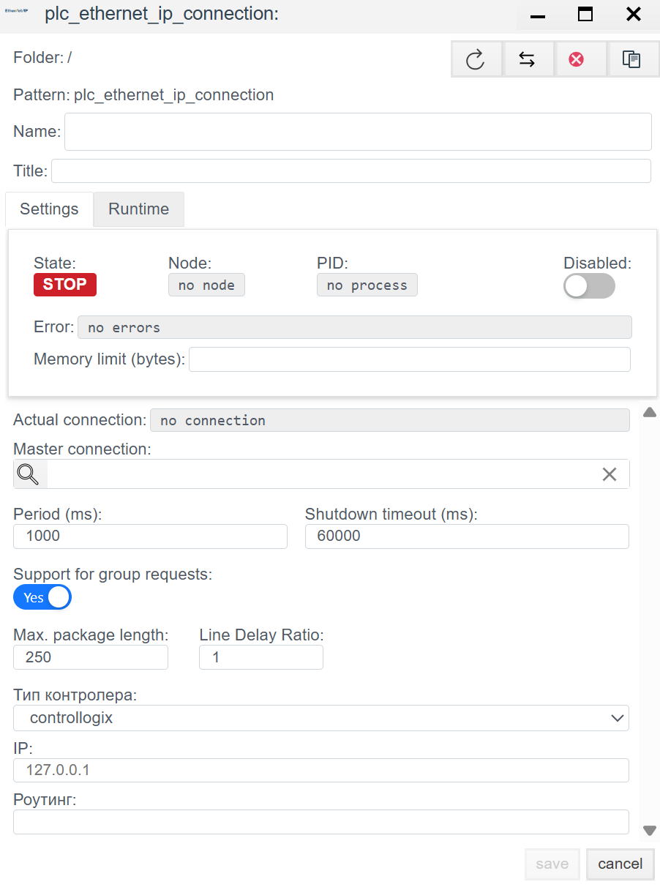
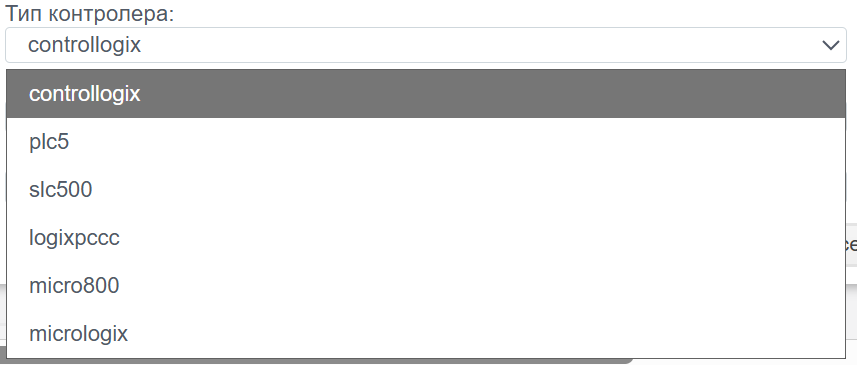

# Конфигурация драйвера Ethernet/IP (Rockwell Automation)

## Общее описание
Протокол **EtherNet/IP** (Industrial Protocol) — это промышленный стандарт, использующий Common Industrial Protocol (CIP) поверх стандартного Ethernet.
В системе **Faceplate** данный драйвер используется для нативной интеграции с контроллерами **Allen-Bradley (Rockwell Automation)** и совместимыми устройствами.

### 🏭 Поддерживаемое оборудование
Согласно конфигурации драйвера, поддерживаются следующие семейства контроллеров:
* **ControlLogix / CompactLogix** (Теговая адресация, CIP)
* **Micro800** (Серия Micro820/850/870)
* **MicroLogix** (PCCC адресация)
* **SLC 500** (Legacy, PCCC)
* **PLC-5** (Legacy, PCCC)
* **LogixPCCC** (Специфичный режим для Logix через PCCC)

---

## ШАГ 1. Настройка соединения (`plc_ethernet_ip_connection`)

На этом этапе создается сессия связи с контроллером.

### 1.1 Основные параметры (General Settings)

| Параметр | Описание |
| :--- | :--- |
| **Name** | Уникальное системное имя соединения (например, `cip_line1_main`). |
| **Period (ms)** | Период опроса.  *Рекомендация:* Для Ethernet/IP обычно 100-500 мс. CIP — быстрый протокол, но не перегружайте EN2T модули. |
| **Shutdown timeout** | Время ожидания корректного разрыва TCP-сессии (CIP Forward Close). |
| **Master connection** | Используется для настройки резервирования (Redundancy). Ссылка на основной канал. |
| **Support for group requests** | **Yes** — включить оптимизацию (Multi-Request packets). Драйвер будет упаковывать несколько чтений в один Ethernet-кадр. |

### 1.2 Параметры контроллера (Controller Settings)

Это критически важная секция, определяющая метод адресации.

| Поле | Описание и аналитика |
| :--- | :--- |
| **Тип контроллера** | Выберите семейство ПЛК: • **ControlLogix:** Использует символьные имена тегов. Самый современный режим. • **MicroLogix / SLC / PLC5:** Используют адресацию файлов данных (N7:0, F8:1). |
| **IP** | IP-адрес коммуникационного модуля или процессора. |
| **Роутинг (Routing)** | *Опционально.* Путь CIP (CIP Path) для доступа к процессору, если он находится не в том же слоте, куда приходит Ethernet, или в другом шасси. *Формат:* Обычно указывается как последовательность пар `Порт,Адрес`. *Пример:* `1,0` (Backplane, Slot 0). Оставьте пустым для CompactLogix (без шасси). |

---

## ШАГ 2. Настройка тегов (`plc_ethernet_ip_binding`)

В протоколе Ethernet/IP (особенно для ControlLogix) мы обращаемся к данным по **Имени тега**, а не по адресу памяти.

### 2.1 Параметры привязки

| Поле | Описание |
| :--- | :--- |
| **Name** | Имя объекта привязки в дереве системы. |
| **Tag** | Системный тег Faceplate, куда будет записано значение. |
| **Access** | **R** (Только чтение), **W** (Только запись), **RW**. |
| **Transformation** | Преобразование сырых данных (масштабирование, инверсия бит). |

### 2.2 Адресация данных (Target Data)

| Поле | Инструкция по заполнению |
| :--- | :--- |
| **Controller tag name** | **Символьный адрес в ПЛК.** • Для **ControlLogix:** Имя тега, как в Studio 5000. Например: `MyTag`, `Program:MainProg.Step`. • Для **SLC/MicroLogix:** Адрес элемента. Например: `N7:0`, `F8:10`, `B3:0/5`. |
| **Data type** | Тип данных, ожидаемый от контроллера (DINT, REAL, BOOL, STRING). Должен совпадать с типом, объявленным в ПЛК. |

---

<!-- ## Дополнительно

1.  **CIP Path (Роутинг):** Самая частая ошибка при работе с шасси ControlLogix. Если Ethernet-модуль стоит в слоте 1, а процессор в слоте 0, IP-адреса недостаточно. Нужно прописать путь к процессору через Backplane.
2.  **Синтаксис тегов:** В ControlLogix теги бывают *Controller Scoped* (глобальные) и *Program Scoped* (локальные).
    * Глобальный: `TagName`
    * Локальный: `Program:ProgramName.TagName`
3.  **Строки (Strings):** В Allen-Bradley строки имеют специфичную структуру (длина + данные). Убедитесь, что `Data type` выбран верно, чтобы драйвер корректно распаковал структуру.
4.  **Legacy (SLC/PLC5):** Эти контроллеры не поддерживают оптимизацию `Support for group requests` так же эффективно, как новые. Если возникают ошибки связи, попробуйте отключить эту опцию. -->