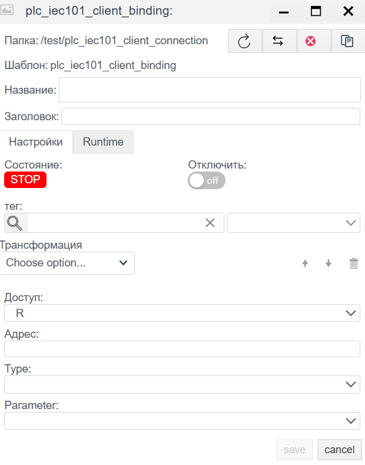

# Руководство по конфигурации IEC 60870-5-101 Client

## Общее описание
Драйвер **IEC 101 Client** предназначен для обмена данными с оборудованием телемеханики (RTU) по последовательным каналам связи (RS-232, RS-485) используя протокол **IEC 60870-5-101**. В отличие от IEC 104 (TCP/IP), этот протокол ориентирован на низкоскоростные физические линии и требует точной настройки адресации канального уровня.

Процесс настройки состоит из двух этапов:
1.  **Connection (`plc_iec101_client_connection`):** Настройка COM-порта, параметров канального уровня (Link Layer) и адресации.
2.  **Binding (`plc_iec101_client_binding`):** Адресация конкретных информационных объектов (IOA).

---

## ШАГ 1. Настройка соединения (Connection)

На этом этапе задаются параметры физического порта и специфичные настройки протокола IEC 101 (размеры адресов, режим баланса).

### 1.1 Панель диагностики (Runtime)
| Поле | Описание |
| :--- | :--- |
| **State** | **STOP** — драйвер остановлен. **RUN** — драйвер запущен. |
| **Error** | Текст ошибки (например, `Timeout` или ошибка открытия порта). |
| **Actual connection** | Текущий активный канал (при резервировании). |

### 1.2 Основные параметры (Settings)
| Параметр | Описание |
| :--- | :--- |
| **Name** | Уникальное имя соединения. |
| **Period (ms)** | Базовый цикл обработки драйвера. |
| **Shutdown timeout (ms)** | Время ожидания завершения операций при остановке. |
| **Support for group requests** | **Yes** — включить поддержку общего опроса (General Interrogation). |
| **Max. package length** | Максимальный размер пакета. Обычно 250 байт. |
| **Line Delay Ratio** | Коэффициент задержки линии. |

### 1.3 Параметры Протокола (IEC 60870-5-101)
Критические настройки, которые должны совпадать с конфигурацией RTU.

| Поле | Описание |
| :--- | :--- |
| **Common Address of ASDU** | **Адрес станции (CA).** Логический адрес устройства (RTU). |
| **Common Address Size** | Размер поля адреса ASDU. Стандарт: **1** или **2** байта. |
| **Originator Address Size** | Размер поля адреса отправителя. Обычно **1** байт (иногда 0). |
| **Information Object Address Size** | Размер адреса объекта (IOA). Обычно **2** или **3** байта. |
| **Link Address** | **Адрес канального уровня.** Используется для адресации физического устройства на шине RS-485 (в несбалансированном режиме). Часто совпадает с Common Address. |
| **Link Address Size** | Размер поля адреса канала. Стандарт: **1** или **2** байта (иногда 0 для точка-точка). |
| **Balanced** | **Режим передачи:** • **Off (Unbalanced):** Режим "Ведущий-Ведомый" (Master-Slave). Сервер опрашивает устройства по очереди. (Стандарт для RS-485). • **On (Balanced):** Равноправный режим (Point-to-Point). Спонтанная передача с обеих сторон. (Чаще для RS-232, оптоволокна, полным дуплексом). |

### 1.4 Настройки порта (SERIAL)
| Поле | Описание |
| :--- | :--- |
| **Port** | Путь к COM-порту (Linux: `/dev/ttyS0`, Windows: `COM1`). |
| **Baud rate** | Скорость передачи (например, `9600`). |
| **Parity** | Четность (None, Even, Odd). IEC 101 часто требует `Even`. |
| **Stop bits** | Стоповые биты (1 или 2). |
| **Data bits** | Биты данных (обычно 8). |
| **Timeout** | Время ожидания ответа от устройства. |
| **Attempts** | Количество попыток запроса перед ошибкой. |

**Group request:** Настройка периодичности общего опроса (Interrogation) для групп (обычно группа 20).

---

## ШАГ 2. Настройка переменных (Binding)

### 2.1 Параметры привязки
| Поле | Описание |
| :--- | :--- |
| **Name** | Имя привязки. |
| **Tag** | Системный тег Faceplate. |
| **Transformation** | Преобразование значения. |
| **Access** | **R** (Чтение/Мониторинг), **W** (Запись/Команда), **RW** (Чтение и Запись). |
| **Address** | **IOA (Information Object Address).** Адрес объекта. Число. |
| **Type** | **Тип ASDU.** Формат данных. Примеры: `1: M_SP_NA_1` (Single Point), `30: M_SP_TB_1` (Single Point + Time). |
| **Parameter** | Атрибут значения: `Value`, `Quality`, `Timestamp`. |

### Расчет IOA (Если задан октетами)
Если адрес в карте задан байтами (например, `10.2.0`), используйте формулу Little-Endian:
$$Address = Octet_1 + (Octet_2 \times 256) + (Octet_3 \times 65536)$$