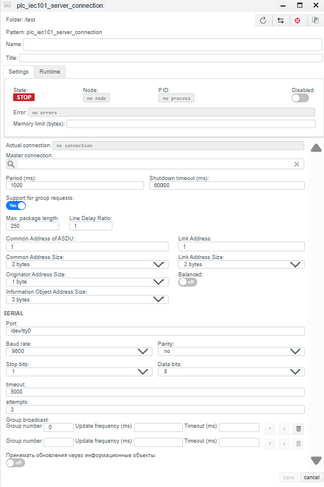
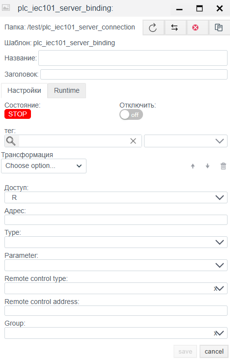

# Руководство по конфигурации IEC 60870-5-101 Server

## Общее описание
Драйвер **IEC 101 Server** позволяет системе **Faceplate** работать в режиме Контролируемого Пункта (КП / Slave) по последовательным интерфейсам (RS-232/485). В этом режиме система ожидает запросов от внешнего Пункта Управления (Master), передает данные и выполняет команды телеуправления.

Процесс настройки состоит из двух этапов:
1.  **Connection (`plc_iec101_server_connection`):** Настройка COM-порта, физического уровня и параметров адресации.
2.  **Binding (`plc_iec101_server_binding`):** Формирование карты адресов (IOA) и настройка параметров управления.

---

##  1. Настройка соединения (Connection)
> Создать PLC cоединения → [Шаги создания PLC соединения](./general_ru.md#создание-plc-соединения)

На этом этапе задаются параметры порта и логики протокола. Они должны строго соответствовать настройкам Мастера.

#### 1.1 Панель диагностики
>Диагностика PLC соединения → [Диагностика](./general_ru.md#диагностика-diagnostics)

| Поле | Описание |
| :--- | :--- |
| **State** | **STOP** — драйвер остановлен. **RUN** — драйвер запущен. |
| **Node** | Узел кластера. Указывает, на каком узле выполняется процесс. |
| **PID** | ID процесса. |
| **Error** | Текст ошибки (при наличии). |
| **Disabled** | Флаг отключения соединения. Через данную кнопку пользователь отключает или включает драйвер.|
| **Memory limit (bytes)** | Ограничение памяти (пределы оперативной памяти в байтах для процесса, обслуживающего соединение). Емкость памяти определяет количество переменных (тегов), которые могут быть обработаны. |
| **Actual connection** | Текущий активный канал связи. В системах с резервированием (Redundancy) указывает, какое именно соединение (основное или резервное) осуществляет обмен данными в текущий момент. |
| **Master connection** | Привязка к основному каналу связи. Заполняется для резервных соединений. Поле указывает, какое соединение является приоритетным (Master), определяя логическую пару для механизма резервирования. |

### 1.2 Основные параметры (Settings)
| Параметр | Описание |
| :--- | :--- |
| **Name** | Уникальное имя соединения. |
| **Title** | Заголовок (описание) данного объекта. |
| **Period (ms)** | Базовый цикл обработки драйвера. |
| **Shutdown timeout (ms)** | Время ожидания завершения операций при остановке драйвера. |
| **Support for group requests** *| **Yes** — включить поддержку общего опроса (General Interrogation). |
| **Max. package length** *| Максимальный размер пакета. Обычно 250 байт. |
| **Line Delay Ratio** *| Коэффициент задержки линии. |

> *Примечание:* Для данного типа соединения параметры «Support for group requests*», «Max. package length*» и «Line Delay Ratio*» в соединения не используются. Рекомендуется оставить эти настройки по умолчанию.

### 1.3 Параметры Протокола и Адресации
| Поле | Описание |
| :--- | :--- |
| **Common Address of ASDU** | **Адрес станции (CA).** Логический адрес этого устройства. |
| **Common Address Size** | Размер поля адреса ASDU (1 или 2 байта). |
| **Originator Address Size** | Размер поля адреса отправителя (1 байт или 0). |
| **Information Object Address Size** | Размер поля IOA (2 или 3 байта). |
| **Link Address** | **Адрес канального уровня.** Используется в несбалансированном режиме для адресации на шине. |
| **Link Address Size** | Размер поля адреса канала (1 или 2 байта). |
| **Balanced** | **Режим передачи:** • **Off (Unbalanced):** Несбалансированный (Master-Slave). Обычный режим для RS-485. • **On (Balanced):** Сбалансированный (Point-to-Point). Равноправный режим (обычно RS-232). |

### 1.4 Настройки порта (SERIAL)
| Поле | Описание |
| :--- | :--- |
| **Port** | Имя порта (например, `/dev/ttyUSB0` или `COM1`). |
| **Baud rate** | Скорость передачи (9600, 19200 и т.д.). |
| **Parity** | Четность. В IEC 101 стандартом де-факто является **Even** (Четность). |
| **Stop bits** | Стоповые биты. |
| **Data bits** | Биты данных (обычно 8). |
| **Timeout** | Время ожидания байта в линии. |
| **Attempts** | Количество повторов (актуально для балансного режима). |

**Group broadcast (Групповая рассылка):**
Позволяет настроить периодическую отправку данных определенных групп, даже если клиент не запрашивал их явно.

**Управление списком групп:**
1.  **Добавление группы:** Используйте элементы управления интерфейса для создания новой строки.
2.  **Удаление группы:** Нажмите кнопку с иконкой корзины (Delete) справа от соответствующей строки.
3.  **Порядок:** Используйте стрелки **↑** и **↓** для изменения приоритета опроса групп.

**Параметры группы:**
| Поле | Описание |
| :--- | :--- |
| **Group number** | Уникальный номер (ID) группы опроса. Служит для внутренней идентификации и соответствия стандарту. |
| **Update frequency (ms)** | Период опроса группы в миллисекундах. Определяет, как часто драйвер будет запрашивать обновление данных для тегов, входящих в эту группу. |
| **Timeout (ms)** | Время ожидания ответа от устройства для данной группы запросов. |
---

## 2. Настройка переменных (Binding)

> Создать PLC привязку → [Шаги создания PLC привязки](./general_ru.md#создание-plc-привязки)

### 2.1 Параметры привязки
| Поле | Описание |
| :--- | :--- |
| **Name** | Имя привязки. |
| **Title** | Заголовок (описание) для данного объекта. |
| **State** | **STOP** — привязка остановлена. **RUN** — привязка запущен. |
| **Tag** | Системный тег Faceplate.  Значение будет записано из выбранное поле выбранного объекта в протокол. Cм. [Привязка к тегу](./general_ru.md#привязка-к-тегу-на-примере-архива) |
| **Transformation** | Преобразование значения. См. [Transformation](./transformation_ru.md). |
| **Access** | **R** (Чтение), **W** (Запись), **RW** (Чтение/Запись). |
| **Address** | **IOA (Information Object Address).** Адрес объекта. Числовое значение. |
| **Type** | **Тип ASDU.** Формат данных. Примеры: `1: M_SP_NA_1` (Single Point), `30: M_SP_TB_1` (Single Point + Time). Подробнее в (https://support.kaspersky.com/kics-for-networks/3.0/206199) |
| **Parameter** | Атрибут значения: `Value` (значение), `Quality` ( DIQ/SIQ/QDS), `Timestamp` (метка времени TS). |

>Ошибка в PLC привязке -> [ошибка привязки](./general_ru.md#ошибка-в-привязке)

### 2.2 Расчет IOA (Если задан октетами)
Если адрес в карте памяти задан байтами (например, `10.2.0`), используйте формулу для перевода в десятичное число:
$$Address = Octet_1 + (Octet_2 \times 256) + (Octet_3 \times 256^2)$$

### 2.3 Параметры записи (При Access = RW / W)

Эти поля появляются только если выбран режим **RW** или **W**.
*Примечание:* Для команд телеуправления (TU) использование `Access: RW` обязательно.

| Поле | Описание |
| :--- | :--- |
| **Remote control type** | **Тип команды (Command TypeID).** Тип ASDU для отправки команды. Примеры: • `45: C_SC_NA_1` (Single Command - однопозиционная команда) • `46: C_DC_NA_1` (Double Command - двухпозиционная команда) • `50: C_SE_NC_1` (Set Point Float - уставка float) |
| **Remote control address** | **IOA Команды.** Адрес объекта для записи. Часто совпадает с адресом чтения (`Address`), но иногда они разделены (например, чтение состояния выключателя по IOA 100, а команда управления им по IOA 2100). |

---