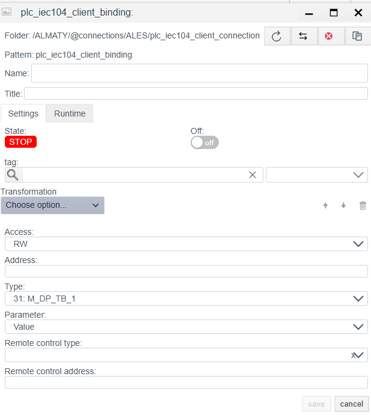

# Руководство по конфигурации IEC 60870-5-104 Client

## Общее описание
Драйвер **IEC 104 Client** предназначен для обмена данными с оборудованием телемеханики (RTU, контроллеры подстанций, терминалы РЗА) по протоколу **IEC 60870-5-104** через сети TCP/IP.

Процесс настройки состоит из двух этапов:
1.  **Connection (`plc_iec104_client_connection`):** Настройка сетевого соединения, параметров ASDU и таймингов протокола.
2.  **Binding (`plc_iec104_client_binding`):** Адресация конкретных информационных объектов (IOA) и настройка команд телеуправления.

---

## ШАГ 1. Настройка соединения (Connection)

На этом этапе задаются параметры физического подключения и настройки канального уровня.

### 1.1 Панель диагностики (Runtime)
Верхняя часть окна отображает статус драйвера.

| Поле | Описание |
| :--- | :--- |
| **State** | **STOP** — драйвер остановлен. **RUN** — драйвер запущен. |
| **Error** | Текст ошибки связи (например, `Socket error` или `DT timeout`). |
| **Actual connection** | Текущий активный канал (при использовании резервирования). |

### 1.2 Основные параметры (Settings)

| Параметр | Описание |
| :--- | :--- |
| **Name** | Уникальное имя соединения. |
| **Period (ms)** | Базовый цикл обработки драйвера. |
| **Shutdown timeout (ms)** | Время ожидания корректного разрыва соединения. |
| **Support for group requests** | **Yes** — включить возможность периодического общего опроса (General Interrogation). |
| **Max. package length** | Максимальный размер APDU. Стандартно 250 байт. |
| **Line Delay Ratio** | Коэффициент задержки для медленных линий связи. |

### 1.3 Настройки протокола (TCP & Layer Parameters)

Эти параметры должны строго совпадать с настройками в ведомом устройстве (RTU).

| Поле | Описание |
| :--- | :--- |
| **IP/Hostname** | IP-адрес ведомого устройства (Slave/Server). |
| **Port** | TCP порт. |
| **Common Address of ASDU** | Общий адрес станции (CA). Уникальный идентификатор устройства на шине. |
| **Common Address Size** | Размер поля адреса ASDU (обычно **2** байта). |
| **Originator Address Size** | Размер поля адреса отправителя (обычно **1** байт, иногда 0). |
| **Information Object Address Size** | Размер поля адреса объекта (IOA). Стандарт: **3** байта. |
| **To** | Тайм-аут установки TCP соединения (t0). |
| **T1 (ms)** | Тайм-аут подтверждения отправленного APDU (t1). |
| **T2 (ms)** | Тайм-аут подтверждения приема APDU (t2) при отсутствии трафика данных. |
| **T3 (ms)** | Тайм-аут тестирования канала (t3). Если канал простаивает это время, отправляется тестовый фрейм `TESTFR`. |
| **W** | Размер окна передачи (w). Количество неподтвержденных APDU, которые можно принять до отправки подтверждения. |

**Group request (Групповой опрос):**
Секция внизу позволяет настроить периодичность вызова "Общего опроса" (General Interrogation) для конкретных групп.
* **Group number:** Номер группы опроса (обычно 20 для Global Interrogation).
* **Update frequency (ms):** Период опроса.
* **Timeout (ms):** Время ожидания завершения опроса.

---

## ШАГ 2. Настройка переменных (Binding)

Настройка привязки конкретного сигнала телесигнализации (TS) или телеизмерения (TM).

### 2.1 Общие параметры
| Поле | Описание |
| :--- | :--- |
| **Name** | Имя объекта привязки. |
| **Tag** | Системный тег Faceplate. |
| **Transformation** | Преобразование значения (например, масштабирование). |
| **Access** | Режим доступа: • **R** — Только чтение (Мониторинг). • **W** — Только Запись. • **RW** — Чтение и Запись (Телеуправление). |
| **Address** | **IOA (Information Object Address).** Адрес информационного объекта (Полный Адрес). Число (например, `100`). См. раздел расчета адреса ниже. |
| **Type** | **Тип ASDU (TypeID).** Тип данных, ожидаемый от устройства. Примеры: • `1: M_SP_NA_1` (Одноэлементная ТС) • `30: M_SP_TB_1` (ТС с меткой времени CP56) • `13: M_ME_NC_1` (Измерение float) • `36: M_ME_TF_1` (Измерение float с меткой времени) |
| **Parameter** | Атрибут значения: `Value` (Значение), `Quality` (Качество сигнала: QDS/SIQ), `Timestamp` (Метка времени). |

### Расчет полного адреса IOA

Стандартный размер адреса информационного объекта (IOA) составляет **3 байта**. Если в документации к устройству IOA разбит на октеты (байты), его нужно пересчитать в десятичный формат. Используется порядок байт **Little-Endian**.

**Формула:**
$$Address = Октет_1 + (Октет_2 \times 256) + (Октет_3 \times 65536)$$

**Пример:** Адрес в карте `10.2.0` (HEX: `0A 02 00`).
$$10 + (2 \times 256) + (0 \times 65536) = 10 + 512 = \mathbf{522}$$
В поле **Address** вписываем **522**.

### 2.2 Параметры Телеуправления и Записи (При Access = RW / W)

Эти поля появляются только если выбран режим **RW** или **W**.
*Примечание:* Для команд телеуправления (TU) использование `Access: RW` обязательно.

| Поле | Описание |
| :--- | :--- |
| **Remote control type** | **Тип команды (Command TypeID).** Тип ASDU для отправки команды. Примеры: • `45: C_SC_NA_1` (Single Command - однопозиционная команда) • `46: C_DC_NA_1` (Double Command - двухпозиционная команда) • `50: C_SE_NC_1` (Set Point Float - уставка float) |
| **Remote control address** | **IOA Команды.** Адрес объекта для записи. Часто совпадает с адресом чтения (`Address`), но иногда они разделены (например, чтение состояния выключателя по IOA 100, а команда управления им по IOA 2100). |

---
<!-- 
## Дополнительно 

1.  **Размеры полей (Sizes):** Если соединение разрывается сразу после старта, проверьте параметры `Common Address Size`, `Originator Address Size` и `IOA Size`. Они должны точно соответствовать настройкам в RTU.
2.  **Типы ASDU:** Убедитесь, что выбранный `Type` соответствует типу данных, который присылает устройство. Если устройство шлет ТС с меткой времени (Type 30), а вы настроили Type 1, данные могут игнорироваться.
3.  **Телеуправление:** Для команд (TU) обязательно используйте `Access: RW`. Если команды не проходят, проверьте, не требует ли устройство двухэтапного выполнения (Select/Execute) — драйвер обычно обрабатывает это автоматически в зависимости от типа команды. -->
   

