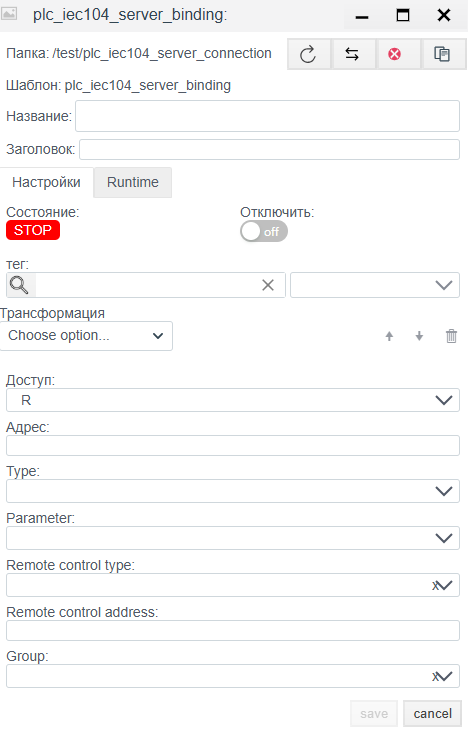

# Руководство по конфигурации IEC 60870-5-104 Server

## Общее описание
Драйвер **IEC 104 Server** позволяет системе **Faceplate** выступать в роли контролируемого пункта (КП/Slave). В этом режиме система открывает TCP-порт и ожидает подключений от внешних управляющих систем (SCADA верхнего уровня, Пункты Управления), передавая им данные своих внутренних тегов и принимая команды управления.

Процесс настройки состоит из двух этапов:
1.  **Connection (`plc_iec104_server_connection`):** Настройка TCP-порта, адресации ASDU и временных параметров протокола.
2.  **Binding (`plc_iec104_server_binding`):** Публикация конкретных тегов в адресное пространство протокола (IOA) и настройка параметров для приема команд.

---

##  1. Настройка соединения (Connection)
> Создать PLC cоединения → [Шаги создания PLC соединения](./general_ru.md#создание-plc-соединения)
> 
На этом этапе конфигурируется "слушающий" сокет и параметры канального уровня. Эти настройки должны соответствовать настройкам Клиента (Master), который будет подключаться к Faceplate.

### 1.1 Панель диагностики
Верхняя часть окна отображает статус драйвера.
>Диагностика PLC соединения → [Диагностика](./general_ru.md#диагностика-diagnostics)

| Поле | Описание |
| :--- | :--- |
| **State** | **STOP** — драйвер остановлен. **RUN** — драйвер запущен. |
| **Node** | Узел кластера. На какой ноде изполняется процесс |
|**PID**|ID процесса.|
| **Error** | Текст ошибки. |
|**Disabled**||
|**Memory limit (bytes)**| Ограничение памяти(пределы оперативной памяти (МБ) для процесса, обслуживающего соединение). Емкость памяти определяет количество переменных (тегов), которые могут быть обработаны в процессе функционирования соединения.|
| **Actual connection** | Текущий исполняемый канал связи. В системах с резервированием (Redundancy) указывает, какое именно соединение (основное или резервное) осуществляет обмен данными в текущий момент времени.|
|**Master connection**|  Привязка к основному каналу связи. Заполняется для резервных соединений. Поле указывает, какое соединение является приоритетным (Master), определяя логическую пару для механизма резервирования.|

## 1.2 Основные параметры (Settings)

| Параметр | Описание |
| :--- | :--- |
| **Name** | Уникальное имя соединения. |
| **Title** | Заголовок (описание) данного объекта. |
| **Period (ms)** | Базовый цикл обработки драйвера. |
| **Shutdown timeout (ms)** | Время ожидания корректного разрыва соединения. |
| **Support for group requests** | **Yes** — включить возможность периодического общего опроса (General Interrogation). |
| **Max. package length** | Максимальный размер APDU. Стандартно 250 байт. |
| **Line Delay Ratio** | Коэффициент задержки для медленных линий связи. |

### 1.3 Параметры протокола (IEC 60870-5-104 server)

| Поле | Описание |
| :--- | :--- |
| **Port** | TCP порт для входящих соединений. Стандарт IANA: **2404**. |
| **Originator Address** | Адрес инициатора, который сервер будет подставлять в свои ответы по умолчанию (обычно 0). |
| **Common Address of ASDU** | **Адрес станции (CA).** Уникальный номер этого устройства в сети IEC 104. Должен совпадать с настройками Клиента. |
| **Common Address Size** | Размер поля адреса ASDU в байтах. Стандарт: **2 bytes**. |
| **Originator Address Size** | Размер поля адреса отправителя. Стандарт: **1 byte** (иногда 0). |
| **Information Object Address Size** | Размер поля адреса объекта (IOA). Стандарт: **3 bytes**. |
| **K** | Параметр **k** (APDU transmit window). Максимальное число переданных пакетов без подтверждения. |
| **W** | Параметр **w** (APDU receive window). Максимальное число принятых пакетов до отправки подтверждения. |
| **T1 (ms)** | Тайм-аут ожидания подтверждения передачи (Time-out for send confirmation). |
| **T2 (ms)** | Тайм-аут ожидания подтверждения приема (Time-out for ack in case of no data message). |
| **T3 (ms)** | Тайм-аут теста канала (Time-out for send test frames). Интервал отправки `TESTFR`, если канал простаивает. |

**Group broadcast (Групповая рассылка):**
Позволяет настроить периодическую отправку данных определенных групп, даже если клиент не запрашивал их явно.

**Управление списком групп:**
1.  **Добавление группы:** Используйте элементы управления интерфейса для создания новой строки.
2.  **Удаление группы:** Нажмите кнопку с иконкой корзины (Delete) справа от соответствующей строки.
3.  **Порядок:** Используйте стрелки **↑** и **↓** для изменения приоритета опроса групп.

**Параметры группы:**
| Поле | Описание |
| :--- | :--- |
| **Group number** | Уникальный номер (ID) группы опроса. Служит для внутренней идентификации и соответствия стандарту. |
| **Update frequency (ms)** | Период опроса группы в миллисекундах. Определяет, как часто драйвер будет запрашивать обновление данных для тегов, входящих в эту группу. |
| **Timeout (ms)** | Время ожидания ответа от устройства для данной группы запросов. |
---

##  2. Настройка переменных (Binding)

Этот этап определяет список сигналы, которые сервер будет отдавать "наверх".

> Создать PLC привязку → [Шаги создания PLC привязки](./general_ru.md#создание-plc-привязки)
> 
### 2.1 Параметры привязки
| Поле | Описание |
| :--- | :--- |
| **Name** | Имя привязки. |
| **Title** | Заголовок (описание) для данного объекта. |
| **State** | **STOP** — привязка остановлена. **RUN** — привязка запущен. |
| **Tag** | Системный тег Faceplate.  Значение будет записано из выбранное поле выбранного объекта в протокол. Cм. [Привязка к тегу](./general_ru.md#привязка-к-тегу-на-примере-архива) |
| **Transformation** | Преобразование значения. См. [Transformation](./transformation_ru.md). |
| **Access** | **R** (Чтение), **W** (Запись), **RW** (Чтение/Запись). |
| **Address** | **IOA (Information Object Address).** Адрес объекта. Числовое значение. |
| **Type** | **Тип ASDU.** Формат данных. Примеры: `1: M_SP_NA_1` (Single Point), `30: M_SP_TB_1` (Single Point + Time). Подробнее в (https://support.kaspersky.com/kics-for-networks/3.0/206199) |
| **Parameter** | Атрибут значения: `Value` (значение), `Quality` ( DIQ/SIQ/QDS), `Timestamp` (метка времени TS). |

>Ошибка в PLC привязке -> [ошибка привязки](./general_ru.md#ошибка-в-привязке)

### 2.2 Расчет IOA (Если задан октетами)
Если адрес в карте памяти задан байтами (например, `10.2.0`), используйте формулу для перевода в десятичное число:
$$Address = Octet_1 + (Octet_2 \times 256) + (Octet_3 \times 256^2)$$

### 2.3 Параметры Телеуправления (Remote Control)
Эти поля становятся активными и обязательными, если `Access` установлен в **RW**. Они определяют, как сервер должен обрабатывать входящие команды.

| Поле | Описание |
| :--- | :--- |
| **Remote control type** | **Тип команды.** Тип ASDU, который сервер ожидает получить от клиента для воздействия на этот объект. Примеры: `C_SC_NA_1` (Single Command), `C_SE_NC_1` (Setpoint Float). |
| **Remote control address** | **IOA Команды.** Адрес, на который клиент должен прислать команду управления. Часто совпадает с адресом мониторинга (`Address`), но может и отличаться. |
| **Group** | Номер группы опроса (Interrogation Group), в которую входит данный сигнал (обычно 20 — General Interrogation). |

---
