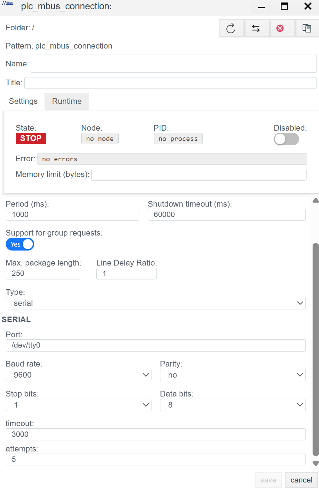
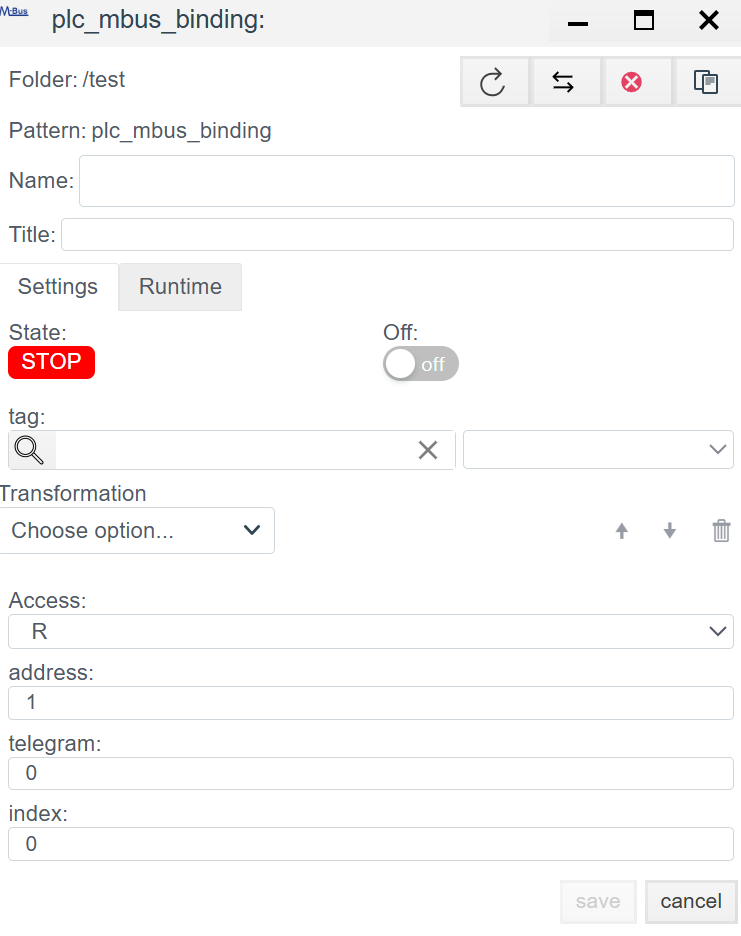

# Руководство по конфигурации драйвера M-Bus (Meter-Bus)

## Общее описание
**M-Bus (Meter-Bus)** — это специализированный европейский стандарт (EN 13757) для дистанционного считывания данных с приборов коммерческого учета: теплосчетчиков, водосчетчиков, счетчиков газа и электроэнергии.

В системе **Faceplate** драйвер M-Bus является гибридным и поддерживает два физических уровня:
1.  **Serial (COM):** Прямое подключение к серверу через Master-конвертер уровней (M-Bus <-> RS-232/485).
2.  **TCP (Ethernet):** Подключение через удаленные шлюзы (Ethernet-to-MBus) или прозрачные конвертеры.

Архитектура настройки состоит из двух шагов:
1.  **Connection (`plc_mbus_connection`):** Настройка транспорта до шины.
2.  **Binding (`plc_mbus_binding`):** Настройка опроса конкретной переменной внутри прибора.

---

## ШАГ 1. Настройка соединения (Connection)

На этом этапе мы конфигурируем мастер-устройство, опрашивающее шину.

### 1.1 Диагностика и управление (Runtime)
*Панель для мониторинга состояния драйвера в реальном времени.*

| Поле | Описание |
| :--- | :--- |
| **State** | **STOP** (Красный) — опрос остановлен. **RUN** (Зеленый) — драйвер работает. |
| **Error** | Текст последней ошибки (например, `Timeout` или `Checksum error`). |
| **Actual connection** | При использовании резервирования показывает, какой канал активен (Master или Backup). |

### 1.2 Базовые настройки (General Settings)

| Параметр | Рекомендации системного аналитика |
| :--- | :--- |
| **Name** | Уникальное имя соединения в системе. |
| **Period (ms)** | Период опроса шины.  ⚠️ **Важно:** M-Bus — медленный протокол (обычно 2400 бод). Не ставьте период менее **60000 мс** (1 минута), особенно если приборы работают от батареек, чтобы не разрядить их раньше срока. |
| **Type** | Переключатель режима: `serial` или `tcp`. |

---

### 1.3 Настройка физического уровня (В зависимости от Type)

#### Вариант А: Режим `serial` (Прямое подключение)
Используется, если аппаратный конвертер M-Bus подключен непосредственно к COM-порту сервера.

| Поле | Описание |
| :--- | :--- |
| **Port** | Системное имя порта (Linux: `/dev/ttyUSB0`, Win: `COM1`). |
| **Baud rate** | Скорость обмена.  *Стандарт:* Обычно **2400** (реже 9600). Должна совпадать с настройками приборов. |
| **Parity** | Четность.  *Стандарт:* Обычно **Even** (Четность). На скриншоте стоит `no`, но для большинства теплосчетчиков требуется `Even`. |
| **Data / Stop bits** | Обычно 8 бит данных и 1 стоп-бит. |
| **Timeout** | Время ожидания ответа. Для M-Bus лучше ставить с запасом (3000-5000 мс). |

#### Вариант Б: Режим `tcp` (Сетевой шлюз)
Используется, если шина M-Bus находится удаленно и подключена через Ethernet-конвертер.

| Поле | Описание |
| :--- | :--- |
| **IP/Hostname** | IP-адрес шлюза. |
| **Port** | TCP порт (часто `502`, `1001` или `8000` — см. документацию на шлюз). |
| **Timeout** | Учитывайте сетевые задержки + медлительность самой шины. |

> **Действие:** После настройки нажмите **Save**, затем дважды кликните по созданному соединению, чтобы добавить привязки.

---

## ШАГ 2. Настройка переменных (Binding)

Особенность M-Bus в том, что прибор отдает **всю** информацию одним большим пакетом. Задача Binding — "выкусить" из этого пакета нужное значение.

### 2.1 Параметры привязки

| Поле | Описание |
| :--- | :--- |
| **Name** | Имя объекта привязки. |
| **Tag** | Системный тег, в который будет записано значение. |
| **Access** | **R** — Read Only (Только чтение). **W** — Write (Редко используется в M-Bus). |
| **Address** | **Primary Address (Первичный адрес).** Число от 1 до 250. Уникальный адрес счетчика на шине. |
| **Telegram** | Номер телеграммы. Для большинства простых приборов = `0`. (Используется, если данные не влезают в один пакет). |
| **Index** | **Индекс данных в пакете.** Самый сложный параметр.  Это порядковый номер переменной в структуре ответа M-Bus.  *Пример:* Если счетчик шлет последовательность: [Время, Энергия, Расход, Температура], то для получения Энергии Index = `1` (или `0`, зависит от реализации драйвера, начните с 0). |

---

<!-- ## Дополнительно

1.  **Физика связи (90% проблем):**
    * Стандартные настройки большинства счетчиков (Danfoss, Kamstrup, Techem): **2400 baud, 8E1 (Even Parity)**.
    * Убедитесь, что настройки в секции `Serial` соответствуют этому стандарту. На скриншотах `9600 8N1` — это часто подходит для Modbus, но редко для M-Bus.
2.  **Поиск Индекса (Index):**
    * Драйвер не показывает имена переменных из пакета ("Energy", "Volume"), он видит только поток данных.
    * *Совет:* Используйте стороннюю утилиту (например, M-Bus Sheet или ПО от производителя шлюза), чтобы прочитать пакет целиком, посмотреть, каким по счету идет нужный параметр, и вписать этот номер в поле `Index`.
3.  **Коллизии адресов:**
    * В M-Bus частая проблема — два прибора с заводским адресом `0` или `1` на одной шине. Подключайте приборы по одному и меняйте им адреса перед сборкой полной шины. -->