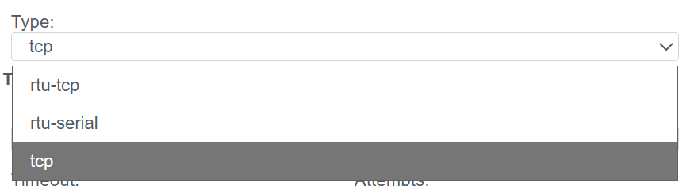
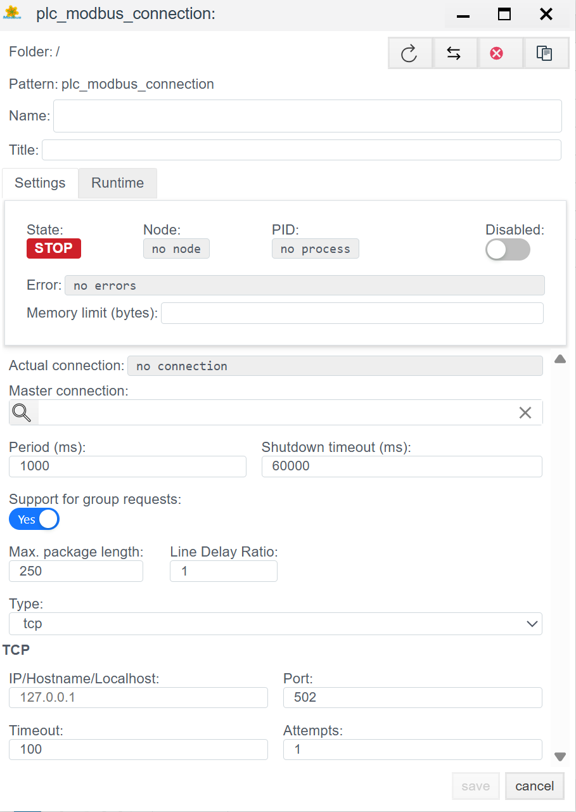
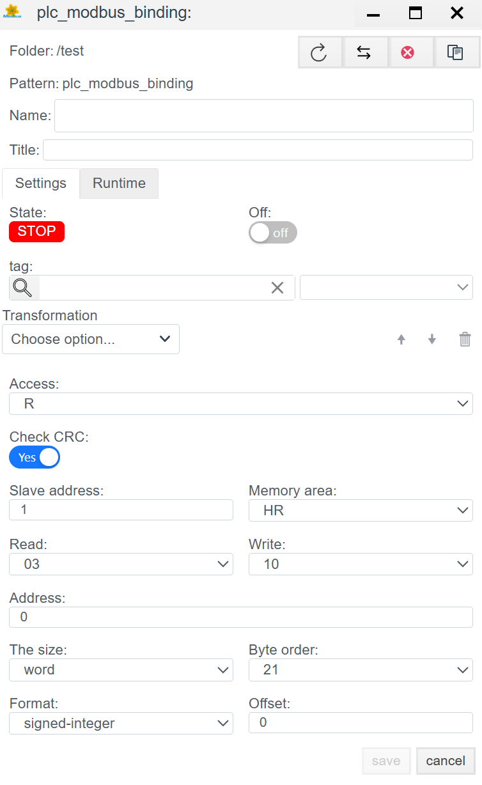

# Руководство по конфигурации Modbus (TCP/RTU)

## Общее описание
**Modbus** — это де-факто стандарт промышленной автоматизации. В системе **Faceplate** реализован универсальный драйвер, поддерживающий три режима работы, что позволяет опрашивать как современные контроллеры, так и устаревшее оборудование или датчики через шлюзы.

Поддерживаемые режимы (`Type`):
1.  **tcp:** Классический Modbus TCP (Ethernet).
2.  **rtu-serial:** Modbus RTU через физический COM-порт (RS-485/232).
3.  **rtu-tcp:** Modbus RTU инкапсулированный в TCP пакет (Modbus-over-TCP). Используется для работы с прозрачными шлюзами (Moxa, HF и др.).

Процесс настройки состоит из двух этапов:
1.  **Connection (`plc_modbus_connection`):** Настройка транспорта.
2.  **Binding (`plc_modbus_binding`):** Адресация регистров.

---

##  1. Настройка соединения (Connection)
> Создать PLC cоединения → [Шаги создания PLC соединения](./general_ru.md#создание-plc-соединения)
На этом этапе мы выбираем физику связи.

### 1.1 Панель диагностики
>Диагностика PLC соединения → [Диагностика](./general_ru.md#диагностика-diagnostics)

| Поле | Описание |
| :--- | :--- |
| **State** | **STOP** — драйвер остановлен. **RUN** — драйвер запущен. |
| **Node** | Узел кластера. Указывает, на каком узле выполняется процесс. |
| **PID** | ID процесса. |
| **Error** | Текст ошибки (при наличии). |
| **Disabled** | Флаг отключения соединения. Через данную кнопку пользователь отключает или включает драйвер.|
| **Memory limit (bytes)** | Ограничение памяти (пределы оперативной памяти в байтах для процесса, обслуживающего соединение). Емкость памяти определяет количество переменных (тегов), которые могут быть обработаны. |
| **Actual connection** | Текущий активный канал связи. В системах с резервированием (Redundancy) указывает, какое именно соединение (основное или резервное) осуществляет обмен данными в текущий момент. |
| **Master connection** | Привязка к основному каналу связи. Заполняется для резервных соединений. Поле указывает, какое соединение является приоритетным (Master), определяя логическую пару для механизма резервирования. |

### 1.2 Основные параметры (Settings)
| Параметр | Описание |
| :--- | :--- |
| **Name** | Уникальное имя соединения. |
| **Title** | Заголовок (описание) данного объекта. |
| **Period (ms)** | Базовый цикл обработки драйвера. |
| **Shutdown timeout (ms)** | Время ожидания завершения операций при остановке драйвера. |
| **Support for group requests** *| **Yes** — включить поддержку общего опроса (General Interrogation). |
| **Max. package length** *| Максимальный размер пакета. Обычно 250 байт. |
| **Line Delay Ratio** *| Коэффициент задержки линии. |

### 1.3 Выбор типа транспорта
Первым делом определите тип подключения в поле **Type**.

#### 1.3.1 Режим `tcp` (Ethernet)
Используется для связи с ПЛК или модулями ввода-вывода, имеющими Ethernet-порт и поддерживающими стек Modbus TCP.

| Поле | Описание |
| :--- | :--- |
| **IP/Hostname** | IP-адрес устройства (например, `192.168.1.10`). |
| **Port** | Стандартный порт Modbus TCP — **502**. |
| **Timeout** | Время ожидания ответа сервера (в мс). |
| **Attempts** | Количество повторных попыток перед ошибкой связи. |

#### 1.3.2 Режим `rtu-serial` (RS-485/232)
Используется для прямого подключения гирлянды устройств к COM-порту сервера.

| Поле | Описание |
| :--- | :--- |
| **Port** | Путь к порту (Linux: `/dev/ttyUSB0`, Windows: `COM1`). |
| **Baud rate** | Скорость. Должна строго совпадать на всех устройствах линии (9600, 19200 и т.д.). |
| **Parity** | Четность (`no`, `even`, `odd`). |
| **Stop bits / Data bits** | Обычно `1` и `8`. |
| **Line Delay Ratio** | Коэффициент задержки линии. Увеличьте, если линия длинная и "шумная". |

> **Примечание:** Режим **rtu-tcp** настраивается аналогично режиму TCP (нужен IP и Порт), но структура пакета внутри будет как у RTU (с контрольной суммой CRC).

---

## 2. Настройка переменных (Binding)

Здесь мы привязываем конкретный регистр Modbus к тегу системы.

> Создать PLC привязку → [Шаги создания PLC привязки](./general_ru.md#создание-plc-привязки)

### 2.1 Параметры привязки
| Поле | Описание |
| :--- | :--- |
| **Name** | Имя привязки. |
| **Title** | Заголовок (описание) для данного объекта. |
| **State** | **STOP** — привязка остановлена. **RUN** — привязка запущен. |
| **Tag** | Системный тег Faceplate. Приходящее значение будет записано в выбранное поле выбранного объекта. Cм. [Привязка к тегу](./general_ru.md#привязка-к-тегу-на-примере-архива) |
| **Transformation** | Преобразование значения. См. [Transformation](./transformation_ru.md). |
| **Access** | **R** (Чтение), **W** (Запись), **RW** (Чтение/Запись). |

### 2.2 Адресация (Addressing)

| Поле | Описание |
| :--- | :--- |
| **Slave address** | Адрес устройства (Unit ID). В TCP обычно `1` (или `255`), в Serial — от `1` до `247`. |
| **Memory area** | Тип памяти Modbus: • **HR** (Holding Registers) — 4xxxx, чтение/запись. • **IR** (Input Registers) — 3xxxx, только чтение. • **CS** (Coils) — 0xxxx, биты чтение/запись. • **IS** (Discrete Inputs) — 1xxxx, биты только чтение. |
| **Address** | Смещение (Offset) адреса регистра.  *Внимание:* В некоторых картах адресов нумерация начинается с 1, в драйвере обычно с 0. Если данные "сдвинуты", попробуйте +/- 1. |
| **Read / Write** | Коды функций Modbus. Обычно выставляются автоматически при выборе Memory Area (например, Read `03`, Write `10` или `06`). |

### 2.3 Формат данных (Data Handling)

| Поле | Описание |
| :--- | :--- |
| **The size** | Размер данных (Word = 16 бит, DWord = 32 бита и т.д.). |
| **Format** | Интерпретация данных: `signed-integer` (со знаком), `unsigned`, `float` (вещественное). |
| **Byte order** | **Порядок байт.** Критически важная настройка. • `21` — Big Endian (стандарт). • `12` — Little Endian. • `2143` / `3412` — Различные варианты Swap для 32-битных чисел. Подбирается экспериментально, если число отображается неверно. |
| **Check CRC** | Принудительная проверка контрольной суммы (обычно `Yes`). |

---