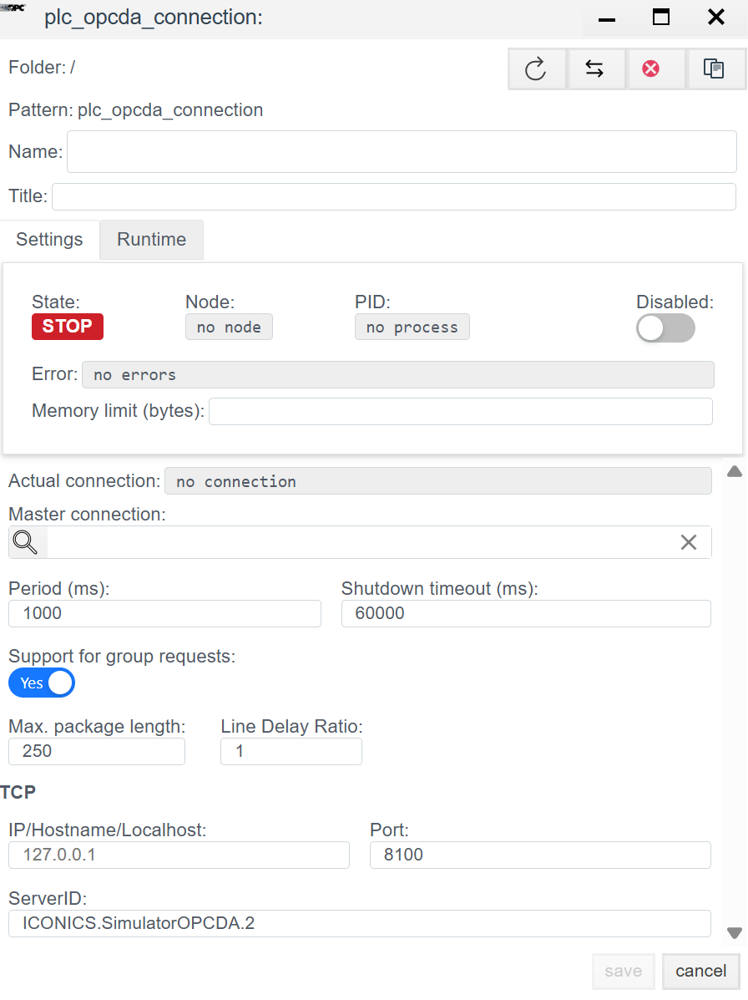

# Руководство по конфигурации OPC DA (Classic)

## Общее описание
**OPC DA (Data Access)** — это классический стандарт обмена данными в промышленной автоматизации, основанный на технологии Microsoft DCOM. В системе **Faceplate** данный драйвер позволяет подключаться к любым внешним OPC-серверам (например, Kepware, Matrikon, Lectus) и считывать с них данные.

> **Важно:** Поскольку OPC DA базируется на DCOM, для успешного соединения часто требуется настройка прав доступа Windows и DCOM на обеих сторонах (Клиент и Сервер).

Процесс настройки состоит из двух этапов:
1.  **Connection (`plc_opcda_connection`):** Настройка подключения к OPC-серверу.
2.  **Binding (`plc_opcda_binding`):** Подписка на конкретные теги.

---

##  1. Настройка соединения (Connection)
> Создать PLC cоединения → [Шаги создания PLC соединения](./general_ru.md#создание-plc-соединения)

На этом этапе мы указываем, где находится OPC-сервер и как он называется.

### 1.1 Панель диагностики
>Диагностика PLC соединения → [Диагностика](./general_ru.md#диагностика-diagnostics)

| Поле | Описание |
| :--- | :--- |
| **State** | **STOP** — драйвер остановлен. **RUN** — драйвер запущен. |
| **Node** | Узел кластера. Указывает, на каком узле выполняется процесс. |
| **PID** | ID процесса. |
| **Error** | Текст ошибки (при наличии). |
| **Disabled** | Флаг отключения соединения. Через данную кнопку пользователь отключает или включает драйвер.|
| **Memory limit (bytes)** | Ограничение памяти (пределы оперативной памяти в байтах для процесса, обслуживающего соединение). Емкость памяти определяет количество переменных (тегов), которые могут быть обработаны. |
| **Actual connection** | Текущий активный канал связи. В системах с резервированием (Redundancy) указывает, какое именно соединение (основное или резервное) осуществляет обмен данными в текущий момент. |
| **Master connection** | Привязка к основному каналу связи. Заполняется для резервных соединений. Поле указывает, какое соединение является приоритетным (Master), определяя логическую пару для механизма резервирования. |
### 1.2 Основные параметры (Settings)

#### Основные параметры
| Параметр | Описание |
| :--- | :--- |
| **Name** | Уникальное имя соединения. |
| **Title** | Заголовок (описание) данного объекта. |
| **Period (ms)** | Базовый цикл обработки драйвера. |
| **Shutdown timeout (ms)** | Время ожидания завершения операций при остановке драйвера. |
| **Support for group requests** *| **Yes** — включить поддержку общего опроса (General Interrogation). |
| **Max. package length** *| Максимальный размер пакета. Обычно 250 байт. |
| **Line Delay Ratio** *| Коэффициент задержки линии. |

#### 1.3 Параметры Протокола (OPC DA)

В отличие от других драйверов, здесь настройки сети указывают на хост, где запущен OPC Server.

| Поле | Описание |
| :--- | :--- |
| **IP/Hostname/Localhost** | Сетевой адрес компьютера, где установлен OPC-сервер. *Пример:* `192.168.1.5` или `localhost` (если сервер на той же машине). |
| **Port** | **8100** (или другой порт, если используется туннелирование).  *Примечание:* В классическом OPC DA порт TCP жестко не задается (работает через DCOM/RPC, порт 135), но в данном драйвере это поле может использоваться для специфичных OPC-туннелей или внутренних прокси. |
| **ServerID** | **ProgID OPC-сервера.** Это самое важное поле. Оно точно идентифицирует программный компонент сервера в реестре Windows. *Примеры:* `Kepware.KEPServerEX.V6`, `Matrikon.OPC.Simulation.1`, `ICONICS.SimulatorOPCDA.2`. |

---

##  2. Настройка переменных (Binding)

В OPC DA адресация происходит по имени тега (Item ID).

> Создать PLC привязку → [Шаги создания PLC привязки](./general_ru.md#создание-plc-привязки)
> 
### 2.1 Параметры привязки
| Поле | Описание |
| :--- | :--- |
| **Name** | Имя привязки. |
| **Title** | Заголовок (описание) для данного объекта. |
| **State** | **STOP** — привязка остановлена. **RUN** — привязка запущен. |
| **Tag** | Системный тег Faceplate. Приходящее значение будет записано в выбранное поле выбранного объекта. Cм. [Привязка к тегу](./general_ru.md#привязка-к-тегу-на-примере-архива) |
| **Transformation** | Преобразование значения. См. [Transformation](./transformation_ru.md). |
| **Access** | **R** — Чтение (Read), **W** — Запись (Write), **RW** — Чтение и запись. |

### 2.2 Адресация (OPC Tag)

| Поле | Инструкция |
| :--- | :--- |
| **OPC tag** | **Item ID (Идентификатор элемента).** Полный путь к тегу в адресном пространстве OPC-сервера. *Примеры:* • `Channel1.Device1.Tag1` • `Simulation.Ramp` • `Bucket Brigade.Int4` |

>Ошибка в PLC привязке -> [ошибка привязки](./general_ru.md#ошибка-в-привязке)

---

