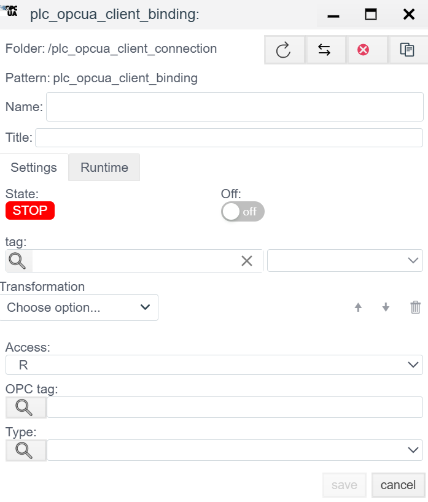

# Руководство по конфигурации OPC UA Client

## Общее описание
**OPC UA (Unified Architecture)** — это современный кроссплатформенный стандарт промышленной связи (IEC 62541). В отличие от классического OPC DA, он не зависит от Windows/DCOM, поддерживает шифрование и сложные структуры данных.

Драйвер **OPC UA Client** в системе **Faceplate** позволяет подключаться к серверам (ПЛК Siemens S7-1500, Kepware, Prosys, B&R и др.) по бинарному протоколу `opc.tcp`.

Процесс настройки состоит из двух этапов:
1.  **Connection (`plc_opcua_client_connection`):** Настройка эндпоинта (Endpoint), безопасности и аутентификации.
2.  **Binding (`plc_opcua_client_binding`):** Подписка на конкретные узлы (Nodes).

---

## ШАГ 1. Настройка соединения (Connection)

Здесь мы создаем защищенный канал связи с сервером.

### 1.1 Панель диагностики (Runtime)
*Верхняя часть окна. Служит для мониторинга сессии.*

| Поле | Описание |
| :--- | :--- |
| **State** | **STOP** (Красный) — клиент остановлен. **RUN** (Зеленый) — сессия (Session) активирована. |
| **Error** | Текст ошибки.  *Частые ошибки:* `BadCertificateUntrusted` (сертификат не принят сервером), `BadTimeout`. |
| **Actual connection** | Текущий активный канал (при использовании резервирования). |

### 1.2 Параметры конфигурации (Settings)

#### Базовые настройки
| Параметр | Описание |
| :--- | :--- |
| **Name** | Уникальное имя соединения. |
| **Period (ms)** | Период публикации (Publishing Interval). Частота, с которой клиент просит сервер присылать обновления подписки. |
| **Support for group requests** | **Yes** — включить группировку узлов в подписки (Subscriptions). Рекомендуется. |
| **Master connection** | Ссылка на основное соединение (для резервирования). |

#### Настройки подключения (Connection & Security)
Самая важная часть настройки OPC UA.

| Поле | Описание и аналитика |
| :--- | :--- |
| **URL** | **Endpoint URL.** Адрес сервера. *Формат:* `opc.tcp://<IP-address>:<Port>` *Пример:* `opc.tcp://192.168.0.10:4840` |
| **MaxNodesPerBrowse** | Ограничение количества узлов при просмотре дерева адресов (Browse). Стандарт: `1000`. |
| **Timeout** | Время ожидания ответа от сервера (мс). |
| **Secure connection** | **Режим шифрования.** • **No (Выкл):** Режим `None` (без безопасности). Подходит для тестов. • **Yes (Вкл):** Использование `Sign` или `SignAndEncrypt`. Требует наличия сертификатов. |
| **Certificate / Key** | Пути к файлам публичного сертификата (`.der`) и приватного ключа (`.pem`) клиента. |
| **Generate a certificate** | Кнопка для автоматической генерации самоподписанного сертификата клиента. |
| **Login / Password** | **Аутентификация пользователя.** • Если пусто — используется **Anonymous**. • Если заполнено — используется **User/Password** токен. |

---

## ШАГ 2. Настройка переменных (Binding)

В OPC UA адресация осуществляется по **NodeId** (Идентификатор узла).

### 2.1 Параметры привязки

| Поле | Описание |
| :--- | :--- |
| **Name** | Имя привязки в дереве проекта. |
| **Tag** | Системный тег Faceplate, куда будет транслироваться значение. |
| **Access** | **R** — Чтение (Subscription/Monitored Item). **W** — Запись (Write Attribute). |
| **Transformation** | *Опционально.* Преобразование значения (например, масштабирование). |

### 2.2 Адресация узла (OPC UA Node)

| Поле | Инструкция |
| :--- | :--- |
| **OPC tag** | **NodeId (Адрес узла).** Уникальный адрес переменной на сервере. Состоит из индекса пространства имен (ns) и идентификатора (s, i, g, b). *Примеры:* • `ns=2;s=Machine1.Sensor.Temp` (Строковый ID) • `ns=3;i=1005` (Числовой ID) • `i=2258` (Стандартный узел, ns=0) |
| **Type** | Тип данных OPC UA (Int32, Float, Boolean, String и т.д.). Обычно определяется автоматически, но можно задать жестко. |

---

<!-- ## Дополнительно

OPC UA — самый безопасный протокол, и именно безопасность чаще всего становится причиной проблем при первом запуске.

1.  **Доверие сертификатам (Trust):**
    * Даже если вы выбрали `Secure connection: No` (None), некоторые серверы все равно требуют, чтобы сертификат клиента был в списке "Trusted".
    * *Симптом:* Ошибка `BadSecurityChecksFailed` или `BadCertificateUntrusted`.
    * *Решение:* Зайдите в конфигуратор OPC-сервера (на стороне ПЛК или SCADA), найдите раздел "Rejected Certificates", найдите там сертификат Faceplate и переместите его в "Trusted".
2.  **Endpoint URL:**
    * Многие серверы имеют несколько URL (разные политики безопасности). Убедитесь, что указанный вами URL совпадает с тем, что сервер "слушает".
3.  **Время (Clock Sync):**
    * Сертификаты имеют срок действия. Если время на сервере и клиенте расходится более чем на пару минут, соединение может быть отклонено.
4.  **Синтаксис NodeId:**
    * NodeId чувствителен к регистру и пробелам. `ns=2;s=MyTag` и `ns=2;s=Mytag` — это разные узлы. Используйте кнопку лупы (Browse) для выбора тега из дерева, чтобы избежать опечаток. -->