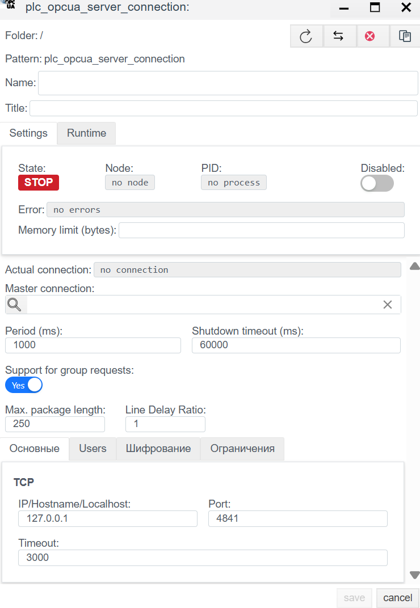
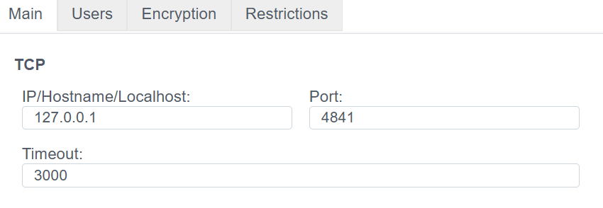
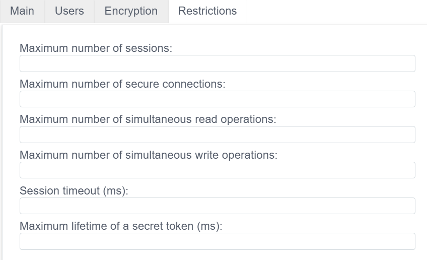
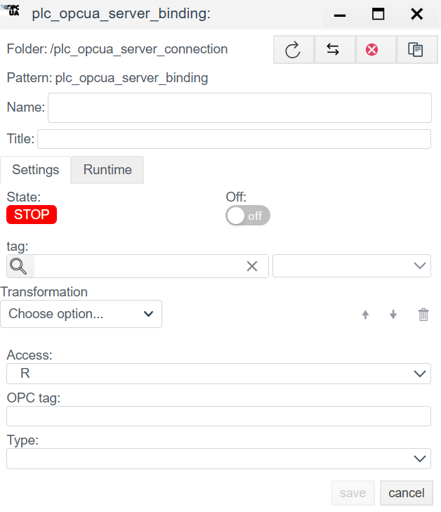

# Руководство по конфигурации OPC UA Server

## Общее описание
Драйвер **OPC UA Server** позволяет системе **Faceplate** выступать в роли сервера OPC UA. Это означает, что система публикует свои внутренние теги во внешнюю сеть, позволяя сторонним клиентам (SCADA, MES, ERP, UaExpert) подключаться, считывать и записывать данные по протоколу `opc.tcp`.

Процесс настройки состоит из двух этапов:
1.  **Connection (`plc_opcua_server_connection`):** Настройка сетевого интерфейса (Endpoint) и параметров сервера.
2.  **Binding (`plc_opcua_server_binding`):** Публикация конкретных тегов в адресное пространство сервера.

---

## 1. Настройка соединения (Connection)
> Создать PLC cоединения → [Шаги создания PLC соединения](./general_ru.md#создание-plc-соединения)

На этом этапе определяется, на каком порту и интерфейсе сервер будет ожидать входящие подключения.

### 1.1 Панель диагностики
>Диагностика PLC соединения → [Диагностика](./general_ru.md#диагностика-diagnostics)

| Поле | Описание |
| :--- | :--- |
| **State** | **STOP** — драйвер остановлен. **RUN** — драйвер запущен. |
| **Node** | Узел кластера. Указывает, на каком узле выполняется процесс. |
| **PID** | ID процесса. |
| **Error** | Текст ошибки (при наличии). |
| **Disabled** | Флаг отключения соединения. Через данную кнопку пользователь отключает или включает драйвер.|
| **Memory limit (bytes)** | Ограничение памяти (пределы оперативной памяти в байтах для процесса, обслуживающего соединение). Емкость памяти определяет количество переменных (тегов), которые могут быть обработаны. |
| **Actual connection** | Текущий активный канал связи. В системах с резервированием (Redundancy) указывает, какое именно соединение (основное или резервное) осуществляет обмен данными в текущий момент. |
| **Master connection** | Привязка к основному каналу связи. Заполняется для резервных соединений. Поле указывает, какое соединение является приоритетным (Master), определяя логическую пару для механизма резервирования. |

### 1.2 Основные параметры (Settings)
| Параметр | Описание |
| :--- | :--- |
| **Name** | Уникальное имя соединения. |
| **Title** | Заголовок (описание) данного объекта. |
| **Period (ms)** | Базовый цикл обработки драйвера. |
| **Shutdown timeout (ms)** | Время ожидания завершения операций при остановке драйвера. |
| **Support for group requests** *| **Yes** — включить поддержку общего опроса (General Interrogation). |
| **Max. package length** *| Максимальный размер пакета. Обычно 250 байт. |
| **Line Delay Ratio** *| Коэффициент задержки линии. |

####  1.3 Параметры Протокола (OPC UA server)

Настройка сервера производится через конфигурационное окно, разделенное на четыре основные вкладки: **Main**, **Users**, **Encryption** и **Restrictions**. Ниже приведено подробное описание каждого параметра.

## 1.3.1 Вкладка Main (Основные настройки)

Здесь задаются сетевые параметры, необходимые для подключения клиентов к серверу.

* **IP/Hostname/Localhost**
  * Сетевой интерфейс, на котором сервер будет ожидать подключения.
  * *Пример:* `127.0.0.1` (только локальный доступ) или `0.0.0.0` (доступ со всех сетевых карт).
* **Port**
  * TCP-порт для входящих соединений.
  * *Стандартное значение:* `4840` или `4841`.
  * *Важно:* Убедитесь, что указанный порт открыт в брандмауэре (Firewall).
* **Timeout**
  * Время ожидания (в мс) перед разрывом соединения при отсутствии ответа от сети.
  * *Рекомендуемое значение:* `3000` (3 секунды).

## 1.3.2 Вкладка Users (Пользователи и Доступ)

Управление правами доступа и учетными записями.

* **Allow anonymous access**
  * Переключатель (`Yes`/`No`).
  * Если включено (**Yes**), любой клиент может подключиться без пароля.
  * *Внимание:* Для рабочих систем рекомендуется отключить эту опцию.
* **Users**
  * Список локальных пользователей для аутентификации (если анонимный доступ отключен).
  * **Login:** Имя пользователя.
  * **Password:** Пароль.
  * Используйте кнопки `↑` `↓` для сортировки и иконку корзины для удаления.

## 1.3.3 Вкладка Encryption (Шифрование и Сертификаты)

Настройка безопасности соединения (Security Policy) и управление сертификатами X.509.

* **Secure connection**
  * Включает требование шифрования данных. Если переключатель в положении `No`, данные передаются в открытом виде.
* **Certificate**
  * Загрузка публичного сертификата сервера (файлы `.der`, `.pem`).
* **Key**
  * Загрузка приватного ключа сервера (файлы `.key`, `.pem`). Этот файл должен храниться в секрете.
* **Generate a certificate**
  * Кнопка для создания самоподписанного сертификата, если у вас нет сертификата от удостоверяющего центра.
* **Trusted certificates**
  * Список доверенных сертификатов клиентов (Whitelist). Клиенты, чьи сертификаты добавлены сюда, смогут подключаться к серверу.
* **Trusted Root Certificates**
  * Корневые сертификаты удостоверяющих центров (CA).
* **Revoked certificates**
  * Список отозванных сертификатов (Blacklist), которым запрещено подключение.

## 1.3.4 Вкладка Restrictions (Ограничения)

Параметры для защиты сервера от перегрузки и управления ресурсами.

* **Maximum number of sessions**
  * Максимальное количество логических сессий, которые могут быть открыты одновременно.
* **Maximum number of secure connections**
  * Лимит на количество одновременных защищенных TCP-каналов.
* **Maximum number of simultaneous read operations**
  * Ограничение на количество переменных (тегов), которые клиент может запросить за один вызов чтения.
* **Maximum number of simultaneous write operations**
  * Ограничение на количество переменных, которые клиент может записать за один вызов.
* **Session timeout (ms)**
  * Время жизни неактивной сессии. Если клиент не проявляет активность в течение этого времени, сервер принудительно закрывает сессию.
* **Maximum lifetime of a secret token (ms)**
  * Срок действия токена безопасности (Security Token). По истечении этого времени канал связи должен быть обновлен (re-negotiation).

---

##  2. Настройка переменных (Binding)

Этот этап определяет "Адресное пространство" (Address Space) вашего сервера. Каждый объект binding создает узел (Node), видимый внешним клиентам.

> Создать PLC привязку → [Шаги создания PLC привязки](./general_ru.md#создание-plc-привязки)
>

### 2.1 Параметры привязки
| Поле | Описание |
| :--- | :--- |
| **Name** | Имя привязки. |
| **Title** | Заголовок (описание) для данного объекта. |
| **State** | **STOP** — привязка остановлена. **RUN** — привязка запущен. |
| **Tag** | Системный тег Faceplate. Приходящее значение будет записано в выбранное поле выбранного объекта. Cм. [Привязка к тегу](./general_ru.md#привязка-к-тегу-на-примере-архива) |
| **Transformation** | Преобразование значения. См. [Transformation](./transformation_ru.md). |
| **Access** | Уровень доступа для внешних клиентов: • **R** — Только чтение (Клиент видит значение, но не может менять). • **RW** — Чтение и запись (Клиент может управлять этим тегом). |
| **OPC tag** | **Имя узла (NodeId).** Имя, под которым переменная будет видна в дереве OPC UA сервера. Пример: `Sensor1` или `Area1.Temp`. |
| **Type** | Тип данных узла OPC UA (Double, Int32, Boolean и т.д.). Если не задано, наследуется от исходного тега. |

>Ошибка в PLC привязке -> [ошибка привязки](./general_ru.md#ошибка-в-привязке)

---
