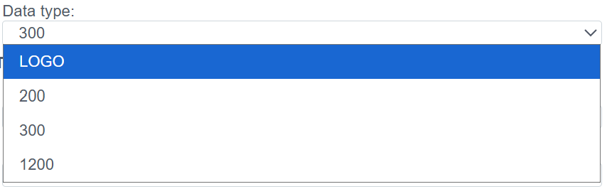

# Руководство по конфигурации S7 (ISO-on-TCP)

## Общее описание
Драйвер **S7** предназначен для нативного обмена данными с программируемыми логическими контроллерами (ПЛК) компании Siemens семейства **Simatic S7**.

Поддерживаемые серии:
* **S7-300 / S7-400** (Классическая архитектура).
* **S7-1200 / S7-1500** (Современные серии, требуют настройки доступа, см. раздел Troubleshooting).
* **Siemens Logo!** (начиная с версий 0BA7/0BA8).

Обмен данными происходит по протоколу **ISO-on-TCP** (RFC 1006) через стандартный порт **102**.

Процесс настройки состоит из двух этапов:
1.  **Connection (`plc_s7_connection`):** Настройка сетевого доступа к CPU.
2.  **Binding (`plc_s7_binding`):** Адресация конкретной ячейки памяти.

---

## 1. Настройка соединения (Connection)
> Создать PLC cоединения → [Шаги создания PLC соединения](./general_ru.md#создание-plc-соединения)
На этом этапе мы настраиваем параметры подключения к коммуникационному процессору или порту Ethernet на CPU.

### 1.1 Панель диагностики
>Диагностика PLC соединения → [Диагностика](./general_ru.md#диагностика-diagnostics)

| Поле | Описание |
| :--- | :--- |
| **State** | **STOP** — драйвер остановлен. **RUN** — драйвер запущен. |
| **Node** | Узел кластера. Указывает, на каком узле выполняется процесс. |
| **PID** | ID процесса. |
| **Error** | Текст ошибки (при наличии). |
| **Disabled** | Флаг отключения соединения. Через данную кнопку пользователь отключает или включает драйвер.|
| **Memory limit (bytes)** | Ограничение памяти (пределы оперативной памяти в байтах для процесса, обслуживающего соединение). Емкость памяти определяет количество переменных (тегов), которые могут быть обработаны. |
| **Actual connection** | Текущий активный канал связи. В системах с резервированием (Redundancy) указывает, какое именно соединение (основное или резервное) осуществляет обмен данными в текущий момент. |
| **Master connection** | Привязка к основному каналу связи. Заполняется для резервных соединений. Поле указывает, какое соединение является приоритетным (Master), определяя логическую пару для механизма резервирования. |

### 1.2 Основные параметры (Settings)

| Параметр | Описание |
| :--- | :--- |
| **Name** | Уникальное имя соединения. |
| **Title** | Заголовок (описание) данного объекта. |
| **Period (ms)** | Базовый цикл обработки драйвера. |
| **Shutdown timeout (ms)** | Время ожидания завершения операций при остановке драйвера. |
| **Support for group requests** *| **Yes** — включить поддержку общего опроса (General Interrogation). |
| **Max. package length** *| Максимальный размер пакета. Обычно 250 байт. |
| **Line Delay Ratio** *| Коэффициент задержки линии. |

### 1.3 Параметры Протокола (S7)

| Поле | Описание и аналитика |
| :--- | :--- |
| **Data type** | Тип (семейство) контроллера.  Влияет на алгоритмы формирования пакетов. Выберите `300` (S7-300/400), `1200` (S7-1200)/`1500`(S7-1500) или LOGO.|
| **IP/Hostname** | IP-адрес контроллера. |
| **Port** | **102** (Стандартный порт Siemens ISO-on-TCP). |
| **Rack** | **Номер корзины (шасси).**  • Для S7-300/400/1500: Обычно `0`. |
| **Slot** | **Номер слота CPU.** (Поле может быть ниже Rack). ⚠️ **Это критичный параметр:** • **S7-300:** Всегда `2`. • **S7-400:** Зависит от конфигурации Hardware (часто `2` или `3`). • **S7-1200 / S7-1500:** Обычно `1` (или `0` для старых прошивок 1200). |

---

##  2. Настройка переменных (Binding)

В S7 память имеет жесткую структуру. Для доступа к переменной нужно знать её область, тип и смещение (адрес).

> Создать PLC привязку → [Шаги создания PLC привязки](./general_ru.md#создание-plc-привязки)

### 2.1 Параметры привязки

| Поле | Описание |
| :--- | :--- |
| **Name** | Имя привязки. |
| **Title** | Заголовок (описание) для данного объекта. |
| **Tag** | Системный тег Faceplate. Приходящее значение будет записано в выбранное поле выбранного объекта. Cм. [Привязка к тегу](./general_ru.md#привязка-к-тегу-на-примере-архива) |
| **State** | **STOP** — привязка остановлена. **RUN** — привязка запущен. |
| **Transformation** | Преобразование значения. См. [Transformation](./transformation_ru.md). |
| **Access** | **R** (Чтение), **W** (Запись), **RW** (Чтение/Запись). |

### 2.2 Адресация памяти (S7 Address)

Для адресации вида `DB1.DBX10.2` (Бит 2 в байте 10 блока данных 1) настройки будут выглядеть так:

| Поле | Инструкция |
| :--- | :--- |
| **Memory area** | Область памяти: • **DB** — Data Block (Блоки данных, основная область). • **I** (Inputs) — Входы. • **Q** (Outputs) — Выходы. • **M** (Flags/Merkers) — Меркерная память. |
| **Type** | Тип данных переменной: • `bit` (BOOL) • `byte`, `word`, `dword` • `int`, `real` (float) |
| **DB** | **Номер блока данных.** Заполняется, только если `Memory area` = **DB**. (Например, `1`). |
| **Byte** | **Смещение байта (Byte Offset).** Начальный байт переменной. |
| **Bit** | **Смещение бита (Bit Offset).** От `0` до `7`.  Заполняется **только** если `Type` = `bit`. Для остальных типов должно быть `0`. |
| **Format** | Интерпретация данных (например, `integer` для знаковых чисел или `float` для вещественных). |

>Ошибка в PLC привязке -> [ошибка привязки](./general_ru.md#ошибка-в-привязке)
---
