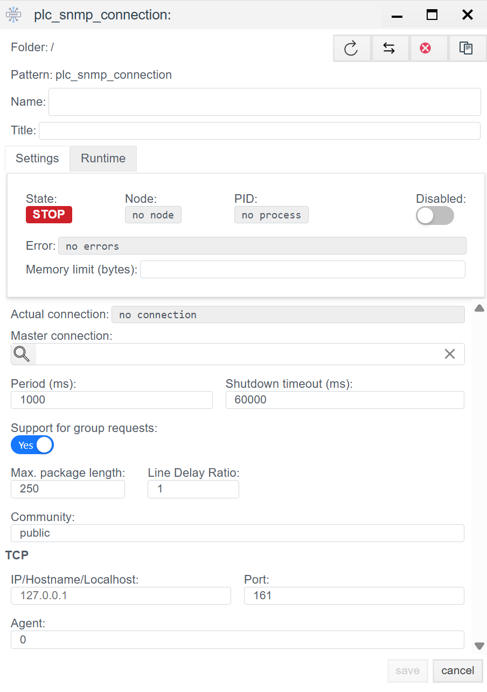

# Конфигурация SNMP в Faceplate

## Общее описание
**SNMP** (Simple Network Management Protocol) — это открытый коммуникационный протокол, определенный Инженерным советом интернета (IETF). Протокол широко используется для обмена данными с сетевым оборудованием (контроллеры, шлюзы, ИБП). 

В среде **Faceplate** реализована поддержка протоколов версий **SNMPv2** и **SNMPv3**.

Процесс интеграции состоит из двух этапов:
1.  **Создание соединения (`plc_snmp_connection`):** Настройка сетевого транспорта и логики резервирования.
2.  **Создание привязок (`plc_snmp_binding`):** Адресация конкретных переменных (OID) внутри устройства.

---

##  1. Настройка соединения (Connection)
> Создать PLC cоединения → [Шаги создания PLC соединения](./general_ru.md#создание-plc-соединения)
> 
На этом этапе создается транспортный канал до оборудования.

### 1.1 Панель диагностики
Верхняя часть окна отображает статус драйвера.
>Диагностика PLC соединения → [Диагностика](./general_ru.md#диагностика-diagnostics)

| Поле | Описание |
| :--- | :--- |
| **State** | **STOP** — драйвер остановлен. **RUN** — драйвер запущен. |
| **Node** | Узел кластера. На какой ноде изполняется процесс |
|**PID**|ID процесса.|
| **Error** | Текст ошибки. |
|**Disabled**||
|**Memory limit (bytes)**| Ограничение памяти(пределы оперативной памяти (МБ) для процесса, обслуживающего соединение). Емкость памяти определяет количество переменных (тегов), которые могут быть обработаны в процессе функционирования соединения.|
| **Actual connection** | Текущий исполняемый канал связи. В системах с резервированием (Redundancy) указывает, какое именно соединение (основное или резервное) осуществляет обмен данными в текущий момент времени.|
|**Master connection**|  Привязка к основному каналу связи. Заполняется для резервных соединений. Поле указывает, какое соединение является приоритетным (Master), определяя логическую пару для механизма резервирования.|

### 1.2 Основные параметры (Settings)

| Параметр | Описание |
| :--- | :--- |
| **Name** | Уникальное имя соединения. |
| **Title** | Заголовок (описание) данного объекта. |
| **Period (ms)** | Базовый цикл обработки драйвера. |
| **Shutdown timeout (ms)** | Время ожидания корректного разрыва соединения. |
| **Support for group requests** | **Yes** — включить возможность периодического общего опроса (General Interrogation). |
| **Max. package length** | Максимальный размер APDU. Стандартно 250 байт. |
| **Line Delay Ratio** | Коэффициент задержки для медленных линий связи. |

### 1.3 Параметры Протокола (SNMP) 
Поле | Описание |
| :--- | :--- |
| **Community** | **Строка сообщества (Community String).** Используется как пароль для доступа к данным устройства (для SNMP v1/v2c). • **public** — стандартное значение для прав «только чтение» (Read-only). • **private** — стандартное значение для прав «чтение и запись» (Read-Write). *Важно: Это значение чувствительно к регистру и должно совпадать с настройками в опрашиваемом устройстве.* |
| **IP** | IP-адрес или доменное имя устройства, которое необходимо опрашивать. Примеры: `192.168.1.10` (сетевое устройство) или `127.0.0.1` (локальный агент). |
| **Port** | Сетевой порт агента SNMP. Стандартный порт для запросов: **161**. |
| **Agent** | Идентификатор агента или дополнительный параметр драйвера. По умолчанию часто используется значение `0` или `1`. |

---

##  2. Настройка переменных (Binding)

Внутри соединения создаются объекты `plc_snmp_binding`. Каждый объект соответствует одной переменной (OID) на устройстве.

> Создать PLC привязку → [Шаги создания PLC привязки](./general_ru.md#создание-plc-привязки)

### 2.1 Параметры привязки

| Поле | Описание |
| :--- | :--- |
| **Name** | Имя привязки. |
| **Title** | Заголовок (описание) для данного объекта. |
| **State** | **STOP** — привязка остановлена. **RUN** — привязка запущен. |
| **Tag** | Системный тег Faceplate. Приходящее значение будет записано в выбранное поле выбранного объекта. Cм. [Привязка к тегу](./general_ru.md#привязка-к-тегу-на-примере-архива) |
| **Transformation** | Преобразование значения. См. [Transformation](./transformation_ru.md). |
| **Access** | Права доступа к переменной: • **R** — Read (Только чтение). • **W** — Write (Только запись). • **RW** — Read/Write (Чтение и запись). |
| **Address** | **OID (Object Identifier).** Адрес переменной в иерархии SNMP. *Примеры:* `1.3.6.1.2.1.1.1.0` (абсолютный) или `1.6.3.1` (относительный, если поддерживается). |

>Ошибка в PLC привязке -> [ошибка привязки](./general_ru.md#ошибка-в-привязке)

---
