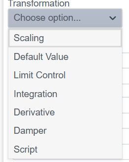
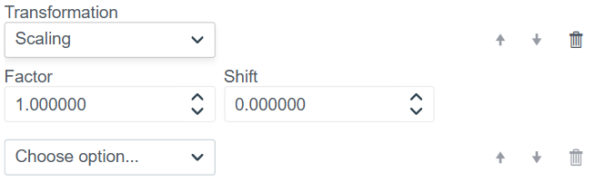
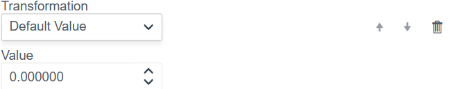
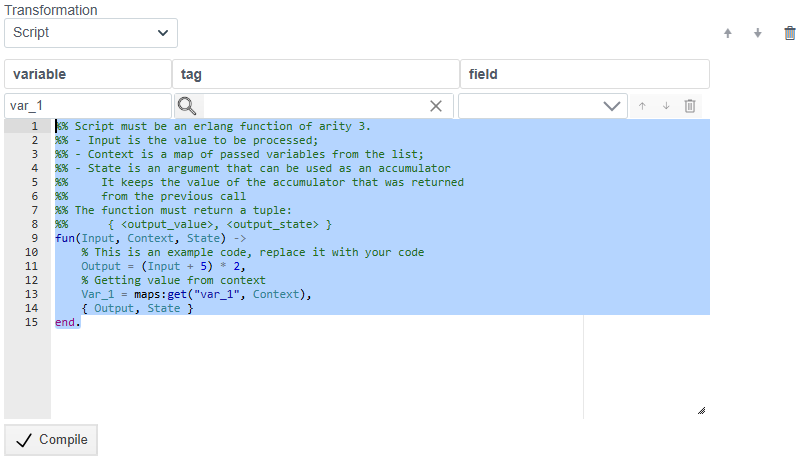

# Настройка функции Transformation

Данный документ описывает функционал предварительной обработки данных (трансформации) при создании привязок (bindings). Модуль позволяет изменять, ограничивать или математически обрабатывать входные значения перед их передачей в систему.

## 1. Обзор доступных методов

В блоке **Transformation** доступен выпадающий список **«Choose option...»**, который открывает перечень всех доступных методов обработки.

Доступные методы:
1.  **Scaling** (Масштабирование)
2.  **Default Value** (Значение по умолчанию)
3.  **Limit Control** (Контроль лимитов)
4.  **Integration** (Интегрирование)
5.  **Derivative** (Дифференцирование)
6.  **Damper** (Демпфирование/Сглаживание)
7.  **Script** (Пользовательский скрипт)

Ниже приведено детальное описание каждого метода.

---

## 2. Scaling (Масштабирование)

Метод выполняет линейное преобразование входного значения по формуле линейной функции:  
$$Y = (X \times \text{Factor}) + \text{Shift}$$

**Параметры:**
* **Factor:** Коэффициент умножения (множитель).
* **Shift:** Значение сдвига (слагаемое).

---

## 3. Default Value (Значение по умолчанию)

Позволяет задать фиксированное значение. Может использоваться для инициализации переменных или замены значения константой.

**Параметры:**
* **Value:** Числовое значение, которое будет передано дальше.

---

## 4. Limit Control (Контроль лимитов)

Ограничивает входное значение заданным диапазоном (Clamping). Если значение выходит за пределы, оно приравнивается к ближайшей границе.

**Параметры:**
* **Lower Limit:** Нижняя граница диапазона.
* **Upper Limit:** Верхняя граница диапазона.

---

## 5. Integration (Интегрирование)

Выполняет математическую операцию интегрирования входящего сигнала по времени (накопление суммы значений).

*Параметры настраиваются автоматически.*

---

## 6. Derivative (Дифференцирование)

Вычисляет производную входящего сигнала, определяя скорость изменения значения за единицу времени.

*Параметры настраиваются автоматически.*

---

## 7. Damper (Демпфирование)

Фильтр для сглаживания сигнала. Позволяет убрать резкие скачки (шум) и сделать изменение значения более плавным.

**Параметры:**
* **Tlag:** Постоянная времени (коэффициент инерции). Чем больше значение, тем сильнее сглаживание и медленнее реакция на изменение входа.

---

## 8. Script (Скрипт)

Позволяет написать произвольную логику обработки данных на языке **Erlang**.

**Возможности:**
* **Variable / Tag / Field:** Позволяет получить доступ к переменным контекста.
* **Code Editor:**
    * Функция принимает аргументы: `Input` (входное значение), `Context` (контекст переменных), `State` (состояние аккумулятора).
    * Функция должна вернуть кортеж: `{Output, State}`.

---

## 9. Использование нескольких трансформаций 

Система поддерживает создание цепочек обработки, где к одной привязке применяется сразу несколько функций трансформации.

### Принцип работы

1.  **Порядок выполнения:**
    Функции выполняются строго **сверху вниз**. Выходное значение первой функции становится входным значением для второй и так далее.
    * *На примере выше:* Сначала срабатывает **Scaling**, затем результат передается в **Default Value**.

2.  **Добавление функции:**
    Чтобы добавить новый шаг в цепочку, нажмите на выпадающее меню **«Choose option...»** в нижней части списка. Откроется меню (см. п.1), и выбранная функция добавится в конец списка.

3.  **Управление элементами:**
    Справа от каждой функции находятся кнопки управления:
    * ⬆️ **Стрелка вверх:** Поднимает функцию выше по списку (она выполнится раньше).
    * ⬇️ **Стрелка вниз:** Опускает функцию ниже по списку (она выполнится позже).
    * 🗑 **Корзина:** Удаляет данную функцию трансформации из цепочки.